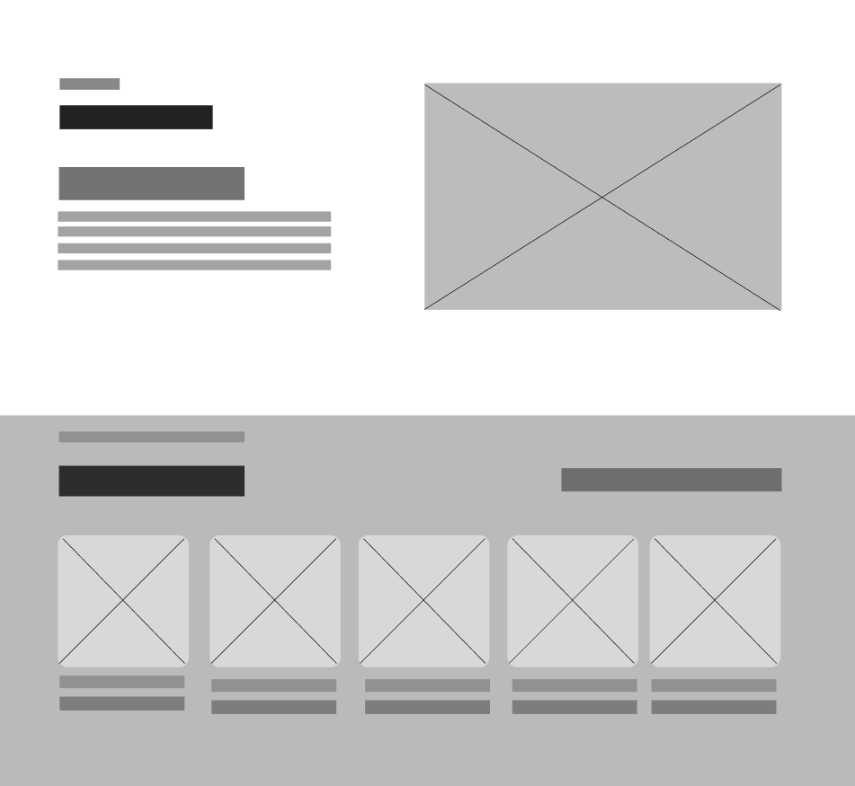

# Capítulo IV: Product Design

## 4.1. Style Guidelines

### 4.1.1. General Style Guidelines
El diseño visual de la plataforma **SumaqAgro** se inclina hacia una estética moderna, limpia e intuitiva, en línea con nuestro compromiso de ofrecer soluciones agrotecnológicas que transmitan innovación, sostenibilidad, confianza y cercanía. Nuestro objetivo es crear una experiencia digital que sea tanto eficiente como cercana y profesional para los agricultores, cooperativas e ingenieros agrónomos.

En esta sección, detallaremos cada uno de los elementos visuales y de estilo que guían el desarrollo de la aplicación SumaqAgro, siempre siguiendo los principios de Diseño de Experiencia de Usuario (UX) e Interfaz de Usuario (UI) para garantizar la máxima usabilidad, legibilidad y accesibilidad (a11y).

**Branding**

El logo principal de **SumaqAgro**, un nombre que evoca la unión entre la naturaleza y la tecnología aplicada al sector agrícola. Nuestro propósito es ser un puente tecnológico para el campo, ofreciendo una solución integral de monitoreo satelital de precisión para agricultores, cooperativas e ingenieros agrónomos. El branding se enfoca en transmitir innovación, sostenibilidad, confianza y cercanía, valores esenciales para quienes buscan integrar la tecnología en el desarrollo del sector agrotecnológico.
 

  

**Typography**

La identidad tipográfica de SumaqAgro utiliza fuentes sans-serif seleccionadas de Google Fonts, elegidas por su alta legibilidad, apariencia moderna y óptima compatibilidad con entornos digitales navegables. La combinación de **Poppins** como tipografía principal e **Inter** como tipografía secundaria permite establecer una jerarquía visual clara e intuitiva entre títulos, contenidos informativos y elementos de interfaz, garantizando el cumplimiento de los estándares de accesibilidad web (a11y).

**Fuente principal: Poppins**

Se utiliza principalmente en encabezados y títulos, aportando un estilo geométrico y contemporáneo que refuerza la identidad visual de SumaqAgro:
- **Títulos principales (H1 / Sección heading):** Poppins Bold, 40 px en versión de escritorio / 28 px en móvil (Ejemplo: “Cultiva con Información”).
- **Títulos de secciones (H2 / Sub-headings):** Poppins SemiBold, 32 px en escritorio / 24 px en móvil (Ejemplo: “Nuestro Impacto en el Campo”).
- **Títulos de tarjetas o bloques (H3):** Poppins Medium, 20 px.
- **Subtítulos internos (H4):** Poppins Medium o SemiBold, entre 18 px y 20 px según el contexto.

**Fuente secundaria: Inter**

Se utiliza en bloques de lectura, etiquetas, botones, formularios y componentes de la interfaz gráfica debido a su extraordinaria claridad y rendimiento de lectura en pantallas de diversas resoluciones:
- **Párrafos principales (Body 1):** Inter Regular, 16 px.
- **Textos secundarios, subtítulos y Footer (Body 2):** Inter Regular, 14 px.
- **Botones y llamadas a la acción (Button Text / CTA):** Inter SemiBold, 16 px.
- **Etiquetas de formularios o elementos de interfaz (Labels):** Inter Medium, 14 px.

  
  

Esta combinación y jerarquía tipográfica permite mantener una experiencia de usuario consistente, altamente accesible, clara y profesional a través de los distintos dispositivos y secciones de la plataforma.

**Colors**

La interfaz web utilizará una paleta de colores basada principalmente en tonos **teal, verdes y neutros**, complementados con colores de estado para comunicar acciones, advertencias y errores.

- **Color primario:** se utilizarán tonos teal como color principal de identidad visual. Estos colores estarán presentes en elementos destacados de la interfaz, estados activos, componentes principales y elementos interactivos.

- **Color secundario:** los tonos verdes se emplearán como complemento del color principal, especialmente en botones, indicadores positivos, elementos relacionados con el estado de los cultivos y acciones secundarias.

- **Colores neutros:** se utilizarán tonos grises y blancos para mantener una interfaz limpia y facilitar la lectura del contenido. El fondo general de las vistas empleará tonos claros, mientras que componentes como el **sidebar utilizarán un fondo blanco** para diferenciar claramente la navegación del área principal de trabajo.

- **Superficies y tarjetas:** las tarjetas y contenedores de información utilizarán principalmente fondos blancos o tonos neutros claros. Algunos componentes importantes podrán utilizar fondos oscuros pertenecientes a la paleta principal para generar mayor jerarquía visual.

- **Navegación:** el menú lateral mantendrá una apariencia clara, utilizando fondo blanco y colores verdes o teal para identificar opciones seleccionadas, iconos y elementos interactivos.

- **Estados del sistema:** se utilizarán colores específicos para comunicar información importante:
    - **Rojo:** errores, acciones incorrectas o situaciones que requieren atención inmediata.
    - **Amarillo:** advertencias o situaciones que necesitan precaución.
    - **Verde:** estados correctos, disponibles, saludables o confirmaciones exitosas.

- **Contraste y legibilidad:** los colores oscuros serán utilizados principalmente para textos y elementos destacados, mientras que los tonos claros servirán como fondos y superficies, buscando mantener un contraste adecuado y una lectura sencilla en toda la aplicación.

  

**Spacing**

SumaqAgro utiliza un sistema de espaciado basado en múltiplos de 8 px, permitiendo mantener una interfaz ordenada, consistente y fácil de adaptar a diferentes tamaños de pantalla[cite: 1]. Este sistema se aplica en márgenes, paddings, separación entre componentes y distribución de contenido[cite: 1].

*   **4 px – Extra Small (XS):** Separaciones mínimas entre elementos relacionados, como iconos y texto.
*   **8 px – Small (S):** Espaciado interno pequeño, utilizado en botones, etiquetas y elementos compactos.
*   **16 px – Medium (M):** Espaciado estándar entre textos, campos de formulario y elementos dentro de una tarjeta.
*   **24 px – Large (L):** Separación entre grupos de contenido, tarjetas o bloques relacionados.
*   **32 px – Extra Large (XL):** Espaciado entre secciones internas o componentes principales.
*   **48 px – 2XL:** Utilizado para separar bloques importantes dentro de una misma sección.
*   **64 px – 3XL:** Recomendado para la separación vertical entre secciones principales de la página.
*   **80 px – 4XL:** Puede utilizarse en secciones amplias como Hero, Features o Call to Action en versión Desktop.

**Tono de Comunicación**

La voz y el tono de SumaqAgro están diseñados para ser tan claros, cercanos y confiables como nuestra plataforma. Nuestro objetivo es conectar con agricultores, cooperativas y profesionales del sector agrícola de manera empática, accesible y profesional.

* **Tono: Empático y cercano.** Buscamos reconocer y comprender las principales dificultades del trabajo agrícola, como heladas, sequías, plagas, estrés hídrico o la toma de decisiones basada en información limitada, transmitiendo comprensión y apoyo frente a estos desafíos.

* **Actitud: Profesional y confiable.** Explicamos conceptos técnicos —como el índice NDVI, monitoreo satelital o análisis de cultivos— de manera sencilla pero precisa, relacionándolos con beneficios concretos como la reducción de pérdidas, la optimización de recursos y la mejora de la productividad.

* **Lenguaje: Claro y directo.** Evitamos términos innecesariamente complejos y empleamos mensajes breves orientados a la acción. Las llamadas a la acción (CTAs) indican claramente lo que el usuario puede realizar mediante frases como “Registrar mi parcela”, “Ver estado del cultivo” o “Consultar alertas”.

* **Voz: Experta y facilitadora.** Posicionamos a SumaqAgro como una herramienta moderna para la transformación agrícola, manteniendo siempre una comunicación accesible que prioriza los beneficios prácticos que la plataforma ofrece en el día a día.

Este enfoque comunicacional busca generar confianza y lealtad, asegurando a los productores y organizaciones agrícolas que cuentan con un aliado tecnológico claro y efectivo para optimizar la gestión de sus cultivos.

### 4.1.2. Web Style Guidelines

## 4.2. Information Architecture
### 4.2.1. Organization Systems
### 4.2.2. Labeling Systems
### 4.2.3. SEO Tags and Meta Tags
### 4.2.4. Searching Systems
### 4.2.5. Navigation Systems

## 4.3. Landing Page UI Design
El landing page representa el primer punto de contacto entre los usuarios y la plataforma, por lo que su diseño debe comunicar de manera clara el propósito y los principales beneficios del servicio. En esta sección se presenta el diseño de la interfaz del landing page, considerando una organización visual atractiva, una navegación sencilla y elementos que faciliten la comprensión de la información y orienten al usuario hacia las acciones principales.

### 4.3.1. Landing Page Wireframe
El wireframe del landing page de **SumaqAgro** muestra la estructura inicial de la página y la forma en que se organizan sus principales elementos antes de aplicar el diseño visual definitivo. Su propósito es definir una distribución ordenada y funcional que sirva como base para el desarrollo posterior de la interfaz.

El wireframe está conformado por las siguientes secciones:

**Nav y Hero**

La sección Hero de la Landing Page presenta en su cabecera superior (Navbar) el isotipo y nombre de marca a la izquierda, los enlaces de anclaje (*Inicio*, *Nosotros*, *Soluciones*, *Planes*, *Impacto*), los botones de acceso (*Iniciar sesión* y *Registrarse*) y el selector de internacionalización (*ES*); seguidamente, el área principal de impacto despliega el subtítulo en mayúsculas *«AGRICULTURA INTELIGENTE PARA UN MEJOR MAÑANA»*, el encabezado principal (H1) *«Cultiva con Información. Decide con Precisión»*, un párrafo descriptivo que sintetiza la transformación de datos satelitales para el monitoreo de cultivos, costos y valor de la producción, y dos llamados a la acción primarios representados por los botones *Explorar* y *Cómo funciona* sobre un fondo fotográfico agrícola de campo.

  

**About**

La sección **Nosotros** (*About Us*) presenta una distribución asimétrica compuesta por un bloque textual a la izquierda y un recurso gráfico a la derecha; el área informativa incluye el kicker superior en mayúsculas *«SOBRE SUMAQAGRO»*, el encabezado de sección (H2) *«Nosotros»*, el subtítulo destacado (H3) *«Democratizamos la agricultura de precisión en el Perú»* y un párrafo institucional que detalla la misión de reducir la brecha de tecnificación en las cuencas de papa y café mediante datos satelitales abiertos y herramientas accesibles de monitoreo, costeo y certificación; mientras que a la derecha se exhibe una composición fotográfica con esquinas redondeadas que muestra una parcela de cultivo tecnificado junto a una mano sosteniendo un smartphone con la interfaz móvil del sistema desplegada.

  

**Solutions**

La sección **¿A quién ayudamos?** organiza la propuesta de valor mediante tres tarjetas (*cards*) de autoselección por perfil orientadas a *Agricultores independientes*, *Líderes de cooperativas* y *Asesores técnicos y agrónomos*, detallando en cada una su enfoque productivo, una fotografía representativa de campo y un botón de llamado a la acción específico (*Registrar mi parcela*, *Gestionar cooperativa* y *Unirme como asesor*); inmediatamente después, la sección **Soluciones y Características** expone las cuatro capacidades tecnológicas clave del sistema mediante una grilla de tarjetas que describen el monitoreo satelital de vigor y humedad (*Satellite Monitoring of Vigor and Moisture*), la contabilidad de costos por lote (*Batch Cost Accounting*), la certificación digital de cosecha (*Digital Certification of Harvest Quality*) y el sistema de prescripciones agronómicas (*Agronomic Prescriptions and Alerts*), complementando cada bloque funcional con un indicador del impacto operativo directo que genera en campo.

  

**Video and Plans**

La sección **Conoce SumaqAgro en acción** presenta un contenedor central con fondo verde oscuro que alberga el reproductor del video demostrativo (*About-the-Product*) para evidenciar el funcionamiento en campo; inmediatamente después, la sección **Planes** (*Pricing*) introduce un conmutador de facturación mensual y anual (*«Ahorra 2 meses con el plan anual»*) junto a una grilla de tres tarjetas de suscripción que estructuran el modelo SaaS freemium y B2B: el **Plan Semilla** (S/ 0 para 1 parcela con NDVI básico y botón *«Empezar gratis»*), el **Plan Cooperativa Pro** (destacado con la etiqueta *«Más popular»* a S/ 189/mes para 50 productores con certificación de calidad y botón *«Suscribir cooperativa»*), y el **Plan Asesor Técnico** (S/ 89/mes para supervisar 20 fundos con recetas técnicas y botón *«Prueba de 14 días»*).

  

**Testimonials , Impact and Footer**

La sección **Impacto** y el cierre del Landing Page se estructuran en tres bloques consecutivos orientados a la credibilidad y la conversión: en primer lugar, el área de métricas cuantitativas presenta tres tarjetas superiores con indicadores clave de respaldo agrario (*333k+ Has. de papa*, *223k+ Familias cafeteras* y *>40% Sin cobertura técnica*), acompañadas en la parte inferior por el bloque testimonial *«Lo que dicen nuestros usuarios»* con tarjetas que incluyen avatar, calificación por estrellas y citas de validación de Juan Huamán (productor de papa) y Elena Vargas (cooperativa cafetalera); a continuación, se ubica el banner final de conversión (*Bottom CTA*) en verde oscuro con el titular *«Empieza a decidir con precisión hoy»*, un texto de apoyo y el botón principal de acción *Registrarse gratis*; finalmente, el pie de página (*Footer*) organiza sobre fondo oscuro el isotipo horizontal de SumaqAgro con su propuesta de valor a la izquierda, junto a una distribución de navegación en tres columnas de enlaces (*Products*, *Quick Links* y *Support*) para centralizar recursos, documentación y canales de soporte de la plataforma.

  

### 4.3.2. Landing Page Mock-up

## 4.4. Web Applications UX/UI Design
### 4.4.1. Web Applications Wireframes
### 4.4.2. Web Applications Wireflow Diagrams
### 4.4.3. Web Applications Mock-ups
### 4.4.4. Web Applications User Flow Diagrams

## 4.5. Web Applications Prototyping

## 4.6. Domain-Driven Software Architecture
### 4.6.1. Design-Level Event Storming
### 4.6.2. Software Architecture Context Diagram
### 4.6.3. Software Architecture Container Diagrams
### 4.6.4. Software Architecture Components Diagrams

## 4.7. Software Object-Oriented Design
### 4.7.1. Class Diagrams

## 4.8. Database Design
### 4.8.1. Database Diagrams