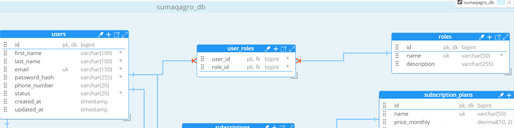
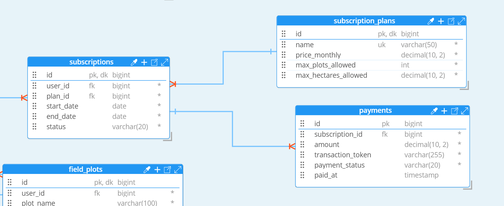
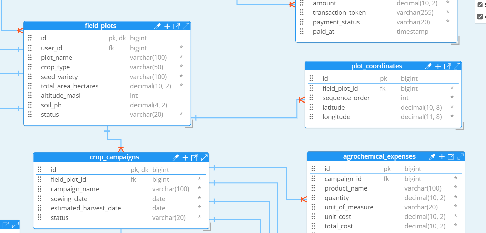
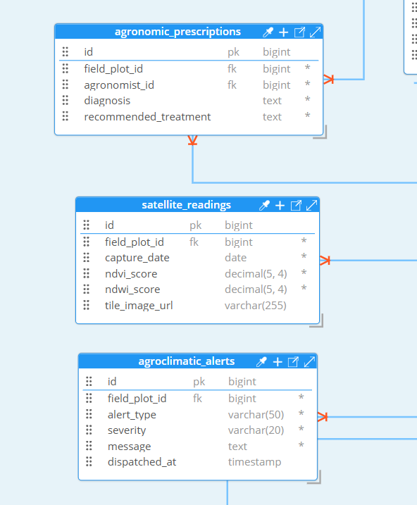
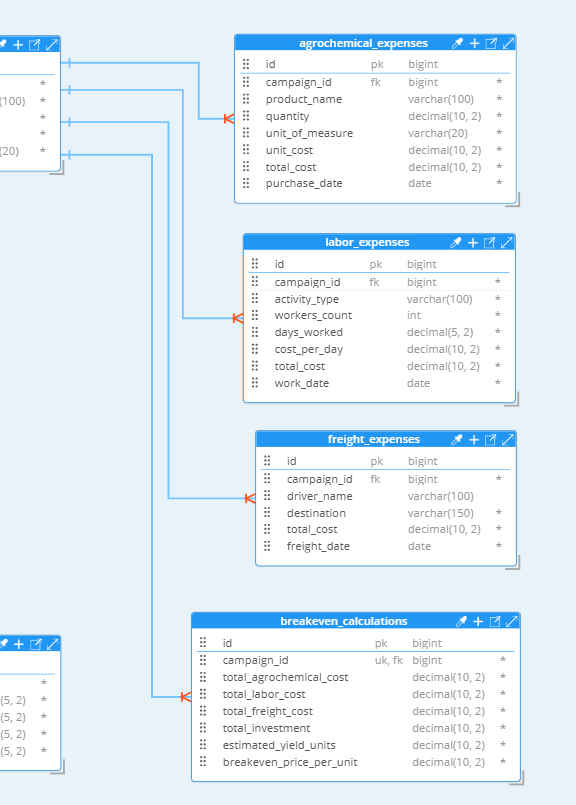
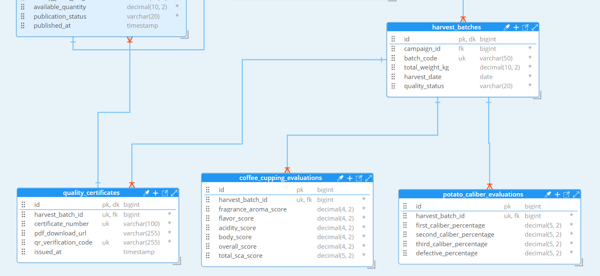
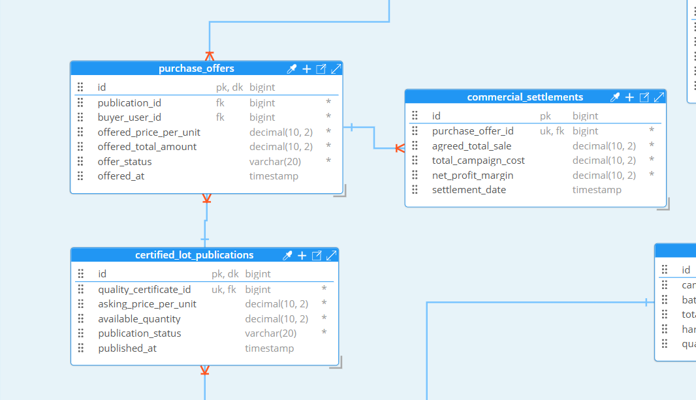

# Capítulo IV: Product Design

## 4.1. Style Guidelines
### 4.1.1. General Style Guidelines
### 4.1.2. Web Style Guidelines

## 4.2. Information Architecture
### 4.2.1. Organization Systems
### 4.2.2. Labeling Systems
### 4.2.3. SEO Tags and Meta Tags
### 4.2.4. Searching Systems
### 4.2.5. Navigation Systems

## 4.3. Landing Page UI Design
### 4.3.1. Landing Page Wireframe
### 4.3.2. Landing Page Mock-up

## 4.4. Web Applications UX/UI Design
### 4.4.1. Web Applications Wireframes
### 4.4.2. Web Applications Wireflow Diagrams
### 4.4.3. Web Applications Mock-ups
### 4.4.4. Web Applications User Flow Diagrams

## 4.5. Web Applications Prototyping

## 4.6. Domain-Driven Software Architecture
En esta sección se traslada la comprensión del negocio obtenida en el Big Picture Event Storming hacia el diseño de arquitectura de software guiado por el dominio (Domain-Driven Design - DDD) y el modelo de abstracción y comunicación visual C4 Model en sus niveles de Contexto, Contenedores y Componentes. A través de esta aproximación arquitectónica, se divide el espacio del problema en Bounded Contexts independientes y de bajo acoplamiento, estableciendo sus agregados transaccionales (Aggregates), comandos, eventos de dominio, modelos de consulta (Read Models) y políticas de automatización reactivas. Asimismo, se formaliza la topología técnica y modular de la solución distribuida, articulando la aplicación web de cara al usuario, el servicio de backend RESTful en Spring Boot, la base de datos relacional y las interfaces de integración con servicios externos.

---
### 4.6.1. Design-Level Event Storming
El equipo llevó a cabo una sesión sincrónica de trabajo colaborativo en Miro siguiendo las pautas metodológicas de la guía Design-Level EventStorming (<https://bit.ly/dles-guide>). La dinámica se enfocó en profundizar y refinar el modelo general del dominio de las cadenas de café de especialidad y papa andina, definiendo las reglas de invariante transaccional y la mecánica de ejecución del sistema.

#### Proceso y Actividades Realizadas en el Taller

Durante la dinámica colaborativa, el equipo ejecutó las siguientes actividades de modelado:

* **Presentación y encuadre del dominio objetivo:** Revisión de las fronteras preliminares identificadas en la fase Big Picture para acotar los flujos de alta criticidad del negocio y delimitar el Core Domain de la plataforma SaaS.
* **Refinamiento de eventos de dominio (Domain Events - Naranja):** Formalización de los hechos inmutables de negocio ocurridos en cada fase operativa, expresados estrictamente en tiempo pasado participio.
* **Incorporación de desencadenantes (Commands - Azul y Policies - Morado):** Asociación de las intenciones operativas formuladas en imperativo con sus respectivos ejecutores (actores o eventos previos). Se establecieron políticas reactivas bajo la convención *Whenever [Domain Event] Then [Command]* para orquestar la consistencia eventual entre distintos contextos.
* **Integración de proyecciones y actores (Read Models - Verde):** Identificación de las vistas de datos, reportes y tableros que los usuarios requieren para tomar decisiones antes de ejecutar un comando.
* **Mapeo de sistemas externos (External Systems - Rosa):** Identificación de pasarelas y servicios satelitales o gubernamentales ajenos a la solución que interactúan como emisores o receptores de datos.
* **Definición de reglas de negocio e invariantes (Aggregates - Amarillo):** Agrupación de datos y comportamientos transaccionales atómicos bajo raíces de agregación (Aggregate Roots) para garantizar la consistencia del estado del sistema en todo momento.

---
#### Evidencia del Modelado en Miro

A continuación se presenta la vista general del tablero desarrollado en Miro, evidenciando los 7 Bounded Contexts formalizados con sus respectivos agregados, comandos, eventos, modelos de lectura, integraciones externas y políticas de automatización:

* **Enlace interactivo al espacio de trabajo:** [Tablero de Event Storming en Miro](https://miro.com/welcomeonboard/WG5aQ1R0dmR5b0xQWTI5TEZvaXplRmpPTUxmT2pmR1NNVXBVakcxRFI5Yk16dVY3TXpRc0RwbHVKNWFndGJvZDZkZXJrbkN4VFZQdzhHTjV6MWdBNUJtQnhYMVFmcjNLbkxyOWQwZlVuWHVPRUdrWUJzeGVtb1g5cE9UeGFKdjJBd044SHFHaVlWYWk0d3NxeHNmeG9BPT0hdjE=?share_link_id=126689221129)

---
#### Alineación con Subdominios SaaS y Bounded Contexts

Considerando la estructura de subdominios recomendada para plataformas SaaS de servicios (gestión de identidades, suscripciones, recursos, ejecución de servicios y analítica) y adaptándola al *Ubiquitous Language* de la cadena de valor agroalimentaria, el dominio se estructuró en 7 Bounded Contexts:

**1. Identity & Access Management (IAM) Context (Generic Subdomain)**
* **Responsabilidad:** Administrar el ciclo de vida de identidades, perfiles, asignación de roles institucionales y provisión de credenciales seguras mediante tokens criptográficos JWT.
* **Agregado `UserAccount`:**
    * *Commands:* `CreateProducerAccount`, `RegisterCooperativeAccount`, `UpdateUserProfile`, `AssignCooperativeRole`, `InviteAgronomistToCooperative`.
    * *Events:* `ProducerAccountCreated`, `CooperativeAccountRegistered`, `UserProfileUpdated`, `CooperativeRoleAssigned`, `AgronomistInvitationSent`.
    * *Read Models:* `UserProfileDashboard`, `CooperativeMemberDirectory`.

**2. Subscriptions & Payments Context (Generic Subdomain)**
* **Responsabilidad:** Controlar la monetización SaaS, selección de planes comerciales (Semilla, Cooperativa Pro, Asesor Técnico), validación de transacciones y cuotas activas de parcelas.
* **Agregado `Subscription`:**
    * *Commands:* `SelectSubscriptionPlan`, `SubmitPaymentTransaction`, `ActivateSubscriptionPro`, `CancelSubscriptionPlan`.
    * *Events:* `SubscriptionPlanSelected`, `PaymentTransactionProcessed`, `SubscriptionProActivated`, `SubscriptionPlanCancelled`.
    * *Read Models:* `PricingCatalogView`, `BillingStatusLedger`.
    * *External System:* Stripe / Niubiz Payment Gateway.

**3. Plot & Crop Management Context (Supporting Subdomain)**
* **Responsabilidad:** Administrar la georreferenciación física de fundos y parcelas mediante coordenadas perimetrales continuas (polígonos GPS), caracterización de suelo e inicio fenológico.
* **Agregado `FieldPlot`:**
    * *Commands:* `RegisterFieldPlot`, `DelineatePerimeterCoordinates`, `RecordSoilBaseline`, `SelectCropType`, `SpecifySeedVariety`, `RecordSowingDate`.
    * *Events:* `FieldPlotRegistered`, `PerimeterCoordinatesDelineated`, `SoilBaselineRecorded`, `CropTypeSelected`, `SeedVarietySpecified`, `SowingDateRecorded`.
    * *Read Models:* `CadastralGISMap`, `CropPhenologyTimeline`.
    * *External System:* MIDAGRI Padrón de Productores (PPA) API.

**4. Satellite Analytics & Alerting Context (Core Subdomain)**
* **Responsabilidad:** Orquestar la observación terrestre multiespectral mediante Sentinel-2 para deducir vigor foliar (NDVI) y estrés hídrico (NDWI), despachar alertas preventivas y gestionar recetas técnicas de campo.
* **Agregado `VegetationAnalysis`:**
    * *Commands:* `FetchMultispectralTiles`, `ComputeVegetationIndexes`, `TriggerAgroclimaticAlert`, `UploadPestEvidencePhoto`, `ScheduleFieldInspection`, `RecordDamageAssessment`, `IssueTechnicalPrescription`, `ConfirmTreatmentApplication`.
    * *Events:* `MultispectralTilesIngested`, `NDVIIndexComputed`, `NDWIIndexComputed`, `VegetationAnomalyDetected`, `AgroclimaticAlertDispatched`, `PestEvidencePhotoUploaded`, `FieldInspectionScheduled`, `DamageAssessmentRecorded`, `TechnicalPrescriptionIssued`, `TreatmentApplicationConfirmed`.
    * *Read Models:* `SatelliteVegetationMap`, `MultispectralIndexDashboard`, `PhytosanitaryDiagnosisInbox`.
    * *External Systems:* Sentinel-2 Open Access API (ESA), SENAMHI Weather API, Twilio SMS / WhatsApp Gateway.

**5. Field Cost Accounting Context (Core Subdomain)**
* **Responsabilidad:** Proveer una bitácora contable rural para asentar compras de insumos, jornales diarios y fletes (con soporte de persistencia local desconectada), determinando el costo unitario por lote y el punto de equilibrio financiero.
* **Agregado `LotFinancialLedger`:**
    * *Commands:* `RecordAgrochemicalExpense`, `RecordDailyLaborExpense`, `RecordFieldFreightExpense`, `LogOfflineFieldExpense`, `SynchronizeFieldLedger`, `ConsolidateLotExpenses`, `CalculateBreakevenPrice`.
    * *Events:* `AgrochemicalExpenseRecorded`, `DailyLaborExpenseRecorded`, `FieldFreightExpenseRecorded`, `OfflineFieldExpenseLogged`, `FieldLedgerSynchronized`, `TotalLotInvestmentCalculated`, `BreakevenPriceCalculated`.
    * *Read Models:* `LotExpenseLogView`, `BreakevenAnalysisReport`.

**6. Harvest Quality & Certification Context (Core Subdomain)**
* **Responsabilidad:** Controlar la recolección, pesaje formal de acopio, calificación de calibres de tubérculo (MIDAGRI) y protocolos de catación sensorial SCA, emitiendo certificados digitales inmutables con código QR público.
* **Agregado `HarvestBatch`:**
    * *Commands:* `RegisterHarvestYield`, `WeighDeliveredLot`, `ExtractRepresentativeSample`, `GradePotatoCaliber`, `PerformCoffeeCuppingSCA`, `AssignQualityScore`, `GenerateDigitalQualityCertificate`, `VerifyLotTraceability`.
    * *Events:* `HarvestYieldRegistered`, `DeliveredLotWeighed`, `RepresentativeSampleExtracted`, `PotatoCaliberGraded`, `CoffeeCuppingCompleted`, `QualityScoreAssigned`, `DigitalQualityCertificateGenerated`, `TraceabilityQRCodeCreated`, `LotTraceabilityVerified`.
    * *Read Models:* `HarvestGradingSheet`, `PublicTraceabilityQRView`.
    * *External System:* Public QR Verification Gateway.

**7. Commercial Settlement Context (Core Subdomain)**
* **Responsabilidad:** Publicar lotes certificados en el catálogo comercial, gestionar las posturas de oferta de compradores mayoristas y liquidar la venta garantizando un margen por encima del costo de producción.
* **Agregado `CommercialSettlement`:**
    * *Commands:* `SetBaseSettlementPrice`, `PublishCertifiedLot`, `SubmitPurchaseOffer`, `AcceptLotSaleAndLiquidate`, `CalculateFinalNetMargin`.
    * *Events:* `BaseSettlementPriceSet`, `CertifiedLotPublished`, `PurchaseOfferReceived`, `LotSaleRegistered`, `NetIncomeCalculated`.
    * *Read Models:* `CertifiedLotCatalog`, `CommercialSettlementLedger`.

---
#### Políticas de Automatización Reactivas (Policies)
La orquestación entre los contextos delimitados se rige por políticas eventuales bajo el estándar *Whenever [Domain Event] Then [Command]*:
* **P1:** `Whenever ProducerAccountCreated Then SelectSubscriptionPlan`
* **P2:** `Whenever SubscriptionProActivated Then RegisterFieldPlot`
* **P3:** `Whenever SowingDateRecorded Then FetchMultispectralTiles`
* **P4:** `Whenever VegetationAnomalyDetected Then TriggerAgroclimaticAlert`
* **P5:** `Whenever TreatmentApplicationConfirmed Then RecordAgrochemicalExpense`
* **P6:** `Whenever DeliveredLotWeighed Then ConsolidateLotExpenses`
* **P7:** `Whenever DigitalQualityCertificateGenerated Then PublishCertifiedLot`
* **P8:** `Whenever BreakevenPriceCalculated Then SetBaseSettlementPrice`

### 4.6.2. Software Architecture Context Diagram

En este apartado se presenta el Diagrama de Contexto del Sistema (Nivel 1 del modelo C4), el cual delimita las fronteras operativas y de software de la plataforma **SumaqAgro**, ubicándola como la solución central del ecosistema. A través de esta vista de alto nivel, se establecen los canales de comunicación y flujos de información que mantiene el sistema tanto con los distintos perfiles de usuario identificados en la investigación como con los servicios externos de terceros necesarios para la operación agrícola. Siguiendo los lineamientos de arquitectura y el enfoque *Diagram-as-Code* exigido para el proyecto, el modelado se desarrolló mediante la herramienta **Structurizr** a través de su especificación formal en Structurizr DSL.

#### Explicación del Diagrama de Contexto

El diagrama sitúa en el centro a **SumaqAgro Platform**, plataforma web distribuida orientada a la agricultura de precisión, el cálculo de costos operativos de campo y la certificación de calidad para las cadenas de café de especialidad y papa andina. A su alrededor se articulan las siguientes interacciones:

##### 1. Actores y Usuarios del Dominio
* **Agricultural Producer (Productor Agrícola):** Agricultor que accede mediante navegadores web o dispositivos móviles para registrar la delimitación geográfica de sus parcelas, monitorear el vigor foliar satelital (NDVI/NDWI) y registrar sus compras de insumos, jornales y fletes en la bitácora de costos.
* **Cooperative Manager (Directivo de Cooperativa):** Usuario administrativo que utiliza la plataforma desde terminales de escritorio para auditar el volumen de acopio de los socios, monitorear los balances financieros por hectárea y aprobar formalmente la emisión de los certificados de calidad de cosecha.
* **Technical Field Advisor (Asesor Técnico de Campo):** Ingeniero agrónomo que hace seguimiento a las alertas satelitales tempranas de estrés hídrico o plagas para priorizar sus visitas presenciales en parcelas críticas, emitiendo recetas agronómicas y dosis correctivas desde la aplicación.
* **Wholesale Buyer (Comprador Mayorista / Exportador):** Usuario comercial que interactúa con la plataforma de forma abierta y sin necesidad de credenciales, escaneando el código QR público de los sacos o lotes para verificar en línea la procedencia geográfica, la variedad botánica y el perfil de calidad certificado.

##### 2. Sistemas Externos e Integraciones
* **Sentinel-2 Open Access API (ESA):** Proveedor satelital que suministra de manera periódica baldosas ópticas multiespectrales. El sistema consume este servicio vía peticiones HTTPS/JSON para computar los índices biofísicos de reflectancia vegetal sin depender de sensores IoT instalados en campo.
* **SENAMHI Weather API:** Servicio meteorológico nacional consultado por HTTPS/JSON para sincronizar pronósticos climáticos y emitir advertencias tempranas ante eventos de heladas meteorológicas o sequías estacionales en los valles productivos.
* **Twilio SMS / WhatsApp Gateway:** Pasarela de mensajería externa utilizada por SumaqAgro para remitir notificaciones prioritarias y alertas agroclimáticas urgentes a productores ubicados en zonas rurales con baja cobertura móvil de datos.
* **Stripe / Niubiz Payment Gateway:** Pasarela de procesamiento de pagos electrónicos integrada mediante API REST (HTTPS/JSON) para la gestión y cobro transaccional de los planes de suscripción de cooperativas agrarias y asesores técnicos.
* **MIDAGRI PPA API:** Servicio gubernamental del Padrón de Productores Agrarios consumido mediante HTTPS/JSON para validar la titularidad catastral de predios y la condición formal de los socios agrícolas.
* **Public QR Verification Gateway:** Punto de acceso web público y liviano que resuelve las peticiones de validación iniciadas por los compradores mayoristas al escanear los códigos QR, certificando la autenticidad e inmutabilidad del lote evaluado.

---
### 4.6.3. Software Architecture Container Diagrams

En esta sección se presenta y describe el Diagrama de Contenedores (Nivel 2 del modelo C4) de la plataforma **SumaqAgro**, el cual profundiza en la frontera del sistema para exponer su arquitectura técnica distribuida. Este diagrama muestra las unidades de despliegue y ejecución independientes que componen la solución, la distribución de responsabilidades entre ellas, las principales decisiones de tecnología adoptadas y los protocolos de red empleados para la comunicación interna y con sistemas externos. El modelado fue estructurado y generado formalmente mediante la especificación DSL de la herramienta **Structurizr**.

#### Asignación de Responsabilidades y Decisiones Tecnológicas

La topología de ejecución del sistema está conformada por cuatro contenedores independientes:

* **Landing Page Container:**
  Sitio web público estático desarrollado con HTML5, CSS3 y JavaScript vanilla, alojado en un servicio cloud de distribución estática. Diseñado con una carga ligera para garantizar un rendimiento óptimo en terminales móviles bajo redes rurales 3G/4G. Su propósito es exponer la propuesta de valor del producto, presentar los planes de suscripción comercial (Semilla, Cooperativa Pro y Asesor Técnico) y canalizar prospectos comerciales hacia el backend mediante llamadas asíncronas HTTPS/JSON.

* **Web Application Container (Single Page Application - SPA):**
  Aplicación web cliente desarrollada sobre el framework Angular 18, utilizando TypeScript y la biblioteca Angular Material. Provee una interfaz reactiva y accesible tanto para productores de campo como para administradores de cooperativas e ingenieros agrónomos. Integra capacidades de almacenamiento local mediante *Service Workers* e *IndexedDB*, lo que permite soportar operaciones en modo desconectado (*offline-first*) para el registro de jornales, compras e insumos en predios rurales sin cobertura de datos móvil, sincronizando la información automáticamente contra la API REST al recuperar la conexión a internet. Asimismo, aloja el visor público interactivo que permite auditar las credenciales y trazabilidad de los lotes cuando un comprador escanea el código QR impreso.

* **RESTful API Backend Container:**
  Servidor de aplicaciones distribuido implementado en Java 21 utilizando el framework Spring Boot 3.x (Spring MVC, Spring Security y Spring Data JPA). Representa el núcleo transaccional del sistema y aloja la lógica de negocio basada en DDD para los 7 Bounded Contexts identificados. Sus responsabilidades abarcan la emisión y validación de tokens criptográficos JWT para el control de accesos, el cómputo de las matrices financieras de costo unitario y punto de equilibrio rural, el procesamiento de reflectancia satelital desacoplado y la exposición de endpoints documentados formalmente bajo OpenAPI 3.0 (Swagger UI).

* **Database Engine Container:**
  Motor relacional MySQL 8.0 configurado como la unidad de persistencia de datos. Almacena las tablas normalizadas del dominio asegurando transacciones atómicas bajo el estándar ACID, soporte de integridad referencial mediante claves foráneas y compatibilidad con tipos de datos espaciales para el resguardo de las geometrías perimetrales de las parcelas agrícolas.

#### Protocolos de Interoperabilidad y Comunicación

* **Acceso de Usuarios:** Los usuarios finales interactúan con los contenedores web (*Landing Page* y *Web Application*) mediante peticiones seguras sobre el protocolo HTTPS.
* **Cliente Web a Backend:** La Single Page Application consume la lógica de negocio y envía datos locales sincronizados mediante llamadas asíncronas RESTful sobre HTTPS, transmitiendo datos estructurados en formato JSON protegidos con tokens de autorización Bearer JWT.
* **Backend a Base de Datos:** Las operaciones transaccionales y de persistencia de los agregados se ejecutan directamente a través de una conexión TCP protegida sobre el puerto 3306 mediante el controlador JDBC de MySQL.
* **Backend a Servicios Externos:** Las consultas salientes hacia Sentinel-2 API, SENAMHI Weather API, Twilio Gateway, Stripe/Niubiz y MIDAGRI PPA se realizan mediante clientes HTTP desacoplados bajo peticiones seguras HTTPS/JSON.
---

### 4.6.4. Software Architecture Components Diagrams

En esta sección se presentan y explican los Diagramas de Componentes (Nivel 3 del modelo C4) correspondientes a cada uno de los contenedores de software ejecutables que integran la plataforma **SumaqAgro**: la **Landing Page**, la **Web Application (Single Page Application en Angular 18)** y el **RESTful API Backend (Spring Boot 3.x)**. A través de estos diagramas se detalla la descomposición estructural interna de cada unidad de despliegue, identificando la naturaleza de sus componentes, sus responsabilidades de negocio asignadas, los detalles de implementación tecnológica y sus flujos de interacción internos y externos. El modelado fue desarrollado en **Structurizr** siguiendo la especificación formal de Structurizr DSL.

---

#### 4.6.4.1. Landing Page Container Components Diagram

El contenedor de la Landing Page descompone la estructura del sitio web estático público, diseñado con una arquitectura liviana orientada a maximizar la velocidad de carga y la tasa de conversión en dispositivos móviles bajo redes rurales 3G/4G.

##### Desglose de Componentes de la Landing Page:
* **`Navigation & Hero Component`:** Bloque estructural desarrollado con HTML5 semántico y maquetado responsivo mediante CSS3 Flexbox. Administra la barra de navegación superior, la identidad visual corporativa de SumaqAgro, la propuesta de valor agroclimática orientada a café de especialidad y papa andina, y el llamado a la acción (CTA) que conduce al formulario de registro y demostración.
* **`Pricing & Plans Catalog Component`:** Componente visual maquetado mediante CSS3 Grid. Presenta la matriz comparativa de los planes de suscripción comercial SaaS: el plan *Semilla* (gratuito para pequeños productores familiares), el plan *Cooperativa Pro* (para gremios con monitoreo consolidado de socios) y el plan *Asesor Técnico* (para agrónomos independientes con carteras de clientes).
* **`Lead Capture Form Component`:** Módulo interactivo implementado en JavaScript vanilla. Intercepta los eventos de ingreso de datos para solicitudes de contacto y demostraciones técnicas, ejecutando validaciones sintácticas del lado del cliente (formato regex de correo electrónico, longitud de número celular y campos obligatorios) para prevenir envíos incompletos a la red.
* **`Landing HTTP Client`:** Componente de comunicación asíncrona construido sobre la API nativa `Fetch` de JavaScript. Serializa las entradas del formulario hacia una carga útil JSON y despacha la petición POST sobre HTTPS hacia el endpoint `/api/v1/users` del backend transaccional, administrando los estados visuales de confirmación o alerta ante incidencias de conectividad.

---

#### 4.6.4.2. Web Application Container Components Diagram (Angular SPA)

El contenedor de la aplicación cliente SPA, implementado sobre el framework **Angular 18**, descompone sus módulos para brindar una experiencia de usuario interactiva y garantizar la persistencia local de datos en campo mediante capacidades desconectadas (*offline-first*).

##### Desglose de Componentes de la Web Application:
* **`Auth & Role Guard`:** Guardia funcional de enrutamiento (`CanActivateFn`) de Angular. Intercepta la navegación hacia rutas protegidas comprobando la vigencia del token JWT almacenado en `sessionStorage`, aplicando el control de acceso basado en roles (RBAC) para productores, directivos y agrónomos.
* **`Plot Management View Component`:** Interfaz gráfica desarrollada con Angular Material y Formularios Reactivos (`ReactiveFormsModule`). Permite la georreferenciación de predios, la captura interactiva de vértices perimetrales GPS y el registro botánico y fenológico de las campañas agrícolas.
* **`Vegetation & Alerting View Component`:** Componente analítico que integra la biblioteca Leaflet.js con Angular. Renderiza capas de calor satelitales con series temporales de reflectancia foliar (NDVI y NDWI), canalizando el buzón de alertas agroclimáticas y recetas fitosanitarias emitidas por el extensionista.
* **`Field Cost Ledger View Component`:** Módulo de captura contable rural que provee formularios reactivos para el asiento inmediato de compras de fertilizantes, jornales diarios y fletes, alimentando los paneles de estimación de costos unitarios y punto de equilibrio.
* **`Harvest & Traceability View Component`:** Vistas de calificación física de calibres de tubérculo (norma técnica MIDAGRI) y protocolos de catación sensorial de café (estándar SCA). Incluye el visor público accesible mediante el escaneo del código QR para la auditoría de procedencia de los lotes.
* **`Client State & Offline Store`:** Capa de almacenamiento transaccional local implementada con *IndexedDB* (mediante Dexie.js) coordinada con estados reactivos basados en `BehaviorSubject` de RxJS. Retiene las operaciones efectuadas en parcelas sin señal de red celular y orquesta la sincronización automática diferida en lote al detectar conectividad a internet.
* **`Service Worker Cache Engine`:** Módulo de Progressive Web App provisto por `@angular/pwa`. Almacena en caché los artefactos estáticos compilados (HTML, CSS, JavaScript e iconografía vectorial), asegurando la operatividad continua de la interfaz web en entornos rurales sin conexión.
* **`REST API Client Service`:** Servicio Angular centralizado (`@Injectable`) que encapsula la comunicación HTTPS con el backend mediante `HttpClient`. Emplea un `HttpInterceptor` que inyecta automáticamente el encabezado `Authorization: Bearer <JWT>` en cada solicitud saliente y unifica la gestión de excepciones HTTP de red.

---

#### 4.6.4.3. RESTful API Backend Container Components Diagram (Spring Boot)

El contenedor transaccional de backend, desarrollado en **Java 21 con Spring Boot 3.x**, implementa una arquitectura en capas desacopladas orientada al dominio (*Layered Architecture / DDD*), gobernando las reglas de negocio de los 7 Bounded Contexts y agregados de la solución.

##### Desglose de Componentes del Backend por Capa Técnica:

* **Capa de Controladores REST (Inbound Controllers):**
  Controladores anotados con `@RestController` que exponen los endpoints del sistema sobre HTTPS/JSON, interceptan las peticiones desde el cliente Angular, validan los DTOs de entrada mediante Bean Validation (`@Valid`) y delegan la ejecución hacia los servicios de aplicación:
  * `IamController`: Expone `/api/v1/auth` y `/api/v1/users` para registro, inicio de sesión seguro, emisión de JWT y gestión de perfiles institucionales.
  * `SubscriptionController`: Expone `/api/v1/subscriptions` para consulta de membresías y confirmación transaccional de planes comerciales.
  * `PlotController`: Expone `/api/v1/plots` para catastro de coordenadas GPS, delimitación perimetral y calendarios de siembra.
  * `MonitoringController`: Expone `/api/v1/monitoring` para mapas multiespectrales, series NDVI/NDWI y recetas agronómicas.
  * `CostController`: Expone `/api/v1/finances` para la bitácora financiera, sincronización diferida de asientos y cálculo de punto de equilibrio.
  * `QualityController`: Expone `/api/v1/harvests` para pesaje de acopio, catación SCA, graduación de calibres y certificados.
  * `SettlementController`: Expone `/api/v1/settlements` para publicación comercial de lotes y liquidaciones de venta.

* **Capa de Servicios de Aplicación (Domain Application Services):**
  Servicios anotados con `@Service` que orquestan las transacciones atómicas, validan las reglas de invariante de cada Agregado y coordinan las llamadas hacia los adaptadores salientes:
  * `UserAccountService`: Administra el ciclo de vida del agregado `UserAccount`, gestionando el hashing seguro de claves y la asignación de permisos.
  * `SubscriptionService`: Gobierna el agregado `Subscription`, controlando la vigencia de membresías y cuotas de predios asignados.
  * `FieldPlotService`: Administra el agregado `FieldPlot`, validando que los polígonos perimetrales no presenten autointersecciones.
  * `VegetationAnalysisService`: Gestiona el agregado `VegetationAnalysis`, calculando algoritmos de reflectancia sobre bandas satelitales y despachando alertas preventivas de estrés foliar.
  * `LotFinancialLedgerService`: Orquesta el agregado `LotFinancialLedger`, calculando la sumatoria de egresos operativos para deducir el costo unitario de producción y el precio de equilibrio.
  * `HarvestBatchService`: Supervisa el agregado `HarvestBatch`, validando umbrales mínimos de calidad sensorial y física antes de autorizar la emisión de acreditaciones.
  * `CommercialSettlementService`: Gobierna el agregado `CommercialSettlement`, protegiendo que la postura comercial aceptada cubra el margen mínimo de ganancia sobre el costo acumulado.

* **Capa de Adaptadores de Infraestructura (Outbound Adapters):**
  Componentes de integración desacoplados anotados con `@Component` que encapsulan la comunicación técnica con plataformas externas o compilan artefactos binarios:
  * `StripeClientAdapter`: Consume mediante cliente REST la API de Stripe/Niubiz para la tokenización de cobros y facturación recurrente.
  * `MidagriClientAdapter`: Consulta el servicio gubernamental del Padrón de Productores Agrarios (PPA) para verificar la titularidad catastral.
  * `SatelliteClientAdapter`: Descarga baldosas ópticas multiespectrales (Bandas B4, B8 y B8A) desde la API abierta de Sentinel-2 (ESA).
  * `WeatherClientAdapter`: Consume los pronósticos agroclimáticos y alertas meteorológicas de SENAMHI.
  * `TwilioNotificationAdapter`: Invoca la API de Twilio para remitir notificaciones prioritarias de emergencia vía SMS y WhatsApp.
  * `PdfQrGeneratorAdapter`: Compila dinámicamente constancias técnicas en formato PDF y codifica el código QR de validación criptográfica pública.

* **Capa de Persistencia (Spring Data JPA Repositories):**
  Interfaces que extienden de `JpaRepository` para mapear los agregados hacia las tablas de la base de datos MySQL 8.0 vía JDBC sobre el puerto TCP 3306:
  * `UserAccountRepository`, `SubscriptionRepository`, `FieldPlotRepository`, `VegetationAnalysisRepository`, `CostLedgerRepository`, `HarvestBatchRepository` y `CommercialSettlementRepository`.
---

## 4.7. Software Object-Oriented Design

En este apartado bajamos el diseño de arquitectura a un nivel más concreto de implementación técnica, traduciendo lo definido en el Event Storming y los componentes de Spring Boot hacia diagramas de clases UML para cada Bounded Context. El objetivo es estructurar cómo se organizan internamente los paquetes, las entidades del dominio, las raíces de agregado (Aggregate Roots), los objetos de valor (Value Objects), los controladores REST, los servicios de aplicación y los repositorios de persistencia.

Para mantener una arquitectura limpia y desacoplada, el diseño sigue los principios SOLID y las convenciones de Domain-Driven Design (DDD). De esta forma aseguramos que la lógica del negocio permanezca independiente de la infraestructura web o de la base de datos, facilitando el mantenimiento y las pruebas unitarias del software.

---

### 4.7.1. Class Diagrams

En esta sección se presentan y explican en detalle los Diagramas de Clases de UML para cada uno de los Bounded Contexts que conforman el backend transaccional de la plataforma **SumaqAgro**. Cada modelo detalla los modificadores de acceso estandarizados (`-` para miembros privados, `+` para miembros públicos y `#` para miembros protegidos), los tipos de datos en atributos y parámetros, los valores de retorno en métodos, las cardinalidades en ambos extremos de cada asociación y la semántica formal de las relaciones (composición para fronteras de agregación, asociación calificada, dependencia `<<use>>` e implementación de interfaces).

---

#### 4.7.1.1. Identity & Access Management (IAM) Context Class Diagram

El Bounded Context de Identity & Access Management modela la gestión de identidades digitales, la autenticación sin estado mediante tokens criptográficos JWT y el control de accesos basado en roles institucionales (RBAC).

##### Desglose Estructural de Clases y Componentes:

* **`UserAccount` (Aggregate Root):**
  Constituye la raíz de consistencia transaccional del contexto, protegiendo las invariantes asociadas al ciclo de vida de la cuenta.
    * **Atributos privados:**
        * `- id: Long`: Identificador único secuencial de la entidad dentro de la base de datos.
        * `- fullName: String`: Nombre completo o razón social del titular registrado.
        * `- isActive: Boolean`: Bandera booleana que determina si la cuenta se encuentra habilitada para iniciar sesión.
        * `- registeredAt: LocalDateTime`: Marca temporal de auditoría que registra la fecha y hora de creación.
        * `- email: Email`: Objeto de valor que resguarda la dirección de correo validada.
        * `- password: PasswordHash`: Objeto de valor que almacena el hash criptográfico de la clave de acceso.
    * **Métodos públicos:**
        * `+ UserAccount(fullName: String, email: Email, password: PasswordHash)`: Constructor que inicializa una cuenta activa con fecha actual.
        * `+ activate(): void`: Cambia el estado de `isActive` a verdadero.
        * `+ deactivate(): void`: Inhabilita la cuenta para bloquear accesos transaccionales.
        * `+ assignRole(role: Role): void`: Vincula un nuevo rol institucional a la colección interna del usuario.
        * `+ removeRole(role: Role): void`: Remueve un rol previamente concedido garantizando que al menos quede un rol base.
        * `+ updateProfile(fullName: String): void`: Muta el nombre del titular previa validación de longitud.
        * `+ getId(): Long`, `+ getFullName(): String`, `+ getEmail(): Email`, `+ getRoles(): List<Role>`: Métodos de lectura de estado.

* **`Role` (Entity) y `RoleType` (Enumeration):**
  Representa el permiso concedido al usuario. `Role` contiene el atributo privado `- id: Long` y `- roleType: RoleType`. La enumeración `RoleType` tipifica estrictamente las etiquetas de autorización: `ROLE_PRODUCER` (productores familiares), `ROLE_COOPERATIVE` (directivos de acopio), `ROLE_AGRONOMIST` (asesores técnicos) y `ROLE_BUYER` (compradores mayoristas).

* **`Email` y `PasswordHash` (Value Objects):**
    * `Email`: Objeto inmutable con el atributo privado `- address: String`. Su constructor valida la conformidad con la expresión regular de correo electrónico estándar RFC 5322; expone `+ getAddress(): String` y sobrescribe `equals()` y `hashCode()`.
    * `PasswordHash`: Contiene `- hashValue: String`. Encapsula el algoritmo de derivación de claves BCrypt; expone `+ verifyPassword(plainTextPassword: String): Boolean` para comparar credenciales sin exponer la contraseña en texto plano y `+ getHashValue(): String`.

* **`UserAccountRepository` (Domain Repository Interface):**
  Interfaz que abstrae las operaciones de persistencia mediante Spring Data JPA. Define los contratos `+ findById(id: Long): Optional<UserAccount>`, `+ findByEmail(email: Email): Optional<UserAccount>`, `+ existsByEmail(email: Email): Boolean`, `+ save(user: UserAccount): UserAccount` y `+ delete(user: UserAccount): void`.

* **`UserAccountService` y `UserAccountServiceImpl` (Application Layer):**
  Define y ejecuta la orquestación de casos de uso de seguridad. `UserAccountServiceImpl` posee dependencias privadas hacia `UserAccountRepository` y `JwtTokenService`; implementa `+ registerProducer(cmd: RegisterProducerCommand): Long`, `+ registerCooperative(cmd: RegisterCooperativeCommand): Long`, `+ authenticate(cmd: SignInCommand): String` y `+ findById(id: Long): Optional<UserAccount>`.

* **`IamController` (REST Controller Interface Layer):**
  Punto de entrada HTTP expuesto bajo `/api/v1/auth` y `/api/v1/users`. Inyecta `UserAccountService` y expone `+ signUpProducer(resource: SignUpProducerResource): ResponseEntity<Long>`, `+ signUpCooperative(resource: SignUpCooperativeResource): ResponseEntity<Long>` y `+ signIn(resource: SignInResource): ResponseEntity<AuthenticatedUserResource>`.

##### Relaciones y Cardinalidades del Contexto:
* **Composición (`UserAccount` "1" *-- "1..*" `Role`):** Una cuenta de usuario es dueña del ciclo de vida de sus roles asignados; no pueden existir roles huérfanos sin una cuenta asociada. Un usuario posee como mínimo un rol (`1..*`).
* **Asociación dirigida (`Role` --> "1" `RoleType`):** Cada entidad `Role` referencia exactamente a un valor de la enumeración `RoleType`.
* **Composición (`UserAccount` *-- "1" `Email` y `PasswordHash`):** La identidad y la seguridad son parte constituyente e inseparable del agregado.
* **Dependencia de uso (`IamController` ..> `UserAccountService`):** El controlador delega comandos hacia el servicio de aplicación.
* **Dependencia de uso y gestión (`UserAccountServiceImpl` ..> `UserAccount` y `UserAccountRepository`):** El servicio gestiona la mutación del agregado e interactúa con el repositorio para persistir los cambios vía JDBC.

---

#### 4.7.1.2. Subscriptions & Payments Context Class Diagram

Este contexto delimita el modelo de monetización SaaS, gobernando la activación comercial de planes, las cuotas de predios asignadas y la interoperabilidad con pasarelas de pago externas.

##### Desglose Estructural de Clases y Componentes:

* **`Subscription` (Aggregate Root):**
  Controla los límites y la vigencia comercial del acceso al servicio.
    * **Atributos privados:**
        * `- id: Long`: Identificador de la suscripción.
        * `- userId: Long`: Identificador del usuario o cooperativa titular (referencia por identidad hacia IAM).
        * `- planTier: PlanTier`: Categoría del plan contratado.
        * `- startDate: LocalDate`: Fecha inicial de vigencia.
        * `- endDate: LocalDate`: Fecha de vencimiento de la membresía.
        * `- isActive: Boolean`: Estado transaccional del servicio contratado.
        * `- maxAllowedPlots: Integer`: Cuota máxima permitida de parcelas registrables.
        * `- transactions: List<PaymentTransaction>`: Colección histórica de cobros asociados.
    * **Métodos públicos:**
        * `+ Subscription(userId: Long, planTier: PlanTier, months: Integer)`: Constructor que establece fechas y cuota base.
        * `+ activate(): void`: Habilita la suscripción tras la confirmación del pago.
        * `+ renew(months: Integer): void`: Extiende la fecha de término por el periodo pagado.
        * `+ cancel(): void`: Inhabilita la renovación automática y actualiza `isActive` a falso.
        * `+ hasPlotQuotaAvailable(currentCount: Integer): Boolean`: Valida si el cliente aún puede registrar parcelas adicionales.

* **`PaymentTransaction` (Entity):**
  Registra cada evento de cobro monetario. Contiene `- id: Long`, `- externalTransactionId: String` (código devuelto por la pasarela), `- paymentDate: LocalDateTime`, `- amount: Money` y `- status: PaymentStatus`. Expone `+ markAsCompleted(): void` y `+ markAsFailed(reason: String): void`.

* **`Money` (Value Object):**
  Encapsula importes con precisión contable. Posee los atributos privados `- amount: BigDecimal` y `- currency: String`. Expone métodos inmutables como `+ add(other: Money): Money`, impidiendo operaciones aritméticas erróneas entre monedas distintas.

* **`PlanTier` y `PaymentStatus` (Enumerations):**
    * `PlanTier`: Define los niveles `FREE_SEED` (plan base individual), `COOPERATIVE_PRO` (gestión gremial multivariable) y `TECHNICAL_ADVISOR` (cartera agronómica).
    * `PaymentStatus`: Fases de cobro `PENDING`, `COMPLETED` y `FAILED`.

* **`StripeClientAdapter` (Outbound Infrastructure Adapter):**
  Cliente tipado anotado con `@Component` que encapsula las credenciales y llamadas seguras HTTPS/JSON hacia la API de pagos mediante `+ chargeCard(token: String, amount: Money): String`.

* **`SubscriptionRepository`, `SubscriptionService` y `SubscriptionController`:**
  El repositorio declara `+ findByUserId(userId: Long): Optional<Subscription>`. El servicio orquesta `+ selectPlan(cmd: SelectPlanCommand): Long` y `+ processPayment(cmd: ProcessPaymentCommand): Boolean`. El controlador atiende peticiones REST bajo `/api/v1/subscriptions`.

##### Relaciones y Cardinalidades del Contexto:
* **Composición (`Subscription` "1" *-- "0..*" `PaymentTransaction`):** Las transacciones financieras están subordinadas al contrato de suscripción.
* **Composición (`PaymentTransaction` *-- "1" `Money`):** El valor económico es intrínseco al comprobante de cobro.
* **Asociación dirigida hacia Enums:** `Subscription` apunta a `PlanTier` (`1`), y `PaymentTransaction` apunta a `PaymentStatus` (`1`).
* **Dependencias:** `SubscriptionController` consume `SubscriptionService`, el cual depende de `SubscriptionRepository` y de `StripeClientAdapter` para interactuar con la pasarela externa.

---

#### 4.7.1.3. Plot & Crop Management Context Class Diagram

Gestiona la delimitación espacial y catastral de predios agrícolas, los atributos físico-químicos del suelo y las campañas fenológicas de cultivo.

##### Desglose Estructural de Clases y Componentes:

* **`FieldPlot` (Aggregate Root):**
  Raíz de agregación que salvaguarda la integridad geográfica de la parcela.
    * **Atributos privados:**
        * `- id: Long`: Identificador único del predio.
        * `- producerId: Long`: Vínculo referencial hacia el productor titular en IAM.
        * `- plotName: String`: Nombre o denominación común del lote.
        * `- calculatedAreaHectares: Double`: Superficie calculada de forma computacional en hectáreas.
        * `- perimeter: PerimeterCoordinates`: Geometría vectorial cerrada del lote.
        * `- soil: SoilBaseline`: Caracterización inicial de suelo.
        * `- crop: CropBatch`: Cultivo actualmente instalado en el terreno.
    * **Métodos públicos:**
        * `+ FieldPlot(producerId: Long, plotName: String, perimeter: PerimeterCoordinates)`: Inicializa la parcela validando topología.
        * `+ updatePerimeter(newPerimeter: PerimeterCoordinates): void`: Recalcula el área y reemplaza las coordenadas perimetrales.
        * `+ registerSoilAnalysis(soil: SoilBaseline): void`: Asocia los resultados de laboratorio del suelo.
        * `+ startCropCampaign(crop: CropBatch): void`: Asigna un nuevo lote fenológico de siembra.

* **`PerimeterCoordinates` y `GeoPoint` (Value Objects):**
    * `GeoPoint`: Encapsula un vértice geográfico mediante `- latitude: Double` y `- longitude: Double`, validando los rangos estándar de latitud (-90 a 90) y longitud (-180 a 180).
    * `PerimeterCoordinates`: Encapsula la lista privada `- points: List<GeoPoint>`. Su método `+ validatePolygonClosure(): Boolean` asegura que el vértice final coincida con el inicial, mientras que `+ computeAreaHectares(): Double` calcula el área utilizando el algoritmo de la fórmula de Shoelace proyectada.

* **`SoilBaseline` y `CropBatch` (Entities):**
    * `SoilBaseline`: Contiene `- textureType: String`, `- phLevel: Double` y `- organicMatterPercentage: Double`.
    * `CropBatch`: Contiene `- cropType: CropType`, `- seedVariety: String` (ej. Typica, Caturra, Canchán, Yungay) y `- sowingDate: LocalDate`. `CropType` tipifica `SPECIALTY_COFFEE` o `ANDEAN_POTATO`.

* **`MidagriClientAdapter` (Outbound Infrastructure Adapter):**
  Componente que interactúa con el Padrón de Productores Agrarios del MIDAGRI mediante `+ validateProducerCadastralId(producerDni: String, cadastralCode: String): Boolean`.

##### Relaciones y Cardinalidades del Contexto:
* **Composición (`FieldPlot` "1" *-- "1" `PerimeterCoordinates`):** Toda parcela posee obligatoriamente una frontera geométrica.
* **Composición (`PerimeterCoordinates` "1" *-- "3..*" `GeoPoint`):** Un polígono válido requiere como mínimo tres vértices cerrados (`3..*`).
* **Composición (`FieldPlot` "1" *-- "1" `SoilBaseline` y `FieldPlot` "1" *-- "0..1" `CropBatch`):** La línea base de suelo es obligatoria, mientras que la siembra es opcional según el ciclo productivo.
* **Dependencias:** `FieldPlotServiceImpl` orquesta el agregado utilizando `FieldPlotRepository` y valida la formalidad del predio mediante `MidagriClientAdapter`.

---

#### 4.7.1.4. Satellite Analytics & Alerting Context Class Diagram

Este contexto centraliza la captura de telemetría espectral provista por Sentinel-2, el cálculo de algoritmos biofísicos de salud vegetal y la emisión de diagnósticos y prescripciones técnicas.

##### Desglose Estructural de Clases y Componentes:

* **`VegetationAnalysis` (Aggregate Root):**
  Consolida el estado biofísico de un predio en un punto específico en el tiempo.
    * **Atributos privados:**
        * `- id: Long`: Identificador del registro analítico.
        * `- plotId: Long`: Parcela evaluada.
        * `- captureDate: LocalDate`: Fecha de adquisición de la baldosa satelital.
        * `- cloudCoveragePercentage: Double`: Porcentaje de cobertura nubosa detectado.
        * `- ndvi: NdviReading`: Valor computado del índice de vegetación normalizado.
        * `- ndwi: NdwiReading`: Valor computado del índice diferencial de agua.
        * `- alerts: List<AgroclimaticAlert>`: Alertas preventivas emitidas.
        * `- prescriptions: List<TechnicalPrescription>`: Recetas técnicas registradas por agrónomos.
    * **Métodos públicos:**
        * `+ evaluateVegetativeHealth(): void`: Compara los índices contra umbrales basales para detectar estrés biótico o abiótico.
        * `+ triggerAlert(alert: AgroclimaticAlert): void`: Anexa una advertencia ante caídas bruscas de reflectancia.
        * `+ addPrescription(rx: TechnicalPrescription): void`: Incorpora la prescripción correctiva del asesor técnico.

* **`NdviReading` y `NdwiReading` (Value Objects):**
  Encapsulan los índices matemáticos mediante `- value: Double`, validando en sus constructores que el valor numérico se sitúe estrictamente en el intervalo $[-1.0, 1.0]$. `NdviReading` provee `+ isStressAnomaly(): Boolean` (activo si el valor cae por debajo de 0.40 en etapas de floración o crecimiento), y `NdwiReading` expone `+ isWaterDeficit(): Boolean`.

* **`AgroclimaticAlert` y `TechnicalPrescription` (Entities):**
    * `AgroclimaticAlert`: Modela eventos de riesgo; posee `- alertType: String`, `- severity: AlertSeverity` (`LOW`, `MEDIUM`, `CRITICAL`), `- message: String` y `- emittedAt: LocalDateTime`.
    * `TechnicalPrescription`: Receta de campo; posee `- advisorId: Long`, `- diagnosis: String`, `- correctiveTreatment: String`, `- dosage: String` y `- isApplied: Boolean`, exponiendo `+ markAsApplied(): void`.

* **Adaptadores de Integración (`SatelliteClientAdapter`, `WeatherClientAdapter`, `TwilioNotificationAdapter`):**
    * `SatelliteClientAdapter`: Descarga bandas ópticas multiespectrales B4, B8 y B8A desde la API de Sentinel-2.
    * `WeatherClientAdapter`: Consume alertas climáticas y pronósticos de heladas de SENAMHI.
    * `TwilioNotificationAdapter`: Remite notificaciones de emergencia mediante SMS y WhatsApp a terminales de agricultores en zonas con baja conectividad.

##### Relaciones y Cardinalidades del Contexto:
* **Composición (`VegetationAnalysis` "1" *-- "1" `NdviReading` y `NdwiReading`):** Los índices satelitales son inseparables del informe espectral.
* **Composición (`VegetationAnalysis` "1" *-- "0..*" `AgroclimaticAlert` y `TechnicalPrescription`):** El análisis de una fecha puede generar múltiples alertas y albergar varias prescripciones correctivas.
* **Dependencias:** `VegetationAnalysisServiceImpl` consume los adaptadores satelitales, meteorológicos y de mensajería para orquestar la ingesta y respuesta agronómica.

---

#### 4.7.1.5. Field Cost Accounting Context Class Diagram

Modela la contabilidad analítica de costos agrícolas, soportando la sincronización de bitácoras sin conexión (*offline-first*) y el cálculo computacional del punto de equilibrio financiero.

##### Desglose Estructural de Clases y Componentes:

* **`LotFinancialLedger` (Aggregate Root):**
  Libro mayor contable que centraliza las inversiones operativas de una campaña productiva.
    * **Atributos privados:**
        * `- id: Long`: Identificador del libro financiero.
        * `- plotId: Long`: Parcela vinculada a la campaña.
        * `- campaignYear: Integer`: Año o ciclo agrícola correspondiente.
        * `- totalInvested: Money`: Inversión acumulada consolidada.
        * `- estimatedYieldUnits: Double`: Rendimiento estimado o real expresado en sacos o toneladas.
        * `- breakeven: BreakevenPrice`: Objeto de valor con el umbral financiero mínimo.
        * `- expenses: List<ExpenseEntry>`: Asientos contables individuales.
    * **Métodos públicos:**
        * `+ recordExpense(entry: ExpenseEntry): void`: Registra un gasto individual actualizando la sumatoria acumulada.
        * `+ syncOfflineBatch(entries: List<ExpenseEntry>): void`: Procesa asientos diferidos provenientes del almacenamiento local del cliente.
        * `+ consolidateFinances(finalYieldUnits: Double): void`: Cierra el ciclo contable calculando los costos unitarios definitivos.
        * `+ calculateBreakeven(): BreakevenPrice`: Ejecuta la fórmula financiera dividiendo el total invertido entre el volumen cosechado.

* **`ExpenseEntry` (Entity) y `ExpenseCategory` (Enumeration):**
  Modela cada egreso operativo. Contiene `- id: Long`, `- category: ExpenseCategory`, `- concept: String`, `- expenseDate: LocalDate`, `- amount: Money` y `- isOfflineSync: Boolean`. `ExpenseCategory` clasifica el gasto en `AGROCHEMICALS` (fertilizantes y plaguicidas), `LABOR_PAYROLL` (jornales de campo), `FREIGHT_TRANSPORT` (flete rural) o `MACHINERY_SERVICES` (alquiler de tractor o despulpadoras).

* **`BreakevenPrice` (Value Object):**
  Almacena de forma inmutable el resultado del costeo financiero mediante `- unitCostPerBag: BigDecimal` y `- suggestedSalePrice: BigDecimal` (precio con margen de utilidad proyectado).

* **`LotFinancialLedgerRepository`, `LotFinancialLedgerService` y `CostController`:**
  El repositorio permite la consulta mediante `+ findByPlotIdAndCampaignYear(plotId: Long, year: Integer)`. El servicio orquesta `+ recordExpense()`, `+ syncOfflineLedger()` y `+ computeBreakeven()`. El controlador REST expone los endpoints en `/api/v1/finances`.

##### Relaciones y Cardinalidades del Contexto:
* **Composición (`LotFinancialLedger` "1" *-- "1..*" `ExpenseEntry`):** Un libro contable se compone necesariamente de uno o más asientos de egreso.
* **Composición (`LotFinancialLedger` *-- "1" `Money` y `0..1` `BreakevenPrice`):** El balance acumulado y el punto de equilibrio son partes integrales del estado del libro contable.
* **Asociación dirigida (`ExpenseEntry` --> "1" `ExpenseCategory`):** Todo asiento está unívocamente tipificado por una categoría operativa.

---

#### 4.7.1.6. Harvest Quality & Certification Context Class Diagram

Este contexto delimita el pesaje formal de acopio, la graduación física de tubérculos de papa, la catación organoléptica de café bajo normas internacionales y la emisión del certificado inmutable avalado con código QR.

##### Desglose Estructural de Clases y Componentes:

* **`HarvestBatch` (Aggregate Root):**
  Representa el lote material acopiado y sometido a verificación técnica.
    * **Atributos privados:**
        * `- id: Long`: Identificador del lote de cosecha.
        * `- plotId: Long`: Referencia al predio de procedencia.
        * `- harvestDate: LocalDate`: Fecha formal de recolección.
        * `- netWeightKg: Double`: Masa neta recepcionada en balanza.
        * `- cuppingSession: CoffeeCuppingSession`: Evaluación sensorial de café (si aplica).
        * `- caliberGrading: PotatoCaliberGrading`: Graduación morfométrica de papa (si aplica).
        * `- certificate: QualityCertificate`: Acreditación digital emitida.
    * **Métodos públicos:**
        * `+ recordDeliveryWeight(netWeightKg: Double): void`: Registra el pesaje oficial de entrega.
        * `+ gradeCoffee(cupping: CoffeeCuppingSession): void`: Asocia los puntajes de cata sensorial.
        * `+ gradePotato(caliber: PotatoCaliberGrading): void`: Asocia los calibres físicos clasificados.
        * `+ issueDigitalCertificate(cert: QualityCertificate): void`: Emite el certificado inmutable con firma digital.

* **`CoffeeCuppingSession` (Entity):**
  Modela el protocolo de catación según el estándar SCA. Contiene `- fragranceAroma: Double`, `- acidity: Double`, `- body: Double`, `- balance: Double` y `- overallScore: Double`. Expone `+ computeTotalScaScore(): Double` y `+ isSpecialtyCoffee(): Boolean` (válido si el puntaje final supera los 80 puntos SCA).

* **`PotatoCaliberGrading` (Entity) y `PotatoCaliberType` (Enumeration):**
  Evalúa el tubérculo según la norma técnica peruana del MIDAGRI. Posee `- caliberType: PotatoCaliberType` (`FIRST_CLASS`, `SECOND_CLASS`, `THIRD_CLASS`), `- sampleWeightGrams: Double` y `- commercialSuitability: Boolean`.

* **`QualityCertificate` (Value Object):**
  Encapsula la acreditación inmutable mediante `- certificateCode: String`, `- digitalSignatureHash: String` (código hash SHA-256 generado sobre los atributos del lote), `- publicVerificationUrl: String` y `- issuedAt: LocalDateTime`.

* **`PdfQrGeneratorAdapter` (Outbound Infrastructure Adapter):**
  Generador técnico que sintetiza el reporte formal en un arreglo binario `byte[]` en formato PDF e incrusta el código QR direccionado a la URL pública de validación.

##### Relaciones y Cardinalidades del Contexto:
* **Composición (`HarvestBatch` "1" *-- "0..1" `CoffeeCuppingSession` / `PotatoCaliberGrading`):** La evaluación técnica depende del tipo botánico del cultivo cosechado en la parcela.
* **Composición (`HarvestBatch` "1" *-- "0..1" `QualityCertificate`):** El certificado digital se expide únicamente tras concluir el pesaje y la calificación técnica.
* **Dependencias:** `HarvestBatchServiceImpl` orquesta el agregado y delega en `PdfQrGeneratorAdapter` la construcción de los artefactos visuales de verificación.

---

#### 4.7.1.7. Commercial Settlement Context Class Diagram

Gobierna la publicación en catálogo de los lotes certificados, la recepción de ofertas comerciales emitidas por compradores mayoristas y la liquidación transaccional asegurando el margen neto sobre el costo de producción.

##### Desglose Estructural de Clases y Componentes:

* **`CommercialSettlement` (Aggregate Root):**
  Controla el acuerdo comercial y la liquidación financiera de la venta.
    * **Atributos privados:**
        * `- id: Long`: Identificador de la negociación.
        * `- harvestBatchId: Long`: Referencia al lote certificado disponible.
        * `- baseNegotiationPrice: Money`: Precio de apertura establecido para la venta.
        * `- status: SettlementStatus`: Fase actual del ciclo de vida comercial.
        * `- acceptedOffer: PurchaseOffer`: Oferta comercial formalmente aceptada por el productor o directivo.
        * `- netMargin: NetMargin`: Margen de ganancia neta consolidado.
        * `- offers: List<PurchaseOffer>`: Lista de propuestas de compra recibidas.
    * **Métodos públicos:**
        * `+ publishLot(): void`: Transiciona el estado a publicado en el catálogo mayorista.
        * `+ receiveOffer(offer: PurchaseOffer): void`: Añade una propuesta de compra a la negociación.
        * `+ acceptOfferAndLiquidate(offerId: Long, productionCost: Money): void`: Acepta la oferta seleccionada, calcula el margen neto resultante y cambia el estado a liquidado (`LIQUIDATED`).

* **`PurchaseOffer` (Entity):**
  Propuesta económica vinculada al lote. Contiene `- id: Long`, `- buyerId: Long`, `- offeredPrice: Money`, `- offeredAt: LocalDateTime` y `- isAccepted: Boolean`. Expone `+ accept(): void` y `+ reject(): void`.

* **`SettlementStatus` (Enumeration) y `NetMargin` (Value Object):**
    * `SettlementStatus`: Máquina de estados de la venta: `DRAFT`, `PUBLISHED`, `OFFER_RECEIVED`, `ACCEPTED` y `LIQUIDATED`.
    * `NetMargin`: Objeto inmutable que almacena `- netProfitAmount: BigDecimal` y `- marginPercentage: Double`, garantizando que la liquidación visualice la rentabilidad final obtenida.

* **`CommercialSettlementRepository`, `CommercialSettlementService` y `SettlementController`:**
  El repositorio declara `+ findByHarvestBatchId(batchId: Long): Optional<CommercialSettlement>`. El servicio orquesta `+ publishCertifiedLot()`, `+ submitBidOffer()` y `+ settleCommercialSale()`. El controlador REST expone los endpoints bajo `/api/v1/settlements`.

##### Relaciones y Cardinalidades del Contexto:
* **Composición (`CommercialSettlement` "1" *-- "0..*" `PurchaseOffer`):** Un acuerdo comercial puede recibir múltiples ofertas mayoristas en competencia (`0..*`).
* **Composición (`CommercialSettlement` *-- "1" `Money` y `0..1` `NetMargin`):** El precio base y el margen neto final son parte constituyente del agregado.
* **Asociación dirigida (`CommercialSettlement` --> "1" `SettlementStatus`):** El ciclo de vida de la comercialización está regido por la enumeración de estados.
* **Dependencias:** `SettlementController` utiliza `CommercialSettlementService`, el cual opera sobre el agregado `CommercialSettlement` y persiste su estado mediante `CommercialSettlementRepository`.lSettlementRepository` (Domain Repository):** Persiste los contratos y acuerdos transaccionales en la base de datos relacional.

---

## 4.8. Database Design

En esta sección se presenta el diseño lógico y físico de la base de datos relacional para la plataforma **SumaqAgro**. El diseño de persistencia se ha estructurado utilizando **MySQL 8.0** como motor gestor de base de datos (RDBMS), garantizando cumplimiento de propiedades ACID, integridad referencial inmutable y soporte de datos espaciales (GIS) para los polígonos perimetrales GPS de las parcelas agrícolas.

Para mantener una alineación estricta con la arquitectura de software basada en **Domain-Driven Design (DDD)** establecida en la sección 4.6 y los diagramas de clases orientados a objetos de la sección 4.7, el esquema de base de datos se encuentra completamente desacoplado y organizado por **Bounded Contexts**. Esta separación previene acoplamientos innecesarios entre dominios y facilita la evolución o eventual migración hacia una topología de microservicios con bases de datos independientes por servicio (*Database-per-Service Pattern*).

#### Convenciones de Nomenclatura y Estándares de Diseño

* **Idioma:** Todos los nombres de tablas, columnas, índices y restricciones se redactan estrictamente en **idioma inglés** (`lowercase`).
* **Formato de Nombres de Tablas:** Nombres en plural utilizando `snake_case` (ej. `users`, `field_plots`, `quality_certificates`).
* **Claves Primarias (Primary Keys - PK):** Identificador entero de 64 bits `id` de tipo `BIGINT AUTO_INCREMENT` en todas las tablas.
* **Claves Foráneas (Foreign Keys - FK):** Formato `<entity_singular>_id` vinculado explícitamente a la clave primaria de la tabla referenciada (ej. `user_id`, `field_plot_id`).
* **Auditoría y Trazabilidad:** Todas las tablas principales incluyen las columnas obligatorias de auditoría temporal:
    * `created_at`: `TIMESTAMP DEFAULT CURRENT_TIMESTAMP`
    * `updated_at`: `TIMESTAMP DEFAULT CURRENT_TIMESTAMP ON UPDATE CURRENT_TIMESTAMP`
* **Manejo de Estados:** Atributos de estado definidos mediante cadenas `VARCHAR` con restricciones `CHECK` o tipos enumerados implícitos en inglés (ej. `'ACTIVE'`, `'INACTIVE'`, `'PENDING'`, `'CERTIFIED'`).

---

### 4.8.1. Database Diagrams

A continuación, se presentan y explican los diagramas entidad-relación (ERD) elaborados en **DataGrip / MySQL Workbench**, agrupados de forma modular por cada uno de los 7 **Bounded Contexts** del dominio de negocio de SumaqAgro.

---

#### 4.8.1.1. Identity & Access Management (IAM) Bounded Context Diagram

Este contexto delimita la persistencia de usuarios, perfiles institucionales, roles y credenciales para la autenticación y autorización segura basada en tokens JWT.

##### Especificación de Tablas y Relaciones

###### Tabla `users`
Almacena las cuentas de usuario registradas en la plataforma (productores, directivos de cooperativa, asesores agrónomos y administradores).

* **Columnas:**
    * `id`: `BIGINT AUTO_INCREMENT` **[PK]** - Identificador único del usuario.
    * `first_name`: `VARCHAR(100) NOT NULL` - Nombres del usuario.
    * `last_name`: `VARCHAR(100) NOT NULL` - Apellidos del usuario.
    * `email`: `VARCHAR(150) NOT NULL UNIQUE` - Correo electrónico de inicio de sesión.
    * `password_hash`: `VARCHAR(255) NOT NULL` - Contraseña encriptada con algoritmo BCrypt.
    * `phone_number`: `VARCHAR(20) NULL` - Número de teléfono o WhatsApp para notificaciones rural/SMS.
    * `status`: `VARCHAR(20) NOT NULL DEFAULT 'ACTIVE'` - Estado de la cuenta (`'ACTIVE'`, `'INACTIVE'`, `'BLOCKED'`).
    * `created_at`: `TIMESTAMP DEFAULT CURRENT_TIMESTAMP` - Fecha de registro.
    * `updated_at`: `TIMESTAMP DEFAULT CURRENT_TIMESTAMP ON UPDATE CURRENT_TIMESTAMP` - Fecha de última actualización.

###### Tabla `roles`
Catálogo de roles del sistema para el control de acceso basado en roles (RBAC).

* **Columnas:**
    * `id`: `BIGINT AUTO_INCREMENT` **[PK]** - Identificador del rol.
    * `name`: `VARCHAR(50) NOT NULL UNIQUE` - Nombre técnico del rol (`'ROLE_FARMER'`, `'ROLE_COOPERATIVE_DIRECTOR'`, `'ROLE_AGRONOMIST'`).
    * `description`: `VARCHAR(255) NULL` - Descripción funcional del rol.

###### Tabla `user_roles`
Tabla asociativa para la relación de muchos a muchos (N:M) entre usuarios y roles.

* **Columnas y Restricciones:**
    * `user_id`: `BIGINT NOT NULL` **[FK]** -> Referencia a `users(id)` ON DELETE CASCADE.
    * `role_id`: `BIGINT NOT NULL` **[FK]** -> Referencia a `roles(id)` ON DELETE CASCADE.
    * **Primary Key Compuesta:** `PRIMARY KEY (user_id, role_id)`

---

#### 4.8.1.2. Subscription & Billing Bounded Context Diagram

Gestiona los planes comerciales (Semilla, Cooperativa Pro, Asesor Técnico), el historial de suscripciones activas y las transacciones de pago con pasarelas externas.

##### Especificación de Tablas y Relaciones

###### Tabla `subscription_plans`
Catálogo de planes comerciales habilitados.

* **Columnas:**
    * `id`: `BIGINT AUTO_INCREMENT` **[PK]** - Identificador del plan.
    * `name`: `VARCHAR(50) NOT NULL UNIQUE` - Nombre del plan (`'SEED_FREE'`, `'COOPERATIVE_PRO'`, `'AGRONOMIST_TECH'`).
    * `price_monthly`: `DECIMAL(10,2) NOT NULL` - Tarifa mensual en Soles (PEN).
    * `max_plots_allowed`: `INT NOT NULL` - Límite máximo de parcelas georreferenciadas permitidas.
    * `max_hectares_allowed`: `DECIMAL(10,2) NOT NULL` - Límite de hectáreas acumuladas.

###### Tabla `subscriptions`
Registra la suscripción activa o histórica de un usuario/entidad.

* **Columnas:**
    * `id`: `BIGINT AUTO_INCREMENT` **[PK]** - Identificador de la suscripción.
    * `user_id`: `BIGINT NOT NULL` **[FK]** -> Referencia a `users(id)`.
    * `plan_id`: `BIGINT NOT NULL` **[FK]** -> Referencia a `subscription_plans(id)`.
    * `start_date`: `DATE NOT NULL` - Fecha de inicio.
    * `end_date`: `DATE NOT NULL` - Fecha de vencimiento.
    * `status`: `VARCHAR(20) NOT NULL DEFAULT 'ACTIVE'` - Estado (`'ACTIVE'`, `'EXPIRED'`, `'CANCELLED'`).

###### Tabla `payments`
Bitácora de cobros y facturación procesada mediante la pasarela de pagos.

* **Columnas:**
    * `id`: `BIGINT AUTO_INCREMENT` **[PK]** - Identificador del pago.
    * `subscription_id`: `BIGINT NOT NULL` **[FK]** -> Referencia a `subscriptions(id)`.
    * `amount`: `DECIMAL(10,2) NOT NULL` - Monto cobrado.
    * `transaction_token`: `VARCHAR(255) NOT NULL` - Token de transacción retornado por Stripe/Niubiz.
    * `payment_status`: `VARCHAR(20) NOT NULL` - Estado (`'COMPLETED'`, `'FAILED'`, `'REFUNDED'`).
    * `paid_at`: `TIMESTAMP DEFAULT CURRENT_TIMESTAMP` - Fecha y hora del pago.

---

#### 4.8.1.3. Plot & Crop Management Bounded Context Diagram

Modela las parcelas agrícolas georreferenciadas, los vértices de polígonos GPS y las campañas fenológicas de siembra.

##### Especificación de Tablas y Relaciones

###### Tabla `field_plots`
Almacena las parcelas registradas por los productores agrícolas.

* **Columnas:**
    * `id`: `BIGINT AUTO_INCREMENT` **[PK]** - Identificador de la parcela.
    * `user_id`: `BIGINT NOT NULL` **[FK]** -> Referencia a `users(id)` (Propietario del predio).
    * `plot_name`: `VARCHAR(100) NOT NULL` - Nombre o alias del fundo (ej. "Fundo La Libertad").
    * `crop_type`: `VARCHAR(50) NOT NULL` - Tipo de cultivo (`'POTATO'`, `'COFFEE'`).
    * `seed_variety`: `VARCHAR(100) NOT NULL` - Variedad botánica (ej. "Yungay", "Canchan", "Typica", "Geisha").
    * `total_area_hectares`: `DECIMAL(10,2) NOT NULL` - Área calculada del polígono en hectáreas.
    * `altitude_masl`: `INT NULL` - Altitud sobre el nivel del mar (m.s.n.m.).
    * `soil_ph`: `DECIMAL(4,2) NULL` - Valor de pH del suelo registrado en la línea base.
    * `status`: `VARCHAR(20) NOT NULL DEFAULT 'ACTIVE'` - Estado operacional.

###### Tabla `plot_coordinates`
Guarda la secuencia ordenada de coordenadas GPS (latitud y longitud) que forman el perímetro de la parcela (Relación 1:N con `field_plots`).

* **Columnas:**
    * `id`: `BIGINT AUTO_INCREMENT` **[PK]** - Identificador del punto GPS.
    * `field_plot_id`: `BIGINT NOT NULL` **[FK]** -> Referencia a `field_plots(id)` ON DELETE CASCADE.
    * `sequence_order`: `INT NOT NULL` - Orden consecutivo del vértice en el polígono (1, 2, 3...).
    * `latitude`: `DECIMAL(10,8) NOT NULL` - Latitud decimal GPS.
    * `longitude`: `DECIMAL(11,8) NOT NULL` - Longitud decimal GPS.

###### Tabla `crop_campaigns`
Registra las campañas fenológicas de cultivo por año/temporada.

* **Columnas:**
    * `id`: `BIGINT AUTO_INCREMENT` **[PK]** - Identificador de la campaña.
    * `field_plot_id`: `BIGINT NOT NULL` **[FK]** -> Referencia a `field_plots(id)`.
    * `campaign_name`: `VARCHAR(100) NOT NULL` - Nombre de la campaña (ej. "Campaña Chica 2026").
    * `sowing_date`: `DATE NOT NULL` - Fecha de siembra.
    * `estimated_harvest_date`: `DATE NOT NULL` - Fecha estimada de cosecha.
    * `status`: `VARCHAR(20) NOT NULL DEFAULT 'IN_PROGRESS'` - Estado (`'IN_PROGRESS'`, `'HARVESTED'`).

---

#### 4.8.1.4. Satellite Analytics & Alerting Bounded Context Diagram

Guarda los registros de reflectancia multiespectral (NDVI y NDWI) extraídos periódicamente de las baldosas de Sentinel-2, así como las alertas agroclimáticas y recetas fitosanitarias.

##### Especificación de Tablas y Relaciones

###### Tabla `satellite_readings`
Almacena el historial de índices multiespectrales procesados por fecha y parcela.

* **Columnas:**
    * `id`: `BIGINT AUTO_INCREMENT` **[PK]** - Identificador de la lectura.
    * `field_plot_id`: `BIGINT NOT NULL` **[FK]** -> Referencia a `field_plots(id)`.
    * `capture_date`: `DATE NOT NULL` - Fecha de la toma de imagen satelital por Sentinel-2.
    * `ndvi_score`: `DECIMAL(5,4) NOT NULL` - Índice de Vegetación de Diferencia Normalizada (-1.0000 a +1.0000).
    * `ndwi_score`: `DECIMAL(5,4) NOT NULL` - Índice de Humedad de Diferencia Normalizada.
    * `tile_image_url`: `VARCHAR(255) NULL` - URL de la baldosa o mapa de calor generado en color falso.
    * `anomaly_detected`: `BOOLEAN DEFAULT FALSE` - Flag que indica si el índice cayó por debajo del umbral mínimo.

###### Tabla `agroclimatic_alerts`
Boletines de alerta por heladas, sequías o ataques de plagas despachados a los productores.

* **Columnas:**
    * `id`: `BIGINT AUTO_INCREMENT` **[PK]** - Identificador de la alerta.
    * `field_plot_id`: `BIGINT NOT NULL` **[FK]** -> Referencia a `field_plots(id)`.
    * `alert_type`: `VARCHAR(50) NOT NULL` - Tipo (`'FROST_WARNING'`, `'WATER_STRESS'`, `'PEST_ANOMALY'`).
    * `severity`: `VARCHAR(20) NOT NULL` - Gravedad (`'LOW'`, `'MEDIUM'`, `'HIGH'`, `'CRITICAL'`).
    * `message`: `TEXT NOT NULL` - Descripción detallada del riesgo detectado.
    * `dispatched_at`: `TIMESTAMP DEFAULT CURRENT_TIMESTAMP` - Fecha de emisión.

###### Tabla `agronomic_prescriptions`
Recetas y prescripciones fitosanitarias emitidas por asesores agrónomos ante reportes de campo.

* **Columnas:**
    * `id`: `BIGINT AUTO_INCREMENT` **[PK]** - Identificador de la receta.
    * `field_plot_id`: `BIGINT NOT NULL` **[FK]** -> Referencia a `field_plots(id)`.
    * `agronomist_id`: `BIGINT NOT NULL` **[FK]** -> Referencia a `users(id)` (Asesor emisor).
    * `diagnosis`: `TEXT NOT NULL` - Diagnóstico de la afección o plaga.
    * `recommended_treatment`: `TEXT NOT NULL` - Dosis y producto fitosanitario recomendado.
    * `application_confirmed`: `BOOLEAN DEFAULT FALSE` - Confirmación del productor tras aplicar la receta.

---

#### 4.8.1.5. Field Cost Accounting Bounded Context Diagram

Contabilidad de costos operativos rurales con soporte de sincronización offline (compras de insumos, jornales y fletes), calculando el costo unitario total y el punto de equilibrio financiero.

##### Especificación de Tablas y Relaciones

###### Tabla `agrochemical_expenses`
Registro de compras de fertilizantes, abonos y plaguicidas por parcela/campaña.

* **Columnas:**
    * `id`: `BIGINT AUTO_INCREMENT` **[PK]** - Identificador del gasto.
    * `campaign_id`: `BIGINT NOT NULL` **[FK]** -> Referencia a `crop_campaigns(id)`.
    * `product_name`: `VARCHAR(100) NOT NULL` - Nombre del insumo/fertilizante.
    * `quantity`: `DECIMAL(10,2) NOT NULL` - Cantidad comprada.
    * `unit_of_measure`: `VARCHAR(20) NOT NULL` - Unidad (`'KG'`, `'LITER'`, `'SAC'`).
    * `unit_cost`: `DECIMAL(10,2) NOT NULL` - Precio unitario (PEN).
    * `total_cost`: `DECIMAL(10,2) NOT NULL` - Monto total del gasto.
    * `purchase_date`: `DATE NOT NULL` - Fecha de compra.

###### Tabla `labor_expenses`
Registro de pago de jornales a trabajadores agrícolas para labores de siembra, deshierbe o cosecha.

* **Columnas:**
    * `id`: `BIGINT AUTO_INCREMENT` **[PK]** - Identificador del gasto de mano de obra.
    * `campaign_id`: `BIGINT NOT NULL` **[FK]** -> Referencia a `crop_campaigns(id)`.
    * `activity_type`: `VARCHAR(100) NOT NULL` - Labor realizada (ej. "Deshierbe manual", "Cosecha").
    * `workers_count`: `INT NOT NULL` - Número de peones contratados.
    * `days_worked`: `DECIMAL(5,2) NOT NULL` - Número de días/jornales.
    * `cost_per_day`: `DECIMAL(10,2) NOT NULL` - Pago por jornal diario (PEN).
    * `total_cost`: `DECIMAL(10,2) NOT NULL` - Monto total de jornales.
    * `work_date`: `DATE NOT NULL` - Fecha del trabajo.

###### Tabla `freight_expenses`
Gastos de transporte y flete desde la parcela hacia el centro de acopio o almacén.

* **Columnas:**
    * `id`: `BIGINT AUTO_INCREMENT` **[PK]** - Identificador del flete.
    * `campaign_id`: `BIGINT NOT NULL` **[FK]** -> Referencia a `crop_campaigns(id)`.
    * `driver_name`: `VARCHAR(100) NULL` - Nombre del transportista/camionero.
    * `destination`: `VARCHAR(150) NOT NULL` - Almacén o destino del flete.
    * `total_cost`: `DECIMAL(10,2) NOT NULL` - Costo total del servicio de flete.
    * `freight_date`: `DATE NOT NULL` - Fecha del traslado.

###### Tabla `breakeven_calculations`
Módulo de consolidación financiera que determina la inversión total y el costo mínimo de venta por unidad.

* **Columnas:**
    * `id`: `BIGINT AUTO_INCREMENT` **[PK]** - Identificador del cálculo.
    * `campaign_id`: `BIGINT NOT NULL` **[FK]** -> Referencia a `crop_campaigns(id)` UNIQUE.
    * `total_agrochemical_cost`: `DECIMAL(10,2) NOT NULL` - Sumatoria de insumos.
    * `total_labor_cost`: `DECIMAL(10,2) NOT NULL` - Sumatoria de jornales.
    * `total_freight_cost`: `DECIMAL(10,2) NOT NULL` - Sumatoria de fletes.
    * `total_investment`: `DECIMAL(10,2) NOT NULL` - Inversión total de la campaña.
    * `estimated_yield_units`: `DECIMAL(10,2) NOT NULL` - Volumen cosechado estimado (en quintales/toneladas).
    * `breakeven_price_per_unit`: `DECIMAL(10,2) NOT NULL` - **Punto de equilibrio:** Precio mínimo de venta por unidad para no generar pérdidas.

---

#### 4.8.1.6. Harvest Quality & Certification Bounded Context Diagram

Modelado de la cosecha recolectada, evaluaciones de calidad física por calibres (papa según norma MIDAGRI) y análisis sensorial de taza (café según protocolo SCA), emitiendo certificados digitales con código QR de verificación pública.

##### Especificación de Tablas y Relaciones

###### Tabla `harvest_batches`
Registro de lotes de cosecha ingresados a almacén/cooperativa.

* **Columnas:**
    * `id`: `BIGINT AUTO_INCREMENT` **[PK]** - Identificador del lote cosechado.
    * `campaign_id`: `BIGINT NOT NULL` **[FK]** -> Referencia a `crop_campaigns(id)`.
    * `batch_code`: `VARCHAR(50) NOT NULL UNIQUE` - Código de lote asignado (ej. "BATCH-2026-P01").
    * `total_weight_kg`: `DECIMAL(10,2) NOT NULL` - Peso total cosechado en kilogramos.
    * `harvest_date`: `DATE NOT NULL` - Fecha de recolección.
    * `quality_status`: `VARCHAR(20) NOT NULL DEFAULT 'PENDING'` - Estado (`'PENDING'`, `'EVALUATED'`, `'CERTIFIED'`).

###### Tabla `potato_caliber_evaluations`
Clasificación de calibres de tubérculo para papa según estándar de pesaje/diámetro.

* **Columnas:**
    * `id`: `BIGINT AUTO_INCREMENT` **[PK]** - Identificador de la evaluación de papa.
    * `harvest_batch_id`: `BIGINT NOT NULL` **[FK]** -> Referencia a `harvest_batches(id)` UNIQUE.
    * `first_caliber_percentage`: `DECIMAL(5,2) NOT NULL` - Porcentaje de Papa Primera (>120g / >6cm).
    * `second_caliber_percentage`: `DECIMAL(5,2) NOT NULL` - Porcentaje de Papa Segunda (80g-120g).
    * `third_caliber_percentage`: `DECIMAL(5,2) NOT NULL` - Porcentaje de Papa Tercera/Chanchera (<80g).
    * `defective_percentage`: `DECIMAL(5,2) NOT NULL` - Porcentaje con daños mecánicos o plagas.

###### Tabla `coffee_cupping_evaluations`
Ficha de catación de café de especialidad según estándar SCA (Specialty Coffee Association).

* **Columnas:**
    * `id`: `BIGINT AUTO_INCREMENT` **[PK]** - Identificador de la catación.
    * `harvest_batch_id`: `BIGINT NOT NULL` **[FK]** -> Referencia a `harvest_batches(id)` UNIQUE.
    * `fragrance_aroma_score`: `DECIMAL(4,2) NOT NULL` - Puntaje de Fragancia/Aroma (0-10).
    * `flavor_score`: `DECIMAL(4,2) NOT NULL` - Puntaje de Sabor (0-10).
    * `acidity_score`: `DECIMAL(4,2) NOT NULL` - Puntaje de Acidez (0-10).
    * `body_score`: `DECIMAL(4,2) NOT NULL` - Puntaje de Cuerpo (0-10).
    * `overall_score`: `DECIMAL(4,2) NOT NULL` - Puntaje General del catador (0-10).
    * `total_sca_score`: `DECIMAL(5,2) NOT NULL` - **Puntaje Total Taza SCA** (ej. 85.50 pts -> Café de Especialidad).

###### Tabla `quality_certificates`
Certificados digitales emitidos con código QR y archivo PDF firmado.

* **Columnas:**
    * `id`: `BIGINT AUTO_INCREMENT` **[PK]** - Identificador del certificado.
    * `harvest_batch_id`: `BIGINT NOT NULL` **[FK]** -> Referencia a `harvest_batches(id)` UNIQUE.
    * `certificate_number`: `VARCHAR(100) NOT NULL UNIQUE` - Código único de certificado (ej. "CERT-SUMAQ-2026-8841").
    * `pdf_download_url`: `VARCHAR(255) NOT NULL` - Enlace de descarga del PDF generado.
    * `qr_verification_code`: `VARCHAR(255) NOT NULL UNIQUE` - Token encriptado codificado en el código QR para verificación pública.
    * `issued_at`: `TIMESTAMP DEFAULT CURRENT_TIMESTAMP` - Fecha y hora de emisión.

---

#### 4.8.1.7. Commercial Settlement Context Diagram

Gestión del catálogo de lotes certificados expuestos a compradores mayoristas, registro de ofertas comerciales y liquidación final de la transacción.

##### Especificación de Tablas y Relaciones

###### Tabla `certified_lot_publications`
Publicaciones de lotes de cosecha certificados disponibles para la venta.

* **Columnas:**
    * `id`: `BIGINT AUTO_INCREMENT` **[PK]** - Identificador de la publicación.
    * `quality_certificate_id`: `BIGINT NOT NULL` **[FK]** -> Referencia a `quality_certificates(id)` UNIQUE.
    * `asking_price_per_unit`: `DECIMAL(10,2) NOT NULL` - Precio base pretendido por quintal/tonelada.
    * `available_quantity`: `DECIMAL(10,2) NOT NULL` - Volumen disponible para venta.
    * `publication_status`: `VARCHAR(20) NOT NULL DEFAULT 'PUBLISHED'` - Estado (`'PUBLISHED'`, `'NEGOTIATING'`, `'SOLD'`).
    * `published_at`: `TIMESTAMP DEFAULT CURRENT_TIMESTAMP` - Fecha de publicación.

###### Tabla `purchase_offers`
Ofertas comerciales enviadas por compradores mayoristas o empresas exportadoras.

* **Columnas:**
    * `id`: `BIGINT AUTO_INCREMENT` **[PK]** - Identificador de la oferta.
    * `publication_id`: `BIGINT NOT NULL` **[FK]** -> Referencia a `certified_lot_publications(id)`.
    * `buyer_user_id`: `BIGINT NOT NULL` **[FK]** -> Referencia a `users(id)` (Comprador ofertante).
    * `offered_price_per_unit`: `DECIMAL(10,2) NOT NULL` - Precio por unidad ofertado.
    * `offered_total_amount`: `DECIMAL(10,2) NOT NULL` - Monto total de la oferta.
    * `offer_status`: `VARCHAR(20) NOT NULL DEFAULT 'PENDING'` - Estado (`'PENDING'`, `'ACCEPTED'`, `'REJECTED'`).
    * `offered_at`: `TIMESTAMP DEFAULT CURRENT_TIMESTAMP` - Fecha de recepción de la oferta.

###### Tabla `commercial_settlements`
Liquidación comercial final que cierra la venta y calcula la ganancia neta.

* **Columnas:**
    * `id`: `BIGINT AUTO_INCREMENT` **[PK]** - Identificador de la liquidación.
    * `purchase_offer_id`: `BIGINT NOT NULL` **[FK]** -> Referencia a `purchase_offers(id)` UNIQUE.
    * `agreed_total_sale`: `DECIMAL(10,2) NOT NULL` - Ingreso bruto total acordado por la venta.
    * `total_campaign_cost`: `DECIMAL(10,2) NOT NULL` - Costo total de inversión derivado del módulo financiero.
    * `net_profit_margin`: `DECIMAL(10,2) NOT NULL` - **Ganancia Neta Real:** (`agreed_total_sale - total_campaign_cost`).
    * `settlement_date`: `TIMESTAMP DEFAULT CURRENT_TIMESTAMP` - Fecha de cierre y liquidación.
