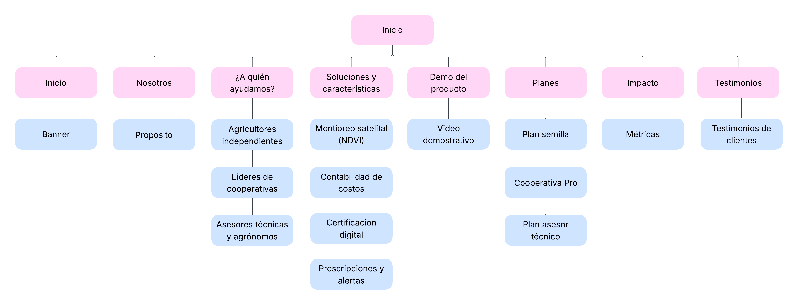
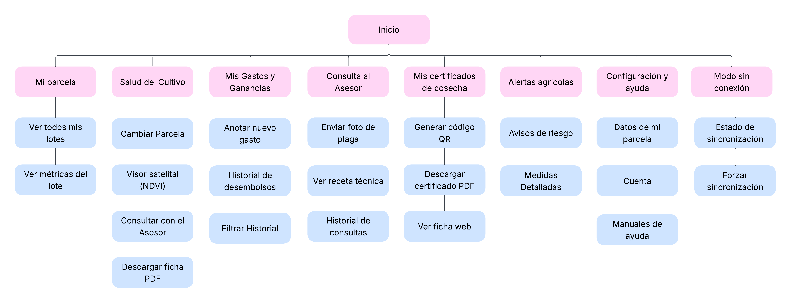

# Capítulo IV: Product Design

## 4.1. Style Guidelines

### 4.1.1. General Style Guidelines
El diseño visual de la plataforma **SumaqAgro** se inclina hacia una estética moderna, limpia e intuitiva, en línea con nuestro compromiso de ofrecer soluciones agrotecnológicas que transmitan innovación, sostenibilidad, confianza y cercanía. Nuestro objetivo es crear una experiencia digital que sea tanto eficiente como cercana y profesional para los agricultores, cooperativas e ingenieros agrónomos.

En esta sección, detallaremos cada uno de los elementos visuales y de estilo que guían el desarrollo de la aplicación SumaqAgro, siempre siguiendo los principios de Diseño de Experiencia de Usuario (UX) e Interfaz de Usuario (UI) para garantizar la máxima usabilidad, legibilidad y accesibilidad (a11y).

**Branding**

El logo principal de **SumaqAgro**, un nombre que evoca la unión entre la naturaleza y la tecnología aplicada al sector agrícola. Nuestro propósito es ser un puente tecnológico para el campo, ofreciendo una solución integral de monitoreo satelital de precisión para agricultores, cooperativas e ingenieros agrónomos. El branding se enfoca en transmitir innovación, sostenibilidad, confianza y cercanía, valores esenciales para quienes buscan integrar la tecnología en el desarrollo del sector agrotecnológico.
 

  

**Typography**

La identidad tipográfica de SumaqAgro utiliza fuentes sans-serif seleccionadas de Google Fonts, elegidas por su alta legibilidad, apariencia moderna y óptima compatibilidad con entornos digitales navegables. La combinación de **Poppins** como tipografía principal e **Inter** como tipografía secundaria permite establecer una jerarquía visual clara e intuitiva entre títulos, contenidos informativos y elementos de interfaz, garantizando el cumplimiento de los estándares de accesibilidad web (a11y).

**Fuente principal: Poppins**

Se utiliza principalmente en encabezados y títulos, aportando un estilo geométrico y contemporáneo que refuerza la identidad visual de SumaqAgro:
- **Títulos principales (H1 / Sección heading):** Poppins Bold, 40 px en versión de escritorio / 28 px en móvil (Ejemplo: “Cultiva con Información”).
- **Títulos de secciones (H2 / Sub-headings):** Poppins SemiBold, 32 px en escritorio / 24 px en móvil (Ejemplo: “Nuestro Impacto en el Campo”).
- **Títulos de tarjetas o bloques (H3):** Poppins Medium, 20 px.
- **Subtítulos internos (H4):** Poppins Medium o SemiBold, entre 18 px y 20 px según el contexto.

**Fuente secundaria: Inter**

Se utiliza en bloques de lectura, etiquetas, botones, formularios y componentes de la interfaz gráfica debido a su extraordinaria claridad y rendimiento de lectura en pantallas de diversas resoluciones:
- **Párrafos principales (Body 1):** Inter Regular, 16 px.
- **Textos secundarios, subtítulos y Footer (Body 2):** Inter Regular, 14 px.
- **Botones y llamadas a la acción (Button Text / CTA):** Inter SemiBold, 16 px.
- **Etiquetas de formularios o elementos de interfaz (Labels):** Inter Medium, 14 px.

  
  

Esta combinación y jerarquía tipográfica permite mantener una experiencia de usuario consistente, altamente accesible, clara y profesional a través de los distintos dispositivos y secciones de la plataforma.

**Colors**

La interfaz web utilizará una paleta de colores basada principalmente en tonos **teal, verdes y neutros**, complementados con colores de estado para comunicar acciones, advertencias y errores.

- **Color primario:** se utilizarán tonos teal como color principal de identidad visual. Estos colores estarán presentes en elementos destacados de la interfaz, estados activos, componentes principales y elementos interactivos.

- **Color secundario:** los tonos verdes se emplearán como complemento del color principal, especialmente en botones, indicadores positivos, elementos relacionados con el estado de los cultivos y acciones secundarias.

- **Colores neutros:** se utilizarán tonos grises y blancos para mantener una interfaz limpia y facilitar la lectura del contenido. El fondo general de las vistas empleará tonos claros, mientras que componentes como el **sidebar utilizarán un fondo blanco** para diferenciar claramente la navegación del área principal de trabajo.

- **Superficies y tarjetas:** las tarjetas y contenedores de información utilizarán principalmente fondos blancos o tonos neutros claros. Algunos componentes importantes podrán utilizar fondos oscuros pertenecientes a la paleta principal para generar mayor jerarquía visual.

- **Navegación:** el menú lateral mantendrá una apariencia clara, utilizando fondo blanco y colores verdes o teal para identificar opciones seleccionadas, iconos y elementos interactivos.

- **Estados del sistema:** se utilizarán colores específicos para comunicar información importante:
    - **Rojo:** errores, acciones incorrectas o situaciones que requieren atención inmediata.
    - **Amarillo:** advertencias o situaciones que necesitan precaución.
    - **Verde:** estados correctos, disponibles, saludables o confirmaciones exitosas.

- **Contraste y legibilidad:** los colores oscuros serán utilizados principalmente para textos y elementos destacados, mientras que los tonos claros servirán como fondos y superficies, buscando mantener un contraste adecuado y una lectura sencilla en toda la aplicación.

  

**Spacing**

SumaqAgro utiliza un sistema de espaciado basado en múltiplos de 8 px, permitiendo mantener una interfaz ordenada, consistente y fácil de adaptar a diferentes tamaños de pantalla[cite: 1]. Este sistema se aplica en márgenes, paddings, separación entre componentes y distribución de contenido[cite: 1].

*   **4 px – Extra Small (XS):** Separaciones mínimas entre elementos relacionados, como iconos y texto.
*   **8 px – Small (S):** Espaciado interno pequeño, utilizado en botones, etiquetas y elementos compactos.
*   **16 px – Medium (M):** Espaciado estándar entre textos, campos de formulario y elementos dentro de una tarjeta.
*   **24 px – Large (L):** Separación entre grupos de contenido, tarjetas o bloques relacionados.
*   **32 px – Extra Large (XL):** Espaciado entre secciones internas o componentes principales.
*   **48 px – 2XL:** Utilizado para separar bloques importantes dentro de una misma sección.
*   **64 px – 3XL:** Recomendado para la separación vertical entre secciones principales de la página.
*   **80 px – 4XL:** Puede utilizarse en secciones amplias como Hero, Features o Call to Action en versión Desktop.

**Tono de Comunicación**

La voz y el tono de SumaqAgro están diseñados para ser tan claros, cercanos y confiables como nuestra plataforma. Nuestro objetivo es conectar con agricultores, cooperativas y profesionales del sector agrícola de manera empática, accesible y profesional.

* **Tono: Empático y cercano.** Buscamos reconocer y comprender las principales dificultades del trabajo agrícola, como heladas, sequías, plagas, estrés hídrico o la toma de decisiones basada en información limitada, transmitiendo comprensión y apoyo frente a estos desafíos.

* **Actitud: Profesional y confiable.** Explicamos conceptos técnicos —como el índice NDVI, monitoreo satelital o análisis de cultivos— de manera sencilla pero precisa, relacionándolos con beneficios concretos como la reducción de pérdidas, la optimización de recursos y la mejora de la productividad.

* **Lenguaje: Claro y directo.** Evitamos términos innecesariamente complejos y empleamos mensajes breves orientados a la acción. Las llamadas a la acción (CTAs) indican claramente lo que el usuario puede realizar mediante frases como “Registrar mi parcela”, “Ver estado del cultivo” o “Consultar alertas”.

* **Voz: Experta y facilitadora.** Posicionamos a SumaqAgro como una herramienta moderna para la transformación agrícola, manteniendo siempre una comunicación accesible que prioriza los beneficios prácticos que la plataforma ofrece en el día a día.

Este enfoque comunicacional busca generar confianza y lealtad, asegurando a los productores y organizaciones agrícolas que cuentan con un aliado tecnológico claro y efectivo para optimizar la gestión de sus cultivos.

### 4.1.2. Web Style Guidelines

## 4.2. Information Architecture

### 4.2.1. Organization Systems

La organización jerárquica del Landing Page de "SumaqAgro" ha sido diseñada con el propósito de guiar al usuario de manera lógica y efectiva desde su primer contacto con la solución hasta su conversión en cliente. Esta estructura responde a principios de arquitectura de la información que priorizan la claridad, la relevancia y la progresión natural del contenido, permitiendo que los usuarios comprendan de inmediato el valor del producto, cómo funciona, sus beneficios, y los pasos para adquirirlo.

**Inicio**

- **Propósito**: Captar la atención del visitante con un mensaje claro y directo orientado al sector agrícola.

- **Contenido**: Propuesta de valor en el banner principal y llamadas a la acción directas.

**Información explicativa**

- **Nosotros:** Presentación del propósito de la plataforma y el equipo detrás de la solución.

- **¿A quién ayudamos?:** Segmentación explícita del valor para los tres públicos objetivo (agricultores independientes, líderes de cooperativas y asesores técnicos/agrónomos).

- **Soluciones y Características:** Detalle de las capacidades tecnológicas clave como monitoreo satelital (NDVI), contabilidad de costos, certificación digital y prescripciones con alertas.

- **Demo del Producto:** Video demostrativo sobre el funcionamiento en campo de la plataforma.

**Conversión y Validación**

- **Planes:** Detalle de las opciones de suscripción diseñadas para cada perfil (Plan Semilla, Cooperativa Pro y Plan Asesor Técnico).

- **Impacto y Testimonios:** Presentación de métricas de alcance y testimonios reales de clientes que validan la experiencia.

  

> 
Organización en el landing page

Además, la arquitectura jerárquica en la interfaz de la aplicación web de "SumaqAgro" ha sido diseñada para facilitar el acceso y gestión eficiente de las múltiples funcionalidades del sistema. Esta estructura permite una distribución lógica del contenido, reduciendo la carga cognitiva del usuario en campo y mejorando su capacidad para encontrar rápidamente las herramientas que necesita.

  

> 
Organización en la aplicación

**Pantalla de inicio (Mi Parcela)**

Una vista general tipo dashboard que presenta:

- Tarjetas resumen de vigor vegetal (NDVI), costos acumulados de la campaña y punto de equilibrio financiero.

- Avisos destacados de alertas fitosanitarias activas o riesgos climáticos.

- Accesos rápidos para explorar lotes y consultar datos clave de la parcela.

**Navegación principal**

Sistema jerárquico accesible desde un menú lateral con iconografía clara. Incluye las siguientes pestañas:

- Mi Parcela

- Salud del Cultivo

- Mis Gastos y Ganancias

- Consulta al Asesor

- Mis Certificados de Cosecha

- Alertas Agrícolas

- Configuración y Ayuda

- Modo Sin Conexión

**Filtrado y organización avanzada**

**a. Para Agricultores Independientes**

- **Filtros por:** Parcelas, lotes y capas satelitales (Vigor del Follaje / Humedad).

- **Funcionalidades destacadas:** Visor satelital (NDVI), registro de gastos y solicitudes de asistencia al asesor.

**b. Para Líderes de Cooperativas**

- **Filtros por:** Lotes comunitarios, categorías de gastos acumulados e historial de cosechas.

- **Funcionalidades destacadas:** Emisión de certificados de calidad con código QR, fichas PDF exportables y métricas de rendimiento por lote.

**c. Para Asesores Técnicos y Agrónomos**

- **Filtros por:** Parcelas asignadas, estado de consultas fitosanitarias y nivel de riesgo/alerta.

- **Funcionalidades destacadas:** Revisión de fotografías de plagas enviadas por agricultores, emisión de recetas técnicas y seguimiento de avisos de riesgo.

**Segmentación por audiencia**

**a. Agricultores independientes**

- Enfoque en el control visual de la salud de sus cultivos, manejo contable sencillo de la campaña y prevención ante contingencias climáticas.

- Visualización rápida de métricas clave y acceso directo a canales de ayuda y soporte en campo.

**b. Líderes de cooperativas**

- Enfoque en la estandarización de la producción, respaldo técnico comercial de la cosecha colectiva y la gestión eficiente de costos.

- Herramientas para la generación de documentos oficiales con código QR que facilitan la venta transparente a acopiadores y compradores.

**c. Asesores técnicos y agrónomos**

- Enfoque en la asistencia técnica distribuida, optimización de visitas a terreno e intervención precisa ante plagas o heladas.

- Canal de comunicación directo para dictar diagnósticos, recomendar dosificación de insumos y mantener un historial clínico por cada parcela.
   
   
### 4.2.2. Labeling Systems

### 4.2.3. SEO Tags and Meta Tags

Con el objetivo de mejorar la visibilidad de "SumaqAgro" en los motores de búsqueda y facilitar su descubrimiento tanto por agricultores independientes, líderes de cooperativas y asesores técnicos agrónomos interesados en optimizar el rendimiento y la gestión de sus cultivos, se ha establecido una estrategia SEO que incluye el uso adecuado de etiquetas HTML para los principales elementos informativos del sitio web estático (Landing Page) y la aplicación web.

**Landing Page**

- **Title:**  
  `<title>SumaqAgro – Monitoreo Satelital y Gestión Agrícola de Precisión</title>`

Una frase concisa que refleja la propuesta de valor de la plataforma e integra palabras clave estratégicas como "monitoreo satelital", "gestión agrícola" y "precisión", términos frecuentemente utilizados por productores y profesionales del sector agrotecnológico al buscar soluciones digitales.

- **Meta Description:**  
  `<meta name="description" content="Plataforma de agrotecnología para el campo peruano. Optimiza el rendimiento de tus cultivos con mapas NDVI, control de costos por lote, trazabilidad con QR y alertas de riesgo fitosanitario.">`

Esta descripción sintetiza el propósito de la herramienta destacando sus beneficios diferenciadores (salud foliar NDVI, control financiero y certificación digital), incorporando términos de búsqueda de alta relevancia como “agrotecnología”, “alertas fitosanitarias” y “código QR”.

- **Meta Keywords:**  
  `<meta name="keywords" content="SumaqAgro, monitoreo satelital agrícola, índice NDVI, agricultura de precisión Perú, gestión de cooperativas agrícolas, control de gastos agrícolas, certificado QR cosecha, alertas fitosanitarias">`

Un conjunto seleccionado de palabras clave que abarca los perfiles de usuario objetivo (agricultores, cooperativas, agrónomos) y las funcionalidades centrales de la solución (NDVI, control de gastos, trazabilidad y alertas de riesgo).

- **Meta Author:**  
  `<meta name="author" content="Equipo de Open Source – Open Source Software">`

Identifica al equipo responsable del diseño, desarrollo y arquitectura de información del sitio web, reforzando la transparencia y la atribución del proyecto.

---

**Web Application – Dashboard Principal**

- **Title:**  
  `<title>Mi Parcela – SumaqAgro | Panel de Control y Monitoreo de Cultivos</title>`

Este título complementa la identidad de la plataforma con una llamada a la acción orientada a la gestión operativa, enfocándose en la centralización y monitoreo de predios agrícolas desde la vista principal de la aplicación.

- **Meta Description:**  
  `<meta name="description" content="Accede a tu panel principal en SumaqAgro. Visualiza el mapa de salud foliar (NDVI) de tus lotes, registra gastos de campaña, consulta el precio de equilibrio y gestiona solicitudes fitosanitarias con tu asesor técnico.">`

Redactado con un enfoque funcional y operativo que detalla las acciones inmediatas que el usuario puede realizar en la interfaz, destacando la interacción entre agricultor, agrónomo y datos geoespaciales.

- **Meta Keywords:**  
  `<meta name="keywords" content="dashboard agrícola, mi parcela, mapas NDVI, salud del cultivo, control de gastos agrícolas, recetas técnicas, alertas de riesgo, plataforma SumaqAgro">`

Palabras clave orientadas a la experiencia interna de la aplicación, utilizando términos específicos de uso continuo en la plataforma (ej. “dashboard agrícola”, “mapas NDVI”, “recetas técnicas”).

- **Meta Author:**  
  `<meta name="author" content="Equipo de Open Source – Open Source Software">`

Especifica el equipo de desarrollo web responsable del proyecto para asegurar la vigencia y atribución tecnológica de la aplicación.
 
 

### 4.2.4. Searching Systems
### 4.2.5. Navigation Systems

La navegación en **SumaqAgro** está diseñada para facilitar el recorrido del usuario de manera clara y rápida. En la Landing Page se implementa una barra de navegación fija (header) en la parte superior que contiene el isotipo de la marca, enlaces directos a las secciones principales, botones de acción y selector de idioma. Estas secciones son:

- **Home:** Retorno a la sección principal de bienvenida.
- **About Us:** Información sobre la propuesta de valor y el equipo.
- **Solutions:** Explicación técnica del monitoreo satelital y gestión agrícola.
- **Plans:** Detalle de las suscripciones disponibles para el campo.
- **Impact:** Resultados y testimonios de uso en los cultivos.
- **Sign In / Register:** Botones de acceso y registro a la plataforma.
- **Selector de Idioma (EN):** Opción para cambiar la localización del sitio.

  

> 
Navegación del sitio web (Landing Page)

Además, en la aplicación web se implementa un menú lateral fijo (sidenav) organizado por categorías principales, el cual permite el acceso directo a las funcionalidades de gestión y monitoreo del sistema:

- **Principal:**
    - **Mi Parcela:** Vista del panel general del predio.
- **Operación agrícola:**
    - **Salud del Cultivo:** Visor con mapas de vigor foliar y métricas del predio.
    - **Mis Gastos y Ganancias:** Gestión contable e historial financiero de campaña.
    - **Consulta al Asesor:** Canal directo de atención fitosanitaria y recetas técnicas.
    - **Mis Certificados de Cosecha:** Emisión y consulta de certificados trazables con QR.
- **Sistema:**
    - **Alertas Agrícolas:** Centro de avisos de riesgo y boletín fitosanitario.
    - **Configuración y Ayuda:** Ajustes de la cuenta, datos de parcelas y soporte.
    - **Modo Sin Conexión:** Estado operativo para sincronización de datos en campo.
    - **Cerrar Sesión:** Salida segura de la plataforma.

Cada sección está representada con un ícono claro y una etiqueta visible, asegurando una navegación fluida e intuitiva dentro de la consola de trabajo.

  

> 
Navegación de la aplicación web (Sidenav)

 

## 4.3. Landing Page UI Design
### 4.3.1. Landing Page Wireframe
### 4.3.2. Landing Page Mock-up

## 4.4. Web Applications UX/UI Design
### 4.4.1. Web Applications Wireframes
### 4.4.2. Web Applications Wireflow Diagrams
### 4.4.3. Web Applications Mock-ups
### 4.4.4. Web Applications User Flow Diagrams

## 4.5. Web Applications Prototyping

## 4.6. Domain-Driven Software Architecture
### 4.6.1. Design-Level Event Storming
### 4.6.2. Software Architecture Context Diagram
### 4.6.3. Software Architecture Container Diagrams
### 4.6.4. Software Architecture Components Diagrams

## 4.7. Software Object-Oriented Design
### 4.7.1. Class Diagrams

## 4.8. Database Design
### 4.8.1. Database Diagrams