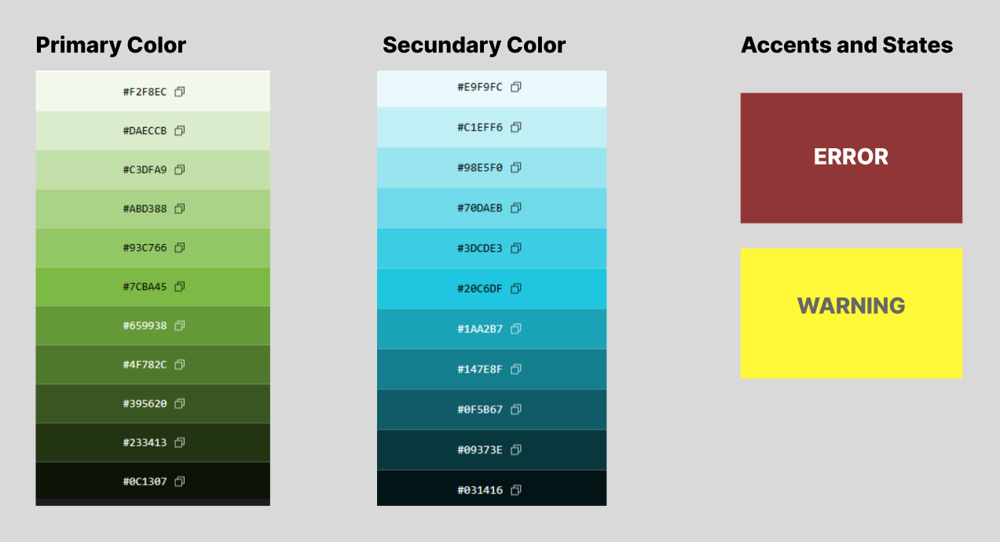

# Capítulo IV: Product Design

## 4.1. Style Guidelines

### 4.1.1. General Style Guidelines
El diseño visual de la plataforma **SumaqAgro** se inclina hacia una estética moderna, limpia e intuitiva, en línea con nuestro compromiso de ofrecer soluciones agrotecnológicas que transmitan innovación, sostenibilidad, confianza y cercanía. Nuestro objetivo es crear una experiencia digital que sea tanto eficiente como cercana y profesional para los agricultores, cooperativas e ingenieros agrónomos.

En esta sección, detallaremos cada uno de los elementos visuales y de estilo que guían el desarrollo de la aplicación SumaqAgro, siempre siguiendo los principios de Diseño de Experiencia de Usuario (UX) e Interfaz de Usuario (UI) para garantizar la máxima usabilidad, legibilidad y accesibilidad (a11y).

**Branding**

El logo principal de **SumaqAgro**, un nombre que evoca la unión entre la naturaleza y la tecnología aplicada al sector agrícola. Nuestro propósito es ser un puente tecnológico para el campo, ofreciendo una solución integral de monitoreo satelital de precisión para agricultores, cooperativas e ingenieros agrónomos. El branding se enfoca en transmitir innovación, sostenibilidad, confianza y cercanía, valores esenciales para quienes buscan integrar la tecnología en el desarrollo del sector agrotecnológico.
 

  

**Typography**

La identidad tipográfica de SumaqAgro utiliza fuentes sans-serif seleccionadas de Google Fonts, elegidas por su alta legibilidad, apariencia moderna y óptima compatibilidad con entornos digitales navegables. La combinación de **Poppins** como tipografía principal e **Inter** como tipografía secundaria permite establecer una jerarquía visual clara e intuitiva entre títulos, contenidos informativos y elementos de interfaz, garantizando el cumplimiento de los estándares de accesibilidad web (a11y).

**Fuente principal: Poppins**

Se utiliza principalmente en encabezados y títulos, aportando un estilo geométrico y contemporáneo que refuerza la identidad visual de SumaqAgro:
- **Títulos principales (H1 / Sección heading):** Poppins Bold, 40 px en versión de escritorio / 28 px en móvil (Ejemplo: “Cultiva con Información”).
- **Títulos de secciones (H2 / Sub-headings):** Poppins SemiBold, 32 px en escritorio / 24 px en móvil (Ejemplo: “Nuestro Impacto en el Campo”).
- **Títulos de tarjetas o bloques (H3):** Poppins Medium, 20 px.
- **Subtítulos internos (H4):** Poppins Medium o SemiBold, entre 18 px y 20 px según el contexto.

**Fuente secundaria: Inter**

Se utiliza en bloques de lectura, etiquetas, botones, formularios y componentes de la interfaz gráfica debido a su extraordinaria claridad y rendimiento de lectura en pantallas de diversas resoluciones:
- **Párrafos principales (Body 1):** Inter Regular, 16 px.
- **Textos secundarios, subtítulos y Footer (Body 2):** Inter Regular, 14 px.
- **Botones y llamadas a la acción (Button Text / CTA):** Inter SemiBold, 16 px.
- **Etiquetas de formularios o elementos de interfaz (Labels):** Inter Medium, 14 px.

Esta combinación y jerarquía tipográfica permite mantener una experiencia de usuario consistente, altamente accesible, clara y profesional a través de los distintos dispositivos y secciones de la plataforma.

  
  

**Colors**
La paleta cromática de SumaqAgro constituye la base visual de todo el ecosistema digital (abarcando tanto el sitio público de la Landing Page como los paneles y módulos operativos de la Web Application). Ha sido diseñada para transmitir una identidad que equilibra la naturaleza agrícola con la tecnología de precisión, garantizando consistencia estética, legibilidad y altos estándares de accesibilidad visual (a11y) en todos los flujos de interacción.

La distribución cromática se organiza en las siguientes categorías funcionales:

*   **Colores principales – Verdes (Primary Colors):**
    Representan el vigor vegetal, la productividad del suelo y la conexión directa con el entorno rural.
    *   **Dark / Forest Green (`#233413` y `#395620`):** Utilizados para textos de máxima jerarquía y alto contraste (H1, H2), fondos de bloques destacados en la Landing Page, y barras superiores o encabezados estructurales dentro del dashboard de la aplicación web.
    *   **Base Green (`#7CBA45` y `#659938`):** Constituyen el color de acción primario. Se emplean en botones de llamada a la acción principales (CTAs como "Registrar mi Parcela" o "Guardar Registro"), estados interactivos activos, botones de confirmación, badges de balance positivo y acentos destacados de la interfaz.
    *   **Light Green (`#DAECCB` y `#F2F8EC`):** Destinados a fondos de tarjetas informativas (cards), paneles secundarios, contenedores de métricas en dashboards, chips de estado óptimo y áreas de trabajo que requieran un descanso visual sin perder la identidad de marca.

*   **Colores secundarios – Turquesas y Celestes (Secondary Colors):**
    Simbolizan el componente tecnológico, el monitoreo satelital, los recursos hídricos y el procesamiento analítico de datos.
    *   **Dark Teal (`#031416` y `#09373E`):** Aplicados en elementos que exigen profundidad visual y sobriedad técnica, tales como el footer de la plataforma, el menú lateral persistente (sidebar) de la Web Application, bordes de separación de alta jerarquía y tablas de datos densas.
    *   **Base Cyan (`#20C6DF` y `#1AA2B7`):** Empleados como acento analítico y tecnológico en iconos satelitales, hipervínculos, botones secundarios tipo outline, capas vectoriales de mapas multiespectrales (NDVI/NDWI) y visualización gráfica de series temporales o reportes financieros.

*   **Colores de acento y estados del sistema (System Feedback & States):**
    Diseñados para comunicar avisos operativos, validaciones y condiciones agronómicas en tiempo real:
    *   **Warning (`#FFF838`):** Reservado para alertas preventivas del sistema, advertencias climáticas (como riesgo moderado de heladas), chips de atención requerida y campos de formulario que demanden revisión por parte del usuario.
    *   **Error (`#913636`):** Empleado en situaciones críticas que requieren intervención inmediata, tales como notificaciones de estrés hídrico severo, detección de umbrales fitosanitarios por plagas, alertas de saldo en pérdida en el motor de costos y mensajes de error en validación de entradas.

El empleo riguroso y homogéneo de estos parámetros cromáticos asegura una experiencia de usuario cohesionada entre la presentación pública del producto y su uso operativo diario, facilitando el reconocimiento instantáneo de jerarquías, estados agronómicos y acciones clave en cualquier pantalla.

  

**Spacing**

**Tono de Comunicación**

La voz y el tono de SumaqAgro están diseñados para ser tan claros, cercanos y confiables como nuestra plataforma. Nuestro objetivo es conectar con agricultores, cooperativas y profesionales del sector agrícola de manera empática, accesible y profesional.

* **Tono: Empático y cercano.** Buscamos reconocer y comprender las principales dificultades del trabajo agrícola, como heladas, sequías, plagas, estrés hídrico o la toma de decisiones basada en información limitada, transmitiendo comprensión y apoyo frente a estos desafíos.

* **Actitud: Profesional y confiable.** Explicamos conceptos técnicos —como el índice NDVI, monitoreo satelital o análisis de cultivos— de manera sencilla pero precisa, relacionándolos con beneficios concretos como la reducción de pérdidas, la optimización de recursos y la mejora de la productividad.

* **Lenguaje: Claro y directo.** Evitamos términos innecesariamente complejos y empleamos mensajes breves orientados a la acción. Las llamadas a la acción (CTAs) indican claramente lo que el usuario puede realizar mediante frases como “Registrar mi parcela”, “Ver estado del cultivo” o “Consultar alertas”.

* **Voz: Experta y facilitadora.** Posicionamos a SumaqAgro como una herramienta moderna para la transformación agrícola, manteniendo siempre una comunicación accesible que prioriza los beneficios prácticos que la plataforma ofrece en el día a día.

Este enfoque comunicacional busca generar confianza y lealtad, asegurando a los productores y organizaciones agrícolas que cuentan con un aliado tecnológico claro y efectivo para optimizar la gestión de sus cultivos.

### 4.1.2. Web Style Guidelines

## 4.2. Information Architecture
### 4.2.1. Organization Systems
### 4.2.2. Labeling Systems
### 4.2.3. SEO Tags and Meta Tags
### 4.2.4. Searching Systems
### 4.2.5. Navigation Systems

## 4.3. Landing Page UI Design
### 4.3.1. Landing Page Wireframe
### 4.3.2. Landing Page Mock-up

## 4.4. Web Applications UX/UI Design
### 4.4.1. Web Applications Wireframes
### 4.4.2. Web Applications Wireflow Diagrams
### 4.4.3. Web Applications Mock-ups
### 4.4.4. Web Applications User Flow Diagrams

## 4.5. Web Applications Prototyping

## 4.6. Domain-Driven Software Architecture
### 4.6.1. Design-Level Event Storming
### 4.6.2. Software Architecture Context Diagram
### 4.6.3. Software Architecture Container Diagrams
### 4.6.4. Software Architecture Components Diagrams

## 4.7. Software Object-Oriented Design
### 4.7.1. Class Diagrams

## 4.8. Database Design
### 4.8.1. Database Diagrams