# Capítulo IV: Product Design

## 4.1. Style Guidelines

### 4.1.1. General Style Guidelines
El diseño visual de la plataforma **SumaqAgro** se inclina hacia una estética moderna, limpia e intuitiva, en línea con nuestro compromiso de ofrecer soluciones agrotecnológicas que transmitan innovación, sostenibilidad, confianza y cercanía. Nuestro objetivo es crear una experiencia digital que sea tanto eficiente como cercana y profesional para los agricultores, cooperativas e ingenieros agrónomos.

En esta sección, detallaremos cada uno de los elementos visuales y de estilo que guían el desarrollo de la aplicación SumaqAgro, siempre siguiendo los principios de Diseño de Experiencia de Usuario (UX) e Interfaz de Usuario (UI) para garantizar la máxima usabilidad, legibilidad y accesibilidad (a11y).

**Branding**

El logo principal de **SumaqAgro**, un nombre que evoca la unión entre la naturaleza y la tecnología aplicada al sector agrícola. Nuestro propósito es ser un puente tecnológico para el campo, ofreciendo una solución integral de monitoreo satelital de precisión para agricultores, cooperativas e ingenieros agrónomos. El branding se enfoca en transmitir innovación, sostenibilidad, confianza y cercanía, valores esenciales para quienes buscan integrar la tecnología en el desarrollo del sector agrotecnológico.
 

  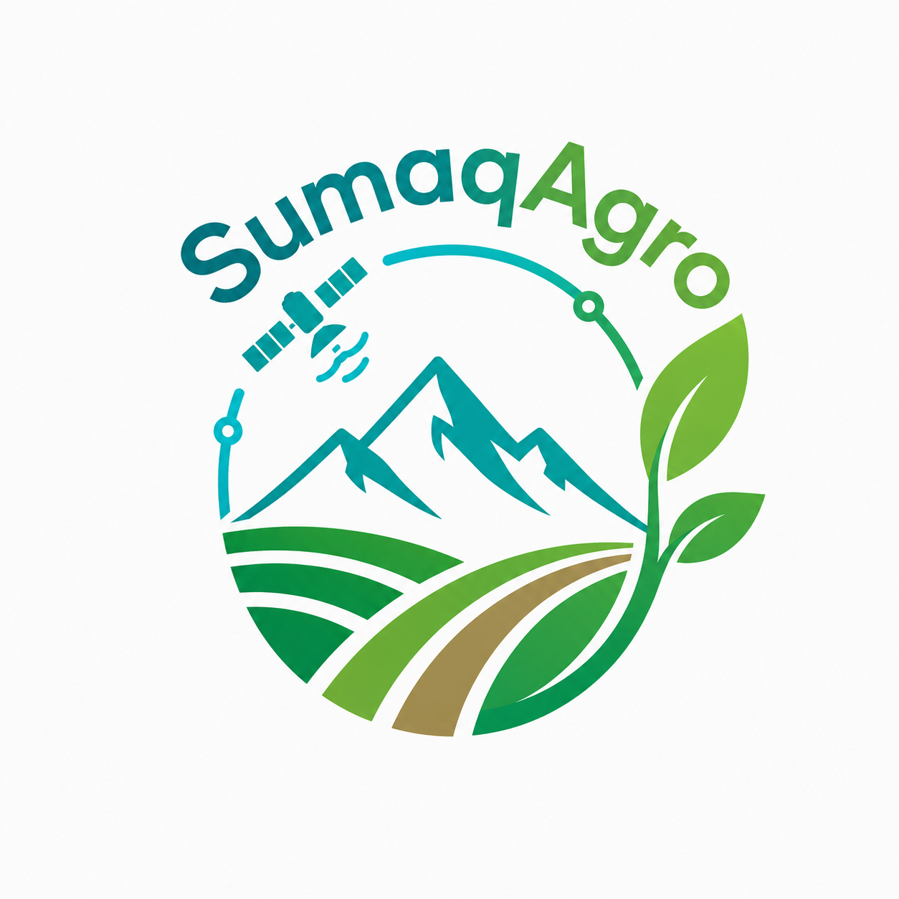

**Typography**

La identidad tipográfica de SumaqAgro utiliza fuentes sans-serif seleccionadas de Google Fonts, elegidas por su alta legibilidad, apariencia moderna y óptima compatibilidad con entornos digitales navegables. La combinación de **Poppins** como tipografía principal e **Inter** como tipografía secundaria permite establecer una jerarquía visual clara e intuitiva entre títulos, contenidos informativos y elementos de interfaz, garantizando el cumplimiento de los estándares de accesibilidad web (a11y).

**Fuente principal: Poppins**

Se utiliza principalmente en encabezados y títulos, aportando un estilo geométrico y contemporáneo que refuerza la identidad visual de SumaqAgro:
- **Títulos principales (H1 / Sección heading):** Poppins Bold, 40 px en versión de escritorio / 28 px en móvil (Ejemplo: “Cultiva con Información”).
- **Títulos de secciones (H2 / Sub-headings):** Poppins SemiBold, 32 px en escritorio / 24 px en móvil (Ejemplo: “Nuestro Impacto en el Campo”).
- **Títulos de tarjetas o bloques (H3):** Poppins Medium, 20 px.
- **Subtítulos internos (H4):** Poppins Medium o SemiBold, entre 18 px y 20 px según el contexto.

**Fuente secundaria: Inter**

Se utiliza en bloques de lectura, etiquetas, botones, formularios y componentes de la interfaz gráfica debido a su extraordinaria claridad y rendimiento de lectura en pantallas de diversas resoluciones:
- **Párrafos principales (Body 1):** Inter Regular, 16 px.
- **Textos secundarios, subtítulos y Footer (Body 2):** Inter Regular, 14 px.
- **Botones y llamadas a la acción (Button Text / CTA):** Inter SemiBold, 16 px.
- **Etiquetas de formularios o elementos de interfaz (Labels):** Inter Medium, 14 px.

  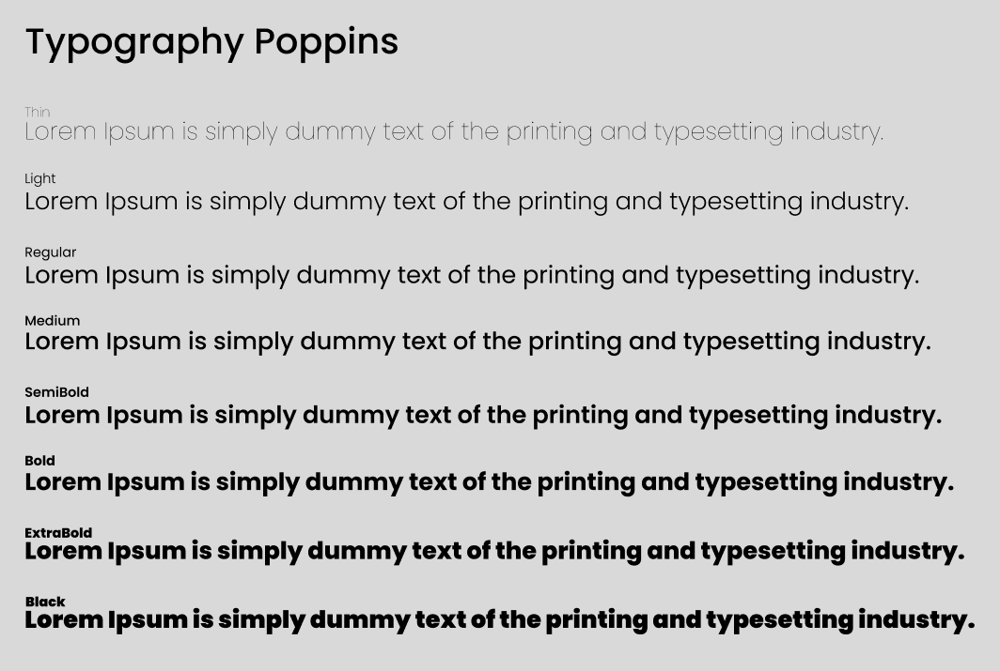
  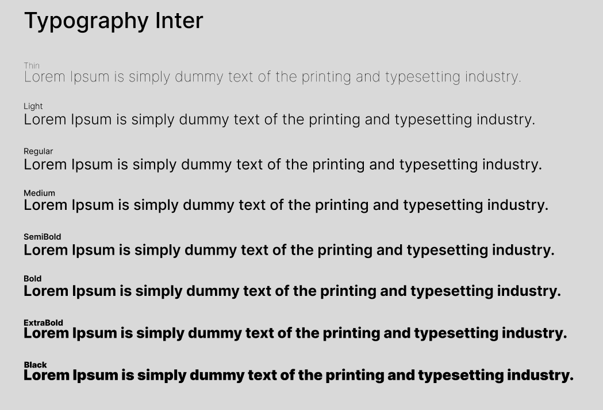

Esta combinación y jerarquía tipográfica permite mantener una experiencia de usuario consistente, altamente accesible, clara y profesional a través de los distintos dispositivos y secciones de la plataforma.

**Colors**

La interfaz web utilizará una paleta de colores basada principalmente en tonos **teal, verdes y neutros**, complementados con colores de estado para comunicar acciones, advertencias y errores.

- **Color primario:** se utilizarán tonos teal como color principal de identidad visual. Estos colores estarán presentes en elementos destacados de la interfaz, estados activos, componentes principales y elementos interactivos.

- **Color secundario:** los tonos verdes se emplearán como complemento del color principal, especialmente en botones, indicadores positivos, elementos relacionados con el estado de los cultivos y acciones secundarias.

- **Colores neutros:** se utilizarán tonos grises y blancos para mantener una interfaz limpia y facilitar la lectura del contenido. El fondo general de las vistas empleará tonos claros, mientras que componentes como el **sidebar utilizarán un fondo blanco** para diferenciar claramente la navegación del área principal de trabajo.

- **Superficies y tarjetas:** las tarjetas y contenedores de información utilizarán principalmente fondos blancos o tonos neutros claros. Algunos componentes importantes podrán utilizar fondos oscuros pertenecientes a la paleta principal para generar mayor jerarquía visual.

- **Navegación:** el menú lateral mantendrá una apariencia clara, utilizando fondo blanco y colores verdes o teal para identificar opciones seleccionadas, iconos y elementos interactivos.

- **Estados del sistema:** se utilizarán colores específicos para comunicar información importante:
    - **Rojo:** errores, acciones incorrectas o situaciones que requieren atención inmediata.
    - **Amarillo:** advertencias o situaciones que necesitan precaución.
    - **Verde:** estados correctos, disponibles, saludables o confirmaciones exitosas.

- **Contraste y legibilidad:** los colores oscuros serán utilizados principalmente para textos y elementos destacados, mientras que los tonos claros servirán como fondos y superficies, buscando mantener un contraste adecuado y una lectura sencilla en toda la aplicación.

  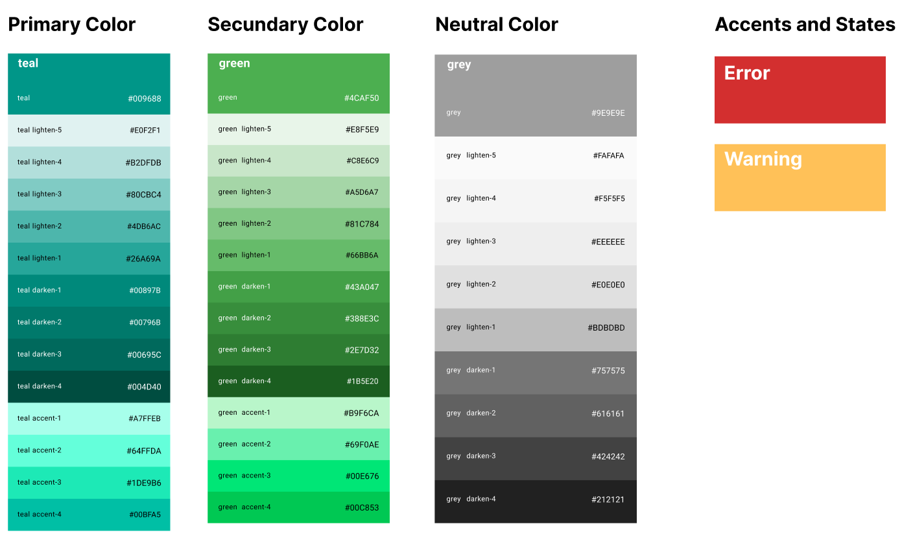

**Spacing**

SumaqAgro utiliza un sistema de espaciado basado en múltiplos de 8 px, permitiendo mantener una interfaz ordenada, consistente y fácil de adaptar a diferentes tamaños de pantalla[cite: 1]. Este sistema se aplica en márgenes, paddings, separación entre componentes y distribución de contenido[cite: 1].

*   **4 px – Extra Small (XS):** Separaciones mínimas entre elementos relacionados, como iconos y texto.
*   **8 px – Small (S):** Espaciado interno pequeño, utilizado en botones, etiquetas y elementos compactos.
*   **16 px – Medium (M):** Espaciado estándar entre textos, campos de formulario y elementos dentro de una tarjeta.
*   **24 px – Large (L):** Separación entre grupos de contenido, tarjetas o bloques relacionados.
*   **32 px – Extra Large (XL):** Espaciado entre secciones internas o componentes principales.
*   **48 px – 2XL:** Utilizado para separar bloques importantes dentro de una misma sección.
*   **64 px – 3XL:** Recomendado para la separación vertical entre secciones principales de la página.
*   **80 px – 4XL:** Puede utilizarse en secciones amplias como Hero, Features o Call to Action en versión Desktop.

**Tono de Comunicación**

La voz y el tono de SumaqAgro están diseñados para ser tan claros, cercanos y confiables como nuestra plataforma. Nuestro objetivo es conectar con agricultores, cooperativas y profesionales del sector agrícola de manera empática, accesible y profesional.

* **Tono: Empático y cercano.** Buscamos reconocer y comprender las principales dificultades del trabajo agrícola, como heladas, sequías, plagas, estrés hídrico o la toma de decisiones basada en información limitada, transmitiendo comprensión y apoyo frente a estos desafíos.

* **Actitud: Profesional y confiable.** Explicamos conceptos técnicos —como el índice NDVI, monitoreo satelital o análisis de cultivos— de manera sencilla pero precisa, relacionándolos con beneficios concretos como la reducción de pérdidas, la optimización de recursos y la mejora de la productividad.

* **Lenguaje: Claro y directo.** Evitamos términos innecesariamente complejos y empleamos mensajes breves orientados a la acción. Las llamadas a la acción (CTAs) indican claramente lo que el usuario puede realizar mediante frases como “Registrar mi parcela”, “Ver estado del cultivo” o “Consultar alertas”.

* **Voz: Experta y facilitadora.** Posicionamos a SumaqAgro como una herramienta moderna para la transformación agrícola, manteniendo siempre una comunicación accesible que prioriza los beneficios prácticos que la plataforma ofrece en el día a día.

Este enfoque comunicacional busca generar confianza y lealtad, asegurando a los productores y organizaciones agrícolas que cuentan con un aliado tecnológico claro y efectivo para optimizar la gestión de sus cultivos.

### 4.1.2. Web Style Guidelines

## 4.2. Information Architecture
### 4.2.1. Organization Systems
### 4.2.2. Labeling Systems
### 4.2.3. SEO Tags and Meta Tags
### 4.2.4. Searching Systems
### 4.2.5. Navigation Systems

## 4.3. Landing Page UI Design
El landing page representa el primer punto de contacto entre los usuarios y la plataforma, por lo que su diseño debe comunicar de manera clara el propósito y los principales beneficios del servicio. En esta sección se presenta el diseño de la interfaz del landing page, considerando una organización visual atractiva, una navegación sencilla y elementos que faciliten la comprensión de la información y orienten al usuario hacia las acciones principales.

### 4.3.1. Landing Page Wireframe
### Desktop Web Browser
El wireframe del landing page de **SumaqAgro** muestra la estructura inicial de la página y la forma en que se organizan sus principales elementos antes de aplicar el diseño visual definitivo. Su propósito es definir una distribución ordenada y funcional que sirva como base para el desarrollo posterior de la interfaz.

**Nav y Hero**

La sección Hero de la Landing Page presenta en su cabecera superior (Navbar) el isotipo y nombre de marca a la izquierda, los enlaces de anclaje (*Inicio*, *Nosotros*, *Soluciones*, *Planes*, *Impacto*), los botones de acceso (*Iniciar sesión* y *Registrarse*) y el selector de internacionalización (*ES*); seguidamente, el área principal de impacto despliega el subtítulo en mayúsculas *«AGRICULTURA INTELIGENTE PARA UN MEJOR MAÑANA»*, el encabezado principal (H1) *«Cultiva con Información. Decide con Precisión»*, un párrafo descriptivo que sintetiza la transformación de datos satelitales para el monitoreo de cultivos, costos y valor de la producción, y dos llamados a la acción primarios representados por los botones *Explorar* y *Cómo funciona* sobre un fondo fotográfico agrícola de campo.

  

**About**

La sección **Nosotros** (*About Us*) presenta una distribución asimétrica compuesta por un bloque textual a la izquierda y un recurso gráfico a la derecha; el área informativa incluye el kicker superior en mayúsculas *«SOBRE SUMAQAGRO»*, el encabezado de sección (H2) *«Nosotros»*, el subtítulo destacado (H3) *«Democratizamos la agricultura de precisión en el Perú»* y un párrafo institucional que detalla la misión de reducir la brecha de tecnificación en las cuencas de papa y café mediante datos satelitales abiertos y herramientas accesibles de monitoreo, costeo y certificación; mientras que a la derecha se exhibe una composición fotográfica con esquinas redondeadas que muestra una parcela de cultivo tecnificado junto a una mano sosteniendo un smartphone con la interfaz móvil del sistema desplegada.

  

**Solutions**

La sección **¿A quién ayudamos?** organiza la propuesta de valor mediante tres tarjetas (*cards*) de autoselección por perfil orientadas a *Agricultores independientes*, *Líderes de cooperativas* y *Asesores técnicos y agrónomos*, detallando en cada una su enfoque productivo, una fotografía representativa de campo y un botón de llamado a la acción específico (*Registrar mi parcela*, *Gestionar cooperativa* y *Unirme como asesor*); inmediatamente después, la sección **Soluciones y Características** expone las cuatro capacidades tecnológicas clave del sistema mediante una grilla de tarjetas que describen el monitoreo satelital de vigor y humedad (*Satellite Monitoring of Vigor and Moisture*), la contabilidad de costos por lote (*Batch Cost Accounting*), la certificación digital de cosecha (*Digital Certification of Harvest Quality*) y el sistema de prescripciones agronómicas (*Agronomic Prescriptions and Alerts*), complementando cada bloque funcional con un indicador del impacto operativo directo que genera en campo.

  

**Video and Plans**

La sección **Conoce SumaqAgro en acción** presenta un contenedor central con fondo verde oscuro que alberga el reproductor del video demostrativo (*About-the-Product*) para evidenciar el funcionamiento en campo; inmediatamente después, la sección **Planes** (*Pricing*) introduce un conmutador de facturación mensual y anual (*«Ahorra 2 meses con el plan anual»*) junto a una grilla de tres tarjetas de suscripción que estructuran el modelo SaaS freemium y B2B: el **Plan Semilla** (S/ 0 para 1 parcela con NDVI básico y botón *«Empezar gratis»*), el **Plan Cooperativa Pro** (destacado con la etiqueta *«Más popular»* a S/ 189/mes para 50 productores con certificación de calidad y botón *«Suscribir cooperativa»*), y el **Plan Asesor Técnico** (S/ 89/mes para supervisar 20 fundos con recetas técnicas y botón *«Prueba de 14 días»*).

  

**Testimonials , Impact and Footer**

La sección **Impacto** y el cierre del Landing Page se estructuran en tres bloques consecutivos orientados a la credibilidad y la conversión: en primer lugar, el área de métricas cuantitativas presenta tres tarjetas superiores con indicadores clave de respaldo agrario (*333k+ Has. de papa*, *223k+ Familias cafeteras* y *>40% Sin cobertura técnica*), acompañadas en la parte inferior por el bloque testimonial *«Lo que dicen nuestros usuarios»* con tarjetas que incluyen avatar, calificación por estrellas y citas de validación de Juan Huamán (productor de papa) y Elena Vargas (cooperativa cafetalera); a continuación, se ubica el banner final de conversión (*Bottom CTA*) en verde oscuro con el titular *«Empieza a decidir con precisión hoy»*, un texto de apoyo y el botón principal de acción *Registrarse gratis*; finalmente, el pie de página (*Footer*) organiza sobre fondo oscuro el isotipo horizontal de SumaqAgro con su propuesta de valor a la izquierda, junto a una distribución de navegación en tres columnas de enlaces (*Products*, *Quick Links* y *Support*) para centralizar recursos, documentación y canales de soporte de la plataforma.

  

### Mobile Web Browser
Para garantizar una experiencia de usuario inclusiva y accesible, el diseño responsivo de la Landing Page de SumaqAgro se fundamenta en un sistema de rejilla fluido adaptado a dispositivos móviles (*Mobile Web Browser*), utilizando una retícula de 4 columnas y una escala de espaciado basada en múltiplos de 8 px.

En esta vista, los componentes de escritorio se reorganizan de manera progresiva en una sola columna (*single-column layout*), condensando la barra de navegación superior en un menú colapsable tipo hamburguesa (*nav-toggle*) y apilando los bloques informativos, tarjetas de segmentos, matrices de soluciones y llamados a la acción (CTAs) de forma lineal para facilitar el desplazamiento continuo (*scrolling*) y la interacción con una sola mano sin pérdida de contexto ni funcionalidad.

**Hero**

En la vista móvil, la cabecera superior compacta el menú de navegación horizontal bajo un botón tipo hamburguesa (`nav-toggle`) ubicado en el extremo superior derecho, manteniendo a la izquierda el isotipo circular y el nombre de marca SumaqAgro; inmediatamente abajo, el área principal apila el contenido verticalmente en una sola columna centrada de cuatro retículas, encabezada por el *kicker* introductorio en mayúsculas, el titular principal (H1) distribuido en dos líneas de alto impacto y un bloque de tres líneas de texto descriptivo con la propuesta de valor satelital; finalmente, la zona inferior de interacción organiza dos botones de llamado a la acción (CTAs) de ancho adaptativo dispuestos lado a lado en posición horizontal para facilitar el acceso táctil inmediato con una sola mano.

  

**About**

En la vista móvil (**Mobile Web Browser**) de las secciones institucionales, el contenido se reorganiza en una columna lineal: el bloque superior **Nosotros** (*About Us*) apila verticalmente el kicker, el encabezado principal, el subtítulo y el texto de la propuesta de valor junto al contenedor de la imagen representativa del cultivo tecnificado; inmediatamente abajo, la sección **Nuestro equipo** sitúa el titular y su párrafo descriptivo para dar paso a una disposición adaptada en dos columnas que agrupa las cinco tarjetas (*cards*) con fotografía, nombre de cada integrante y un icono de acción rápida en la esquina superior derecha, rematando con el último perfil centrado al pie para optimizar el espacio vertical en pantallas compactas.

  

**Solutions**

En la vista móvil (**Mobile Web Browser**) de las secciones comerciales y funcionales, el contenido se adapta a una columna única vertical: en la parte superior, la sección **¿A quién ayudamos?** apila secuencialmente las tres tarjetas de autoselección por rol (*Agricultores independientes*, *Líderes de cooperativas* y *Asesores técnicos*), situando en cada una su icono, titular, descripción de enfoque, vista previa gráfica y el botón de acción (*CTA*) con ancho completo al pie para facilitar el toque con una sola mano[cite: 1, 3]; a continuación, la sección **Soluciones y Características** transforma la grilla de escritorio en un apilamiento lineal de cuatro tarjetas de funcionalidades (monitoreo satelital NDVI, costos por lote, certificación de calidad y prescripciones agronómicas), cada una con su barra decorativa superior, icono de módulo, título, párrafo descriptivo y una tarjeta inferior de impacto cuantificable orientada al valor en campo.

  
 

  

**Video and Plans**

En la vista móvil (**Mobile Web Browser**) de los bloques de demostración y monetización, la interfaz se compacta en una sola columna vertical: en la parte superior, la sección **Conoce SumaqAgro en acción** (*About-the-Product*) enmarca el contenedor del reproductor de video demostrativo centrado sobre un bloque de fondo verde oscuro (#233413) que incluye el botón de reproducción (*Play*) para evidenciar el funcionamiento en campo; inmediatamente después, la sección **Planes** (*Pricing*) sitúa el encabezado de sección, el texto descriptivo y un conmutador de facturación mensual/anual (*switch toggle*), dando paso al apilamiento secuencial de las tres tarjetas de suscripción (*Plan Semilla*, *Plan Cooperativa Pro* y *Plan Asesor Técnico*), donde cada una presenta su nombre de plan, tarifa destacada en Soles, resumen de características y su botón de llamado a la acción (*CTA*) en ancho completo al pie para una pulsación táctil accesible con una sola mano.

  

  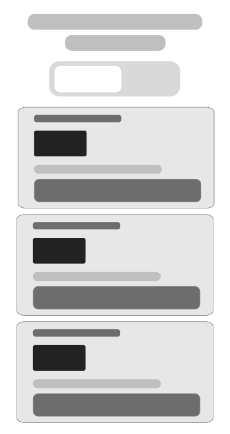

**Impact, Testimonials and Footer**

En la vista móvil (**Mobile Web Browser**) del cierre de la página, los componentes se reorganizan en una secuencia vertical de cuatro bloques lineales: en la parte superior, la sección **Impacto** apila las tres tarjetas de métricas agrarias (*333k+ Has. de papa*, *223k+ Familias cafeteras* y *>40% Sin cobertura técnica*); inmediatamente después, el bloque de testimonios (*«Lo que dicen nuestros usuarios»*) presenta de forma vertical las dos tarjetas de validación social con el avatar, nombre, rol y cita de cada usuario; a continuación, el banner final de conversión (*Bottom CTA*) condensa el titular, el texto de apoyo y el botón de acción *«Registrarse gratis»* adaptado a pantalla completa para facilitar la pulsación táctil con una sola mano; finalmente, el pie de página (*Footer*) sobre fondo oscuro (#031416) apila el isotipo de la marca, la descripción institucional y una botonera de enlaces sociales, rematando con tres columnas colapsadas verticalmente (*Products*, *Quick Links* y *Support*) que distribuyen el acceso a los recursos y enlaces ético-legales del sistema.

  

  

### 4.3.2. Landing Page Mock-up

## 4.4. Web Applications UX/UI Design
### 4.4.1. Web Applications Wireframes
### 4.4.2. Web Applications Wireflow Diagrams
### 4.4.3. Web Applications Mock-ups
### 4.4.4. Web Applications User Flow Diagrams

## 4.5. Web Applications Prototyping

## 4.6. Domain-Driven Software Architecture
En esta sección se traslada la comprensión del negocio obtenida en el Big Picture Event Storming hacia el diseño de arquitectura de software guiado por el dominio (Domain-Driven Design - DDD) y el modelo de abstracción y comunicación visual C4 Model en sus niveles de Contexto, Contenedores y Componentes. A través de esta aproximación arquitectónica, se divide el espacio del problema en Bounded Contexts independientes y de bajo acoplamiento, estableciendo sus agregados transaccionales (Aggregates), comandos, eventos de dominio, modelos de consulta (Read Models) y políticas de automatización reactivas. Asimismo, se formaliza la topología técnica y modular de la solución distribuida, articulando la aplicación web de cara al usuario, el servicio de backend RESTful en Spring Boot, la base de datos relacional y las interfaces de integración con servicios externos.

---
### 4.6.1. Design-Level Event Storming
El equipo llevó a cabo una sesión sincrónica de trabajo colaborativo en Miro siguiendo las pautas metodológicas de la guía Design-Level EventStorming (<https://bit.ly/dles-guide>). La dinámica se enfocó en profundizar y refinar el modelo general del dominio de las cadenas de café de especialidad y papa andina, definiendo las reglas de invariante transaccional y la mecánica de ejecución del sistema.

#### Proceso y Actividades Realizadas en el Taller

Durante la dinámica colaborativa, el equipo ejecutó las siguientes actividades de modelado:

* **Presentación y encuadre del dominio objetivo:** Revisión de las fronteras preliminares identificadas en la fase Big Picture para acotar los flujos de alta criticidad del negocio y delimitar el Core Domain de la plataforma SaaS.
* **Refinamiento de eventos de dominio (Domain Events - Naranja):** Formalización de los hechos inmutables de negocio ocurridos en cada fase operativa, expresados estrictamente en tiempo pasado participio.
* **Incorporación de desencadenantes (Commands - Azul y Policies - Morado):** Asociación de las intenciones operativas formuladas en imperativo con sus respectivos ejecutores (actores o eventos previos). Se establecieron políticas reactivas bajo la convención *Whenever [Domain Event] Then [Command]* para orquestar la consistencia eventual entre distintos contextos.
* **Integración de proyecciones y actores (Read Models - Verde):** Identificación de las vistas de datos, reportes y tableros que los usuarios requieren para tomar decisiones antes de ejecutar un comando.
* **Mapeo de sistemas externos (External Systems - Rosa):** Identificación de pasarelas y servicios satelitales o gubernamentales ajenos a la solución que interactúan como emisores o receptores de datos.
* **Definición de reglas de negocio e invariantes (Aggregates - Amarillo):** Agrupación de datos y comportamientos transaccionales atómicos bajo raíces de agregación (Aggregate Roots) para garantizar la consistencia del estado del sistema en todo momento.

---
#### Evidencia del Modelado en Miro
A continuación se presenta la vista general del tablero desarrollado en Miro, evidenciando los 10 pasos de la metodología Design-Level Event Storming y la organización de los elementos de modelado por colores y categorías.
#### Step 1: Domain Events
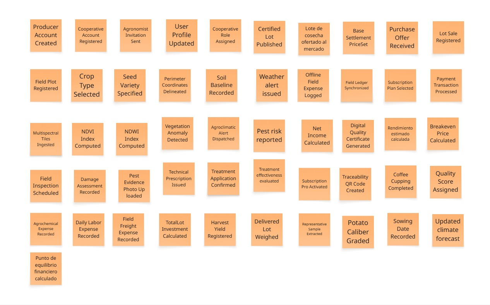
* Dentro de la metodología de Event Storming consiste en realizar una lluvia de ideas intensiva para capturar todos los acontecimientos relevantes que ocurren dentro del dominio del negocio.
#### Step 2: Timelines
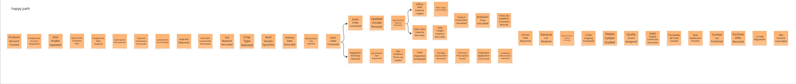
* El segundo paso de Event Storming transforma la lluvia de ideas caótica del Paso 1 en una narrativa operativa coherente, secuenciada cronológicamente de izquierda a derecha bajo el escenario principal o Happy Path.
#### Step 3: Paints Points
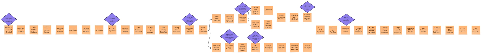
* El tercer paso tiene como función principal identificar y visibilizar de forma temprana las fricciones, riesgos, dudas y cuellos de botella existentes en el flujo operativo del negocio agrícola.
#### Step 4: Pivotal Points
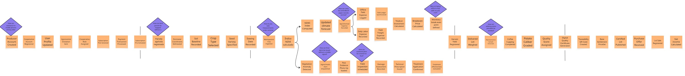
* El cuarto paso tiene como propósito identificar y marcar aquellos eventos de dominio transcendentales que representan cambios de estado irreversibles, puntos de inflexión de alto impacto o transiciones entre diferentes etapas del negocio agrícola.
#### Step 5: Commands
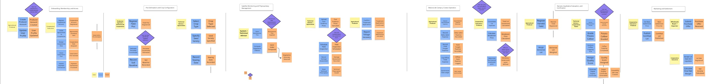
* El paso 5 modela las intenciones directas, acciones de usuario e invocaciones del sistema que provocan la ocurrencia de los eventos de dominio.
#### Step 6: Policies
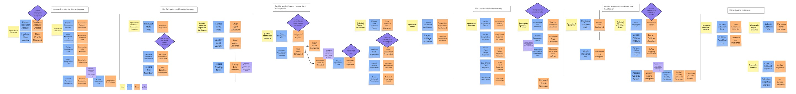
* El paso 6 define las reglas de negocio reactivas, políticas y automatizaciones que se desencadenan automáticamente tras la ocurrencia de uno o más eventos de dominio.
#### Step 7: Read Models
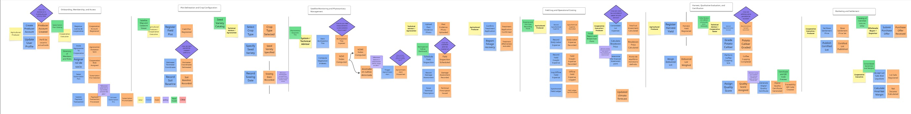
* El paso 7 proyecta los modelos de lectura y vistas de datos necesarios para que los actores e interfaces puedan tomar decisiones informadas antes de ejecutar un comando.
#### Step 8: Commands

#### Step 9: Commands

#### Step 10: Bounded Contexts
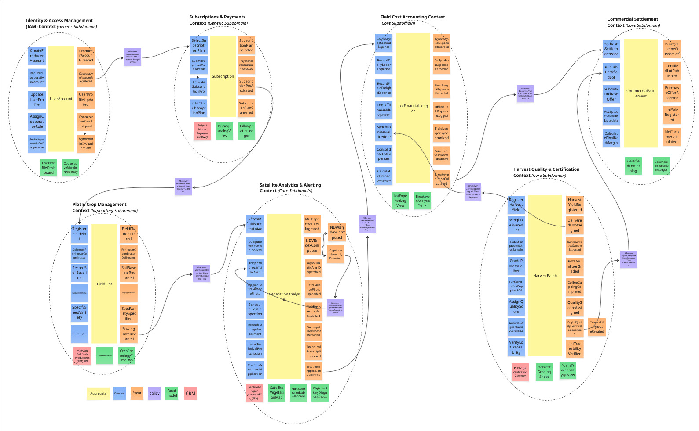

* **Enlace interactivo al espacio de trabajo:** [Tablero de Event Storming en Miro](https://miro.com/welcomeonboard/WG5aQ1R0dmR5b0xQWTI5TEZvaXplRmpPTUxmT2pmR1NNVXBVakcxRFI5Yk16dVY3TXpRc0RwbHVKNWFndGJvZDZkZXJrbkN4VFZQdzhHTjV6MWdBNUJtQnhYMVFmcjNLbkxyOWQwZlVuWHVPRUdrWUJzeGVtb1g5cE9UeGFKdjJBd044SHFHaVlWYWk0d3NxeHNmeG9BPT0hdjE=?share_link_id=126689221129)

---
#### Alineación con Subdominios SaaS y Bounded Contexts

Considerando la estructura de subdominios recomendada para plataformas SaaS de servicios (gestión de identidades, suscripciones, recursos, ejecución de servicios y analítica) y adaptándola al *Ubiquitous Language* de la cadena de valor agroalimentaria, el dominio se estructuró en 7 Bounded Contexts:

**1. Identity & Access Management (IAM) Context (Generic Subdomain)**
* **Responsabilidad:** Administrar el ciclo de vida de identidades, perfiles, asignación de roles institucionales y provisión de credenciales seguras mediante tokens criptográficos JWT.
* **Agregado `UserAccount`:**
    * *Commands:* `CreateProducerAccount`, `RegisterCooperativeAccount`, `UpdateUserProfile`, `AssignCooperativeRole`, `InviteAgronomistToCooperative`.
    * *Events:* `ProducerAccountCreated`, `CooperativeAccountRegistered`, `UserProfileUpdated`, `CooperativeRoleAssigned`, `AgronomistInvitationSent`.
    * *Read Models:* `UserProfileDashboard`, `CooperativeMemberDirectory`.

**2. Subscriptions & Payments Context (Generic Subdomain)**
* **Responsabilidad:** Controlar la monetización SaaS, selección de planes comerciales (Semilla, Cooperativa Pro, Asesor Técnico), validación de transacciones y cuotas activas de parcelas.
* **Agregado `Subscription`:**
    * *Commands:* `SelectSubscriptionPlan`, `SubmitPaymentTransaction`, `ActivateSubscriptionPro`, `CancelSubscriptionPlan`.
    * *Events:* `SubscriptionPlanSelected`, `PaymentTransactionProcessed`, `SubscriptionProActivated`, `SubscriptionPlanCancelled`.
    * *Read Models:* `PricingCatalogView`, `BillingStatusLedger`.
    * *External System:* Stripe / Niubiz Payment Gateway.

**3. Plot & Crop Management Context (Supporting Subdomain)**
* **Responsabilidad:** Administrar la georreferenciación física de fundos y parcelas mediante coordenadas perimetrales continuas (polígonos GPS), caracterización de suelo e inicio fenológico.
* **Agregado `FieldPlot`:**
    * *Commands:* `RegisterFieldPlot`, `DelineatePerimeterCoordinates`, `RecordSoilBaseline`, `SelectCropType`, `SpecifySeedVariety`, `RecordSowingDate`.
    * *Events:* `FieldPlotRegistered`, `PerimeterCoordinatesDelineated`, `SoilBaselineRecorded`, `CropTypeSelected`, `SeedVarietySpecified`, `SowingDateRecorded`.
    * *Read Models:* `CadastralGISMap`, `CropPhenologyTimeline`.
    * *External System:* MIDAGRI Padrón de Productores (PPA) API.

**4. Satellite Analytics & Alerting Context (Core Subdomain)**
* **Responsabilidad:** Orquestar la observación terrestre multiespectral mediante Sentinel-2 para deducir vigor foliar (NDVI) y estrés hídrico (NDWI), despachar alertas preventivas y gestionar recetas técnicas de campo.
* **Agregado `VegetationAnalysis`:**
    * *Commands:* `FetchMultispectralTiles`, `ComputeVegetationIndexes`, `TriggerAgroclimaticAlert`, `UploadPestEvidencePhoto`, `ScheduleFieldInspection`, `RecordDamageAssessment`, `IssueTechnicalPrescription`, `ConfirmTreatmentApplication`.
    * *Events:* `MultispectralTilesIngested`, `NDVIIndexComputed`, `NDWIIndexComputed`, `VegetationAnomalyDetected`, `AgroclimaticAlertDispatched`, `PestEvidencePhotoUploaded`, `FieldInspectionScheduled`, `DamageAssessmentRecorded`, `TechnicalPrescriptionIssued`, `TreatmentApplicationConfirmed`.
    * *Read Models:* `SatelliteVegetationMap`, `MultispectralIndexDashboard`, `PhytosanitaryDiagnosisInbox`.
    * *External Systems:* Sentinel-2 Open Access API (ESA), SENAMHI Weather API, Twilio SMS / WhatsApp Gateway.

**5. Field Cost Accounting Context (Core Subdomain)**
* **Responsabilidad:** Proveer una bitácora contable rural para asentar compras de insumos, jornales diarios y fletes (con soporte de persistencia local desconectada), determinando el costo unitario por lote y el punto de equilibrio financiero.
* **Agregado `LotFinancialLedger`:**
    * *Commands:* `RecordAgrochemicalExpense`, `RecordDailyLaborExpense`, `RecordFieldFreightExpense`, `LogOfflineFieldExpense`, `SynchronizeFieldLedger`, `ConsolidateLotExpenses`, `CalculateBreakevenPrice`.
    * *Events:* `AgrochemicalExpenseRecorded`, `DailyLaborExpenseRecorded`, `FieldFreightExpenseRecorded`, `OfflineFieldExpenseLogged`, `FieldLedgerSynchronized`, `TotalLotInvestmentCalculated`, `BreakevenPriceCalculated`.
    * *Read Models:* `LotExpenseLogView`, `BreakevenAnalysisReport`.

**6. Harvest Quality & Certification Context (Core Subdomain)**
* **Responsabilidad:** Controlar la recolección, pesaje formal de acopio, calificación de calibres de tubérculo (MIDAGRI) y protocolos de catación sensorial SCA, emitiendo certificados digitales inmutables con código QR público.
* **Agregado `HarvestBatch`:**
    * *Commands:* `RegisterHarvestYield`, `WeighDeliveredLot`, `ExtractRepresentativeSample`, `GradePotatoCaliber`, `PerformCoffeeCuppingSCA`, `AssignQualityScore`, `GenerateDigitalQualityCertificate`, `VerifyLotTraceability`.
    * *Events:* `HarvestYieldRegistered`, `DeliveredLotWeighed`, `RepresentativeSampleExtracted`, `PotatoCaliberGraded`, `CoffeeCuppingCompleted`, `QualityScoreAssigned`, `DigitalQualityCertificateGenerated`, `TraceabilityQRCodeCreated`, `LotTraceabilityVerified`.
    * *Read Models:* `HarvestGradingSheet`, `PublicTraceabilityQRView`.
    * *External System:* Public QR Verification Gateway.

**7. Commercial Settlement Context (Core Subdomain)**
* **Responsabilidad:** Publicar lotes certificados en el catálogo comercial, gestionar las posturas de oferta de compradores mayoristas y liquidar la venta garantizando un margen por encima del costo de producción.
* **Agregado `CommercialSettlement`:**
    * *Commands:* `SetBaseSettlementPrice`, `PublishCertifiedLot`, `SubmitPurchaseOffer`, `AcceptLotSaleAndLiquidate`, `CalculateFinalNetMargin`.
    * *Events:* `BaseSettlementPriceSet`, `CertifiedLotPublished`, `PurchaseOfferReceived`, `LotSaleRegistered`, `NetIncomeCalculated`.
    * *Read Models:* `CertifiedLotCatalog`, `CommercialSettlementLedger`.

---
#### Políticas de Automatización Reactivas (Policies)
La orquestación entre los contextos delimitados se rige por políticas eventuales bajo el estándar *Whenever [Domain Event] Then [Command]*:
* **P1:** `Whenever ProducerAccountCreated Then SelectSubscriptionPlan`
* **P2:** `Whenever SubscriptionProActivated Then RegisterFieldPlot`
* **P3:** `Whenever SowingDateRecorded Then FetchMultispectralTiles`
* **P4:** `Whenever VegetationAnomalyDetected Then TriggerAgroclimaticAlert`
* **P5:** `Whenever TreatmentApplicationConfirmed Then RecordAgrochemicalExpense`
* **P6:** `Whenever DeliveredLotWeighed Then ConsolidateLotExpenses`
* **P7:** `Whenever DigitalQualityCertificateGenerated Then PublishCertifiedLot`
* **P8:** `Whenever BreakevenPriceCalculated Then SetBaseSettlementPrice`

### 4.6.2. Software Architecture Context Diagram

En este apartado se presenta el Diagrama de Contexto del Sistema (Nivel 1 del modelo C4), el cual delimita las fronteras operativas y de software de la plataforma **SumaqAgro**, ubicándola como la solución central del ecosistema. A través de esta vista de alto nivel, se establecen los canales de comunicación y flujos de información que mantiene el sistema tanto con los distintos perfiles de usuario identificados en la investigación como con los servicios externos de terceros necesarios para la operación agrícola. Siguiendo los lineamientos de arquitectura y el enfoque *Diagram-as-Code* exigido para el proyecto, el modelado se desarrolló mediante la herramienta **Structurizr** a través de su especificación formal en Structurizr DSL.

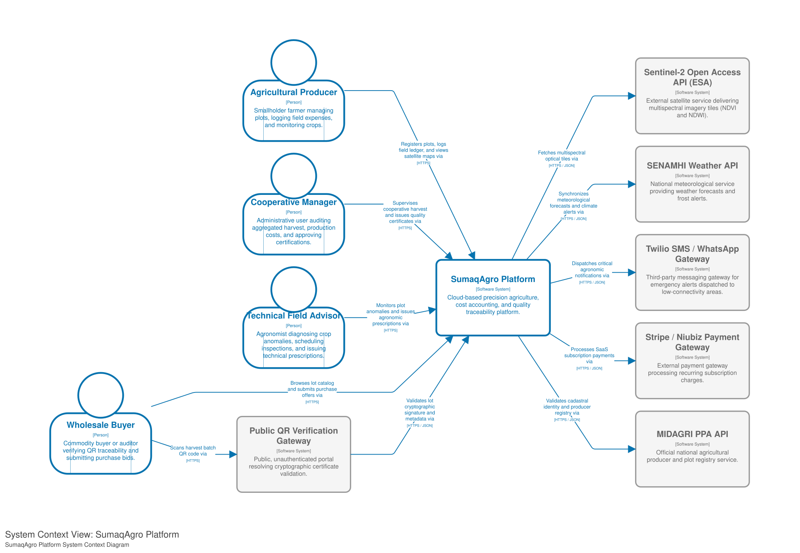

#### Explicación del Diagrama de Contexto

El diagrama sitúa en el centro a **SumaqAgro Platform**, plataforma web distribuida orientada a la agricultura de precisión, el cálculo de costos operativos de campo y la certificación de calidad para las cadenas de café de especialidad y papa andina. A su alrededor se articulan las siguientes interacciones:

##### 1. Actores y Usuarios del Dominio
* **Agricultural Producer (Productor Agrícola):** Agricultor que accede mediante navegadores web o dispositivos móviles para registrar la delimitación geográfica de sus parcelas, monitorear el vigor foliar satelital (NDVI/NDWI) y registrar sus compras de insumos, jornales y fletes en la bitácora de costos.
* **Cooperative Manager (Directivo de Cooperativa):** Usuario administrativo que utiliza la plataforma desde terminales de escritorio para auditar el volumen de acopio de los socios, monitorear los balances financieros por hectárea y aprobar formalmente la emisión de los certificados de calidad de cosecha.
* **Technical Field Advisor (Asesor Técnico de Campo):** Ingeniero agrónomo que hace seguimiento a las alertas satelitales tempranas de estrés hídrico o plagas para priorizar sus visitas presenciales en parcelas críticas, emitiendo recetas agronómicas y dosis correctivas desde la aplicación.
* **Wholesale Buyer (Comprador Mayorista / Exportador):** Usuario comercial que interactúa con la plataforma de forma abierta y sin necesidad de credenciales, escaneando el código QR público de los sacos o lotes para verificar en línea la procedencia geográfica, la variedad botánica y el perfil de calidad certificado.

##### 2. Sistemas Externos e Integraciones
* **Sentinel-2 Open Access API (ESA):** Proveedor satelital que suministra de manera periódica baldosas ópticas multiespectrales. El sistema consume este servicio vía peticiones HTTPS/JSON para computar los índices biofísicos de reflectancia vegetal sin depender de sensores IoT instalados en campo.
* **SENAMHI Weather API:** Servicio meteorológico nacional consultado por HTTPS/JSON para sincronizar pronósticos climáticos y emitir advertencias tempranas ante eventos de heladas meteorológicas o sequías estacionales en los valles productivos.
* **Twilio SMS / WhatsApp Gateway:** Pasarela de mensajería externa utilizada por SumaqAgro para remitir notificaciones prioritarias y alertas agroclimáticas urgentes a productores ubicados en zonas rurales con baja cobertura móvil de datos.
* **Stripe / Niubiz Payment Gateway:** Pasarela de procesamiento de pagos electrónicos integrada mediante API REST (HTTPS/JSON) para la gestión y cobro transaccional de los planes de suscripción de cooperativas agrarias y asesores técnicos.
* **MIDAGRI PPA API:** Servicio gubernamental del Padrón de Productores Agrarios consumido mediante HTTPS/JSON para validar la titularidad catastral de predios y la condición formal de los socios agrícolas.
* **Public QR Verification Gateway:** Punto de acceso web público y liviano que resuelve las peticiones de validación iniciadas por los compradores mayoristas al escanear los códigos QR, certificando la autenticidad e inmutabilidad del lote evaluado.

---
### 4.6.3. Software Architecture Container Diagrams

En esta sección se presenta y describe el Diagrama de Contenedores (Nivel 2 del modelo C4) de la plataforma **SumaqAgro**, el cual profundiza en la frontera del sistema para exponer su arquitectura técnica distribuida. Este diagrama muestra las unidades de despliegue y ejecución independientes que componen la solución, la distribución de responsabilidades entre ellas, las principales decisiones de tecnología adoptadas y los protocolos de red empleados para la comunicación interna y con sistemas externos. El modelado fue estructurado y generado formalmente mediante la especificación DSL de la herramienta **Structurizr**.

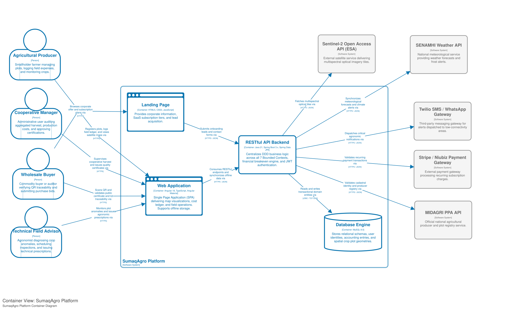

#### Asignación de Responsabilidades y Decisiones Tecnológicas

La topología de ejecución del sistema está conformada por cuatro contenedores independientes:

* **Landing Page Container:**
  Sitio web público estático desarrollado con HTML5, CSS3 y JavaScript vanilla, alojado en un servicio cloud de distribución estática. Diseñado con una carga ligera para garantizar un rendimiento óptimo en terminales móviles bajo redes rurales 3G/4G. Su propósito es exponer la propuesta de valor del producto, presentar los planes de suscripción comercial (Semilla, Cooperativa Pro y Asesor Técnico) y canalizar prospectos comerciales hacia el backend mediante llamadas asíncronas HTTPS/JSON.

* **Web Application Container (Single Page Application - SPA):**
  Aplicación web cliente desarrollada sobre el framework Angular 18, utilizando TypeScript y la biblioteca Angular Material. Provee una interfaz reactiva y accesible tanto para productores de campo como para administradores de cooperativas e ingenieros agrónomos. Integra capacidades de almacenamiento local mediante *Service Workers* e *IndexedDB*, lo que permite soportar operaciones en modo desconectado (*offline-first*) para el registro de jornales, compras e insumos en predios rurales sin cobertura de datos móvil, sincronizando la información automáticamente contra la API REST al recuperar la conexión a internet. Asimismo, aloja el visor público interactivo que permite auditar las credenciales y trazabilidad de los lotes cuando un comprador escanea el código QR impreso.

* **RESTful API Backend Container:**
  Servidor de aplicaciones distribuido implementado en Java 21 utilizando el framework Spring Boot 3.x (Spring MVC, Spring Security y Spring Data JPA). Representa el núcleo transaccional del sistema y aloja la lógica de negocio basada en DDD para los 7 Bounded Contexts identificados. Sus responsabilidades abarcan la emisión y validación de tokens criptográficos JWT para el control de accesos, el cómputo de las matrices financieras de costo unitario y punto de equilibrio rural, el procesamiento de reflectancia satelital desacoplado y la exposición de endpoints documentados formalmente bajo OpenAPI 3.0 (Swagger UI).

* **Database Engine Container:**
  Motor relacional MySQL 8.0 configurado como la unidad de persistencia de datos. Almacena las tablas normalizadas del dominio asegurando transacciones atómicas bajo el estándar ACID, soporte de integridad referencial mediante claves foráneas y compatibilidad con tipos de datos espaciales para el resguardo de las geometrías perimetrales de las parcelas agrícolas.

#### Protocolos de Interoperabilidad y Comunicación

* **Acceso de Usuarios:** Los usuarios finales interactúan con los contenedores web (*Landing Page* y *Web Application*) mediante peticiones seguras sobre el protocolo HTTPS.
* **Cliente Web a Backend:** La Single Page Application consume la lógica de negocio y envía datos locales sincronizados mediante llamadas asíncronas RESTful sobre HTTPS, transmitiendo datos estructurados en formato JSON protegidos con tokens de autorización Bearer JWT.
* **Backend a Base de Datos:** Las operaciones transaccionales y de persistencia de los agregados se ejecutan directamente a través de una conexión TCP protegida sobre el puerto 3306 mediante el controlador JDBC de MySQL.
* **Backend a Servicios Externos:** Las consultas salientes hacia Sentinel-2 API, SENAMHI Weather API, Twilio Gateway, Stripe/Niubiz y MIDAGRI PPA se realizan mediante clientes HTTP desacoplados bajo peticiones seguras HTTPS/JSON.
---

### 4.6.4. Software Architecture Components Diagrams

En esta sección se presentan y explican los Diagramas de Componentes (Nivel 3 del modelo C4) correspondientes a cada uno de los contenedores de software ejecutables que integran la plataforma **SumaqAgro**: la **Landing Page**, la **Web Application (Single Page Application en Angular 18)** y el **RESTful API Backend (Spring Boot 3.x)**. A través de estos diagramas se detalla la descomposición estructural interna de cada unidad de despliegue, identificando la naturaleza de sus componentes, sus responsabilidades de negocio asignadas, los detalles de implementación tecnológica y sus flujos de interacción internos y externos. El modelado fue desarrollado en **Structurizr** siguiendo la especificación formal de Structurizr DSL.

---

#### 4.6.4.1. Landing Page Container Components Diagram

El contenedor de la Landing Page descompone la estructura del sitio web estático público, diseñado con una arquitectura liviana orientada a maximizar la velocidad de carga y la tasa de conversión en dispositivos móviles bajo redes rurales 3G/4G.

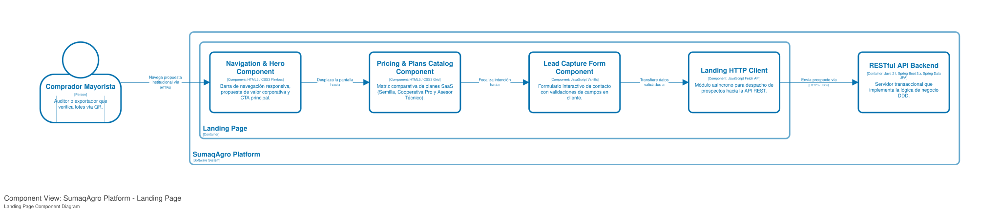

##### Desglose de Componentes de la Landing Page:
* **`Navigation & Hero Component`:** Bloque estructural desarrollado con HTML5 semántico y maquetado responsivo mediante CSS3 Flexbox. Administra la barra de navegación superior, la identidad visual corporativa de SumaqAgro, la propuesta de valor agroclimática orientada a café de especialidad y papa andina, y el llamado a la acción (CTA) que conduce al formulario de registro y demostración.
* **`Pricing & Plans Catalog Component`:** Componente visual maquetado mediante CSS3 Grid. Presenta la matriz comparativa de los planes de suscripción comercial SaaS: el plan *Semilla* (gratuito para pequeños productores familiares), el plan *Cooperativa Pro* (para gremios con monitoreo consolidado de socios) y el plan *Asesor Técnico* (para agrónomos independientes con carteras de clientes).
* **`Lead Capture Form Component`:** Módulo interactivo implementado en JavaScript vanilla. Intercepta los eventos de ingreso de datos para solicitudes de contacto y demostraciones técnicas, ejecutando validaciones sintácticas del lado del cliente (formato regex de correo electrónico, longitud de número celular y campos obligatorios) para prevenir envíos incompletos a la red.
* **`Landing HTTP Client`:** Componente de comunicación asíncrona construido sobre la API nativa `Fetch` de JavaScript. Serializa las entradas del formulario hacia una carga útil JSON y despacha la petición POST sobre HTTPS hacia el endpoint `/api/v1/users` del backend transaccional, administrando los estados visuales de confirmación o alerta ante incidencias de conectividad.

---

#### 4.6.4.2. Web Application Container Components Diagram (Angular SPA)

El contenedor de la aplicación cliente SPA, implementado sobre el framework **Angular 18**, descompone sus módulos para brindar una experiencia de usuario interactiva y garantizar la persistencia local de datos en campo mediante capacidades desconectadas (*offline-first*).

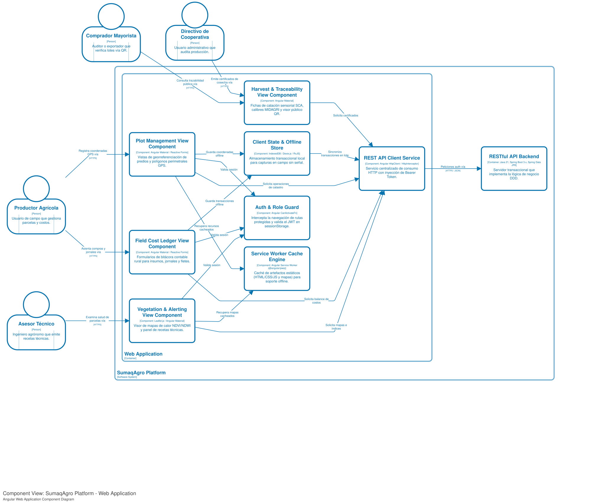

##### Desglose de Componentes de la Web Application:
* **`Auth & Role Guard`:** Guardia funcional de enrutamiento (`CanActivateFn`) de Angular. Intercepta la navegación hacia rutas protegidas comprobando la vigencia del token JWT almacenado en `sessionStorage`, aplicando el control de acceso basado en roles (RBAC) para productores, directivos y agrónomos.
* **`Plot Management View Component`:** Interfaz gráfica desarrollada con Angular Material y Formularios Reactivos (`ReactiveFormsModule`). Permite la georreferenciación de predios, la captura interactiva de vértices perimetrales GPS y el registro botánico y fenológico de las campañas agrícolas.
* **`Vegetation & Alerting View Component`:** Componente analítico que integra la biblioteca Leaflet.js con Angular. Renderiza capas de calor satelitales con series temporales de reflectancia foliar (NDVI y NDWI), canalizando el buzón de alertas agroclimáticas y recetas fitosanitarias emitidas por el extensionista.
* **`Field Cost Ledger View Component`:** Módulo de captura contable rural que provee formularios reactivos para el asiento inmediato de compras de fertilizantes, jornales diarios y fletes, alimentando los paneles de estimación de costos unitarios y punto de equilibrio.
* **`Harvest & Traceability View Component`:** Vistas de calificación física de calibres de tubérculo (norma técnica MIDAGRI) y protocolos de catación sensorial de café (estándar SCA). Incluye el visor público accesible mediante el escaneo del código QR para la auditoría de procedencia de los lotes.
* **`Client State & Offline Store`:** Capa de almacenamiento transaccional local implementada con *IndexedDB* (mediante Dexie.js) coordinada con estados reactivos basados en `BehaviorSubject` de RxJS. Retiene las operaciones efectuadas en parcelas sin señal de red celular y orquesta la sincronización automática diferida en lote al detectar conectividad a internet.
* **`Service Worker Cache Engine`:** Módulo de Progressive Web App provisto por `@angular/pwa`. Almacena en caché los artefactos estáticos compilados (HTML, CSS, JavaScript e iconografía vectorial), asegurando la operatividad continua de la interfaz web en entornos rurales sin conexión.
* **`REST API Client Service`:** Servicio Angular centralizado (`@Injectable`) que encapsula la comunicación HTTPS con el backend mediante `HttpClient`. Emplea un `HttpInterceptor` que inyecta automáticamente el encabezado `Authorization: Bearer <JWT>` en cada solicitud saliente y unifica la gestión de excepciones HTTP de red.

---

#### 4.6.4.3. RESTful API Backend Container Components Diagram (Spring Boot)

El contenedor transaccional de backend, desarrollado en **Java 21 con Spring Boot 3.x**, implementa una arquitectura en capas desacopladas orientada al dominio (*Layered Architecture / DDD*), gobernando las reglas de negocio de los 7 Bounded Contexts y agregados de la solución.

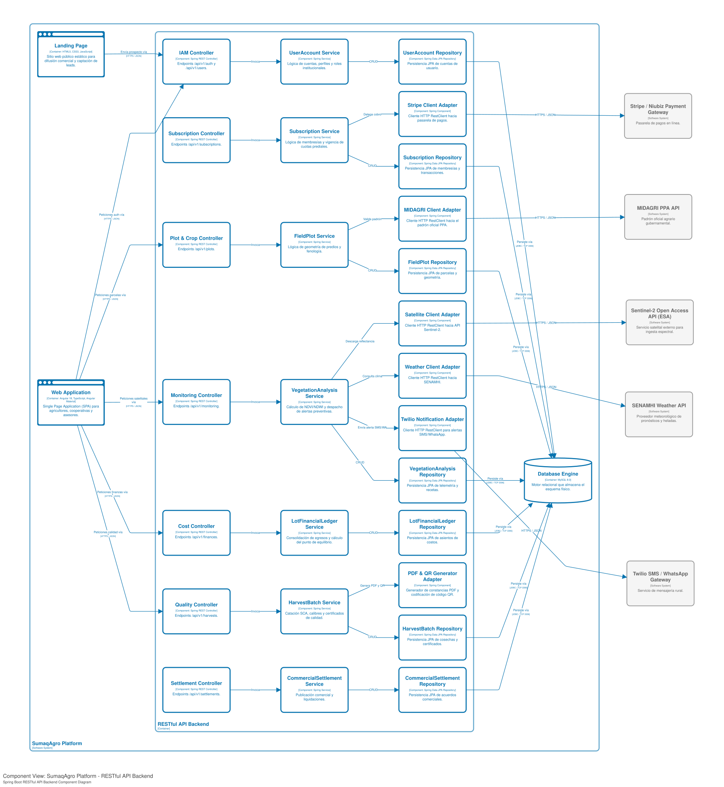

##### Desglose de Componentes del Backend por Capa Técnica:

* **Capa de Controladores REST (Inbound Controllers):**
  Controladores anotados con `@RestController` que exponen los endpoints del sistema sobre HTTPS/JSON, interceptan las peticiones desde el cliente Angular, validan los DTOs de entrada mediante Bean Validation (`@Valid`) y delegan la ejecución hacia los servicios de aplicación:
  * `IamController`: Expone `/api/v1/auth` y `/api/v1/users` para registro, inicio de sesión seguro, emisión de JWT y gestión de perfiles institucionales.
  * `SubscriptionController`: Expone `/api/v1/subscriptions` para consulta de membresías y confirmación transaccional de planes comerciales.
  * `PlotController`: Expone `/api/v1/plots` para catastro de coordenadas GPS, delimitación perimetral y calendarios de siembra.
  * `MonitoringController`: Expone `/api/v1/monitoring` para mapas multiespectrales, series NDVI/NDWI y recetas agronómicas.
  * `CostController`: Expone `/api/v1/finances` para la bitácora financiera, sincronización diferida de asientos y cálculo de punto de equilibrio.
  * `QualityController`: Expone `/api/v1/harvests` para pesaje de acopio, catación SCA, graduación de calibres y certificados.
  * `SettlementController`: Expone `/api/v1/settlements` para publicación comercial de lotes y liquidaciones de venta.

* **Capa de Servicios de Aplicación (Domain Application Services):**
  Servicios anotados con `@Service` que orquestan las transacciones atómicas, validan las reglas de invariante de cada Agregado y coordinan las llamadas hacia los adaptadores salientes:
  * `UserAccountService`: Administra el ciclo de vida del agregado `UserAccount`, gestionando el hashing seguro de claves y la asignación de permisos.
  * `SubscriptionService`: Gobierna el agregado `Subscription`, controlando la vigencia de membresías y cuotas de predios asignados.
  * `FieldPlotService`: Administra el agregado `FieldPlot`, validando que los polígonos perimetrales no presenten autointersecciones.
  * `VegetationAnalysisService`: Gestiona el agregado `VegetationAnalysis`, calculando algoritmos de reflectancia sobre bandas satelitales y despachando alertas preventivas de estrés foliar.
  * `LotFinancialLedgerService`: Orquesta el agregado `LotFinancialLedger`, calculando la sumatoria de egresos operativos para deducir el costo unitario de producción y el precio de equilibrio.
  * `HarvestBatchService`: Supervisa el agregado `HarvestBatch`, validando umbrales mínimos de calidad sensorial y física antes de autorizar la emisión de acreditaciones.
  * `CommercialSettlementService`: Gobierna el agregado `CommercialSettlement`, protegiendo que la postura comercial aceptada cubra el margen mínimo de ganancia sobre el costo acumulado.

* **Capa de Adaptadores de Infraestructura (Outbound Adapters):**
  Componentes de integración desacoplados anotados con `@Component` que encapsulan la comunicación técnica con plataformas externas o compilan artefactos binarios:
  * `StripeClientAdapter`: Consume mediante cliente REST la API de Stripe/Niubiz para la tokenización de cobros y facturación recurrente.
  * `MidagriClientAdapter`: Consulta el servicio gubernamental del Padrón de Productores Agrarios (PPA) para verificar la titularidad catastral.
  * `SatelliteClientAdapter`: Descarga baldosas ópticas multiespectrales (Bandas B4, B8 y B8A) desde la API abierta de Sentinel-2 (ESA).
  * `WeatherClientAdapter`: Consume los pronósticos agroclimáticos y alertas meteorológicas de SENAMHI.
  * `TwilioNotificationAdapter`: Invoca la API de Twilio para remitir notificaciones prioritarias de emergencia vía SMS y WhatsApp.
  * `PdfQrGeneratorAdapter`: Compila dinámicamente constancias técnicas en formato PDF y codifica el código QR de validación criptográfica pública.

* **Capa de Persistencia (Spring Data JPA Repositories):**
  Interfaces que extienden de `JpaRepository` para mapear los agregados hacia las tablas de la base de datos MySQL 8.0 vía JDBC sobre el puerto TCP 3306:
  * `UserAccountRepository`, `SubscriptionRepository`, `FieldPlotRepository`, `VegetationAnalysisRepository`, `CostLedgerRepository`, `HarvestBatchRepository` y `CommercialSettlementRepository`.
---

## 4.7. Software Object-Oriented Design

En este apartado bajamos el diseño de arquitectura a un nivel más concreto de implementación técnica, traduciendo lo definido en el Event Storming y los componentes de Spring Boot hacia diagramas de clases UML para cada Bounded Context. El objetivo es estructurar cómo se organizan internamente los paquetes, las entidades del dominio, las raíces de agregado (Aggregate Roots), los objetos de valor (Value Objects), los controladores REST, los servicios de aplicación y los repositorios de persistencia.

Para mantener una arquitectura limpia y desacoplada, el diseño sigue los principios SOLID y las convenciones de Domain-Driven Design (DDD). De esta forma aseguramos que la lógica del negocio permanezca independiente de la infraestructura web o de la base de datos, facilitando el mantenimiento y las pruebas unitarias del software.

---

### 4.7.1. Class Diagrams

En esta sección se presentan y explican en detalle los Diagramas de Clases de UML para cada uno de los Bounded Contexts que conforman el backend transaccional de la plataforma **SumaqAgro**. Cada modelo detalla los modificadores de acceso estandarizados (`-` para miembros privados, `+` para miembros públicos y `#` para miembros protegidos), los tipos de datos en atributos y parámetros, los valores de retorno en métodos, las cardinalidades en ambos extremos de cada asociación y la semántica formal de las relaciones (composición para fronteras de agregación, asociación calificada, dependencia `<<use>>` e implementación de interfaces).

---

#### 4.7.1.1. Identity & Access Management (IAM) Context Class Diagram

El Bounded Context de Identity & Access Management modela la gestión de identidades digitales, la autenticación sin estado mediante tokens criptográficos JWT y el control de accesos basado en roles institucionales (RBAC).

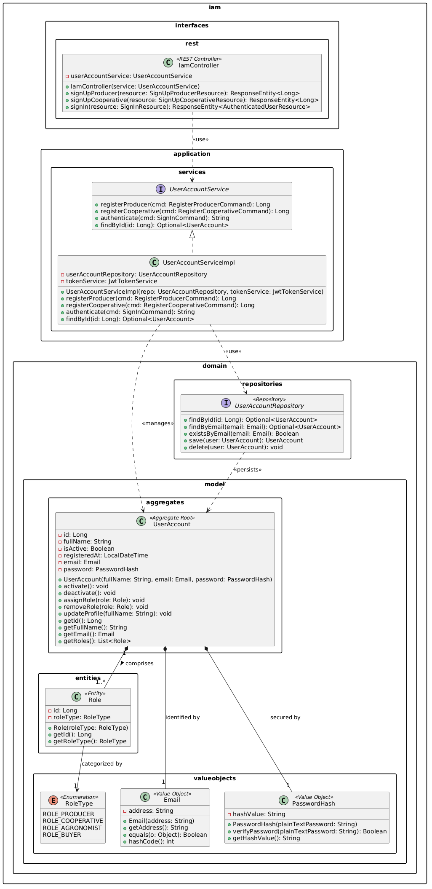

##### Desglose Estructural de Clases y Componentes:

* **`UserAccount` (Aggregate Root):**
  Constituye la raíz de consistencia transaccional del contexto, protegiendo las invariantes asociadas al ciclo de vida de la cuenta.
    * **Atributos privados:**
        * `- id: Long`: Identificador único secuencial de la entidad dentro de la base de datos.
        * `- fullName: String`: Nombre completo o razón social del titular registrado.
        * `- isActive: Boolean`: Bandera booleana que determina si la cuenta se encuentra habilitada para iniciar sesión.
        * `- registeredAt: LocalDateTime`: Marca temporal de auditoría que registra la fecha y hora de creación.
        * `- email: Email`: Objeto de valor que resguarda la dirección de correo validada.
        * `- password: PasswordHash`: Objeto de valor que almacena el hash criptográfico de la clave de acceso.
    * **Métodos públicos:**
        * `+ UserAccount(fullName: String, email: Email, password: PasswordHash)`: Constructor que inicializa una cuenta activa con fecha actual.
        * `+ activate(): void`: Cambia el estado de `isActive` a verdadero.
        * `+ deactivate(): void`: Inhabilita la cuenta para bloquear accesos transaccionales.
        * `+ assignRole(role: Role): void`: Vincula un nuevo rol institucional a la colección interna del usuario.
        * `+ removeRole(role: Role): void`: Remueve un rol previamente concedido garantizando que al menos quede un rol base.
        * `+ updateProfile(fullName: String): void`: Muta el nombre del titular previa validación de longitud.
        * `+ getId(): Long`, `+ getFullName(): String`, `+ getEmail(): Email`, `+ getRoles(): List<Role>`: Métodos de lectura de estado.

* **`Role` (Entity) y `RoleType` (Enumeration):**
  Representa el permiso concedido al usuario. `Role` contiene el atributo privado `- id: Long` y `- roleType: RoleType`. La enumeración `RoleType` tipifica estrictamente las etiquetas de autorización: `ROLE_PRODUCER` (productores familiares), `ROLE_COOPERATIVE` (directivos de acopio), `ROLE_AGRONOMIST` (asesores técnicos) y `ROLE_BUYER` (compradores mayoristas).

* **`Email` y `PasswordHash` (Value Objects):**
    * `Email`: Objeto inmutable con el atributo privado `- address: String`. Su constructor valida la conformidad con la expresión regular de correo electrónico estándar RFC 5322; expone `+ getAddress(): String` y sobrescribe `equals()` y `hashCode()`.
    * `PasswordHash`: Contiene `- hashValue: String`. Encapsula el algoritmo de derivación de claves BCrypt; expone `+ verifyPassword(plainTextPassword: String): Boolean` para comparar credenciales sin exponer la contraseña en texto plano y `+ getHashValue(): String`.

* **`UserAccountRepository` (Domain Repository Interface):**
  Interfaz que abstrae las operaciones de persistencia mediante Spring Data JPA. Define los contratos `+ findById(id: Long): Optional<UserAccount>`, `+ findByEmail(email: Email): Optional<UserAccount>`, `+ existsByEmail(email: Email): Boolean`, `+ save(user: UserAccount): UserAccount` y `+ delete(user: UserAccount): void`.

* **`UserAccountService` y `UserAccountServiceImpl` (Application Layer):**
  Define y ejecuta la orquestación de casos de uso de seguridad. `UserAccountServiceImpl` posee dependencias privadas hacia `UserAccountRepository` y `JwtTokenService`; implementa `+ registerProducer(cmd: RegisterProducerCommand): Long`, `+ registerCooperative(cmd: RegisterCooperativeCommand): Long`, `+ authenticate(cmd: SignInCommand): String` y `+ findById(id: Long): Optional<UserAccount>`.

* **`UserAccountResourceAssembler` (Assembler / Interface Layer):**
  Componente encargado de la transformación desacoplada entre las cargas útiles de la API y las entidades del dominio. Expone `+ toResourceFromEntity(entity: UserAccount): UserAccountResource` para serializar las respuestas HTTP y `+ toEntityFromResource(resource: SignUpProducerResource): UserAccount` para reconstruir la raíz de agregación.

* **`IamController` (REST Controller Interface Layer):**
  Punto de entrada HTTP expuesto bajo `/api/v1/auth` y `/api/v1/users`. Inyecta `UserAccountService` y `UserAccountResourceAssembler`, exponiendo `+ signUpProducer(resource: SignUpProducerResource): ResponseEntity<Long>`, `+ signUpCooperative(resource: SignUpCooperativeResource): ResponseEntity<Long>` y `+ signIn(resource: SignInResource): ResponseEntity<AuthenticatedUserResource>`.

##### Relaciones y Cardinalidades del Contexto:
* **Composición (`UserAccount` "1" *-- "1..*" `Role`):** Una cuenta de usuario es dueña del ciclo de vida de sus roles asignados; no pueden existir roles huérfanos sin una cuenta asociada. Un usuario posee como mínimo un rol (`1..*`).
* **Asociación dirigida (`Role` --> "1" `RoleType`):** Cada entidad `Role` referencia exactamente a un valor de la enumeración `RoleType`.
* **Composición (`UserAccount` *-- "1" `Email` y `PasswordHash`):** La identidad y la seguridad son parte constituyente e inseparable del agregado.
* **Dependencia de uso (`IamController` ..> `UserAccountService` y `UserAccountResourceAssembler`):** El controlador delega comandos hacia el servicio de aplicación y utiliza el ensamblador para mapear recursos externos.
* **Dependencia de uso y gestión (`UserAccountServiceImpl` ..> `UserAccount` y `UserAccountRepository`):** El servicio gestiona la mutación del agregado e interactúa con el repositorio para persistir los cambios vía JDBC.

---

#### 4.7.1.2. Subscriptions & Payments Context Class Diagram

Este contexto delimita el modelo de monetización SaaS, gobernando la activación comercial de planes, la cancelación de membresías, las cuotas de predios asignadas y la interoperabilidad con pasarelas de pago externas.

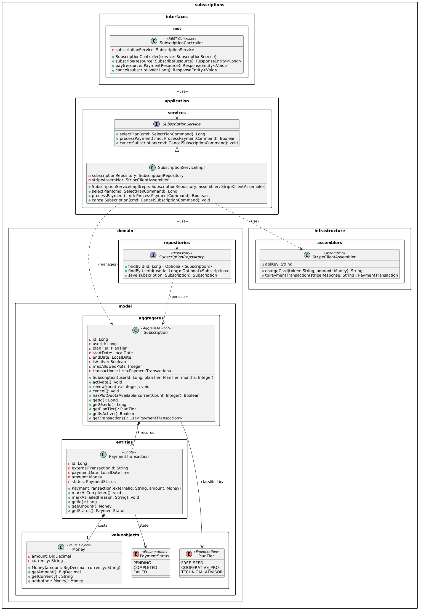

##### Desglose Estructural de Clases y Componentes:

* **`Subscription` (Aggregate Root):**
  Controla los límites y la vigencia comercial del acceso al servicio.
    * **Atributos privados:**
        * `- id: Long`: Identificador de la suscripción.
        * `- userId: Long`: Identificador del usuario o cooperativa titular (referencia por identidad hacia IAM).
        * `- planTier: PlanTier`: Categoría del plan contratado.
        * `- startDate: LocalDate`: Fecha inicial de vigencia.
        * `- endDate: LocalDate`: Fecha de vencimiento de la membresía.
        * `- isActive: Boolean`: Estado transaccional del servicio contratado.
        * `- maxAllowedPlots: Integer`: Cuota máxima permitida de parcelas registrables.
        * `- transactions: List<PaymentTransaction>`: Colección histórica de cobros asociados.
    * **Métodos públicos:**
        * `+ Subscription(userId: Long, planTier: PlanTier, months: Integer)`: Constructor que establece fechas y cuota base.
        * `+ activate(): void`: Habilita la suscripción tras la confirmación del pago.
        * `+ renew(months: Integer): void`: Extiende la fecha de término por el periodo pagado.
        * `+ cancel(): void`: Inhabilita la renovación automática y actualiza `isActive` a falso, emitiendo la cancelación del contrato.
        * `+ hasPlotQuotaAvailable(currentCount: Integer): Boolean`: Valida si el cliente aún puede registrar parcelas adicionales.

* **`PaymentTransaction` (Entity):**
  Registra cada evento de cobro monetario. Contiene `- id: Long`, `- externalTransactionId: String` (código devuelto por la pasarela), `- paymentDate: LocalDateTime`, `- amount: Money` y `- status: PaymentStatus`. Expone `+ markAsCompleted(): void` y `+ markAsFailed(reason: String): void`.

* **`Money` (Value Object):**
  Encapsula importes con precisión contable. Posee los atributos privados `- amount: BigDecimal` y `- currency: String`. Expone métodos inmutables como `+ add(other: Money): Money`, impidiendo operaciones aritméticas erróneas entre monedas distintas.

* **`PlanTier` y `PaymentStatus` (Enumerations):**
    * `PlanTier`: Define los niveles `FREE_SEED` (plan base individual), `COOPERATIVE_PRO` (gestión gremial multivariable) y `TECHNICAL_ADVISOR` (cartera agronómica).
    * `PaymentStatus`: Fases de cobro `PENDING`, `COMPLETED` y `FAILED`.

* **`StripeClientAssembler` (Infrastructure Layer):**
  Componente de infraestructura y enlace con la pasarela de pagos externa. Encapsula las credenciales y llamadas seguras HTTPS/JSON mediante `+ chargeCard(token: String, amount: Money): String` y `+ toPaymentTransaction(stripeResponse: String): PaymentTransaction` para transformar la respuesta sin procesar de la API en la entidad de cobro del dominio.

* **`SubscriptionRepository`, `SubscriptionService` y `SubscriptionController`:**
  El repositorio declara `+ findByUserId(userId: Long): Optional<Subscription>`. El servicio orquesta `+ selectPlan(cmd: SelectPlanCommand): Long`, `+ processPayment(cmd: ProcessPaymentCommand): Boolean` y `+ cancelSubscription(cmd: CancelSubscriptionCommand): void`. El controlador atiende peticiones REST bajo `/api/v1/subscriptions`, exponiendo `+ subscribe()`, `+ pay()` y `+ cancel(subscriptionId: Long): ResponseEntity<Void>`.

##### Relaciones y Cardinalidades del Contexto:
* **Composición (`Subscription` "1" *-- "0..*" `PaymentTransaction`):** Las transacciones financieras están subordinadas al contrato de suscripción.
* **Composición (`PaymentTransaction` *-- "1" `Money`):** El valor económico es intrínseco al comprobante de cobro.
* **Asociación dirigida hacia Enums:** `Subscription` apunta a `PlanTier` (`1`), y `PaymentTransaction` apunta a `PaymentStatus` (`1`).
* **Dependencias:** `SubscriptionController` consume `SubscriptionService`, el cual depende de `SubscriptionRepository` y de `StripeClientAssembler` para interactuar con la pasarela externa.

---

#### 4.7.1.3. Plot & Crop Management Context Class Diagram

Gestiona la delimitación espacial y catastral de predios agrícolas, los atributos físico-químicos del suelo y las campañas fenológicas de cultivo instaladas.

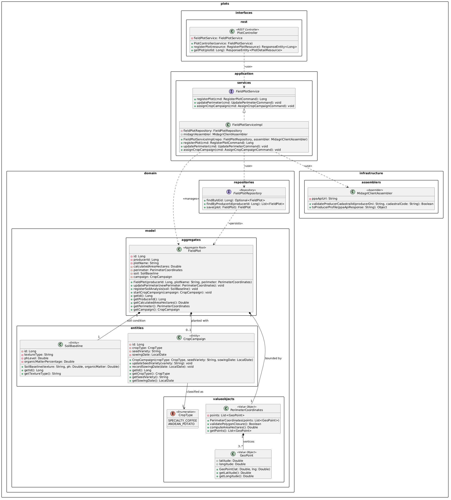

##### Desglose Estructural de Clases y Componentes:

* **`FieldPlot` (Aggregate Root):**
  Raíz de agregación que salvaguarda la integridad geográfica y el estado agronómico de la parcela.
    * **Atributos privados:**
        * `- id: Long`: Identificador único del predio.
        * `- producerId: Long`: Vínculo referencial hacia el productor titular en IAM.
        * `- plotName: String`: Nombre o denominación común del lote.
        * `- calculatedAreaHectares: Double`: Superficie calculada de forma computacional en hectáreas.
        * `- perimeter: PerimeterCoordinates`: Geometría vectorial cerrada del lote.
        * `- soil: SoilBaseline`: Caracterización inicial de suelo.
        * `- campaign: CropCampaign`: Campaña agrícola instalada en el terreno.
    * **Métodos públicos:**
        * `+ FieldPlot(producerId: Long, plotName: String, perimeter: PerimeterCoordinates)`: Inicializa la parcela validando topología.
        * `+ updatePerimeter(newPerimeter: PerimeterCoordinates): void`: Recalcula el área y reemplaza las coordenadas perimetrales.
        * `+ registerSoilAnalysis(soil: SoilBaseline): void`: Asocia los resultados de laboratorio del suelo.
        * `+ startCropCampaign(campaign: CropCampaign): void`: Asigna una nueva campaña fenológica de siembra.

* **`PerimeterCoordinates` y `GeoPoint` (Value Objects):**
    * `GeoPoint`: Encapsula un vértice geográfico mediante `- latitude: Double` y `- longitude: Double`, validando los rangos estándar de latitud (-90 a 90) y longitud (-180 a 180).
    * `PerimeterCoordinates`: Encapsula la lista privada `- points: List<GeoPoint>`. Su método `+ validatePolygonClosure(): Boolean` asegura que el vértice final coincida con el inicial, mientras que `+ computeAreaHectares(): Double` calcula el área utilizando el algoritmo de la fórmula de Shoelace proyectada.

* **`SoilBaseline` y `CropCampaign` (Entities):**
    * `SoilBaseline`: Contiene `- textureType: String`, `- phLevel: Double` y `- organicMatterPercentage: Double`.
    * `CropCampaign`: Modela la campaña fenológica instalada en la parcela. Contiene los atributos privados `- id: Long`, `- cropType: CropType` (`SPECIALTY_COFFEE` o `ANDEAN_POTATO`), `- seedVariety: String` (ej. Typica, Caturra, Canchán, Yungay) y `- sowingDate: LocalDate`. Expone los métodos `+ updateSeedVariety(variety: String): void` y `+ recordSowingDate(date: LocalDate): void`, soportando los eventos de siembra.

* **`MidagriClientAssembler` (Infrastructure Layer):**
  Componente de infraestructura que consulta el Padrón de Productores Agrarios (PPA). Expone `+ validateProducerCadastralId(producerDni: String, cadastralCode: String): Boolean` y `+ toProducerProfile(ppaApiResponse: String): Object` para traducir las respuestas del padrón gubernamental hacia el dominio.

##### Relaciones y Cardinalidades del Contexto:
* **Composición (`FieldPlot` "1" *-- "1" `PerimeterCoordinates`):** Toda parcela posee obligatoriamente una frontera geométrica.
* **Composición (`PerimeterCoordinates` "1" *-- "3..*" `GeoPoint`):** Un polígono válido requiere como mínimo tres vértices cerrados (`3..*`).
* **Composición (`FieldPlot` "1" *-- "1" `SoilBaseline` y `FieldPlot` "1" *-- "0..1" `CropCampaign`):** La línea base de suelo es obligatoria, mientras que la campaña es opcional según el ciclo productivo.
* **Dependencias:** `FieldPlotServiceImpl` orquesta el agregado utilizando `FieldPlotRepository` y valida la formalidad del predio mediante `MidagriClientAssembler`.

---

#### 4.7.1.4. Satellite Analytics & Alerting Context Class Diagram

Este contexto centraliza la captura de telemetría espectral provista por Sentinel-2, el cálculo de algoritmos biofísicos de salud vegetal y la emisión de diagnósticos y prescripciones técnicas.

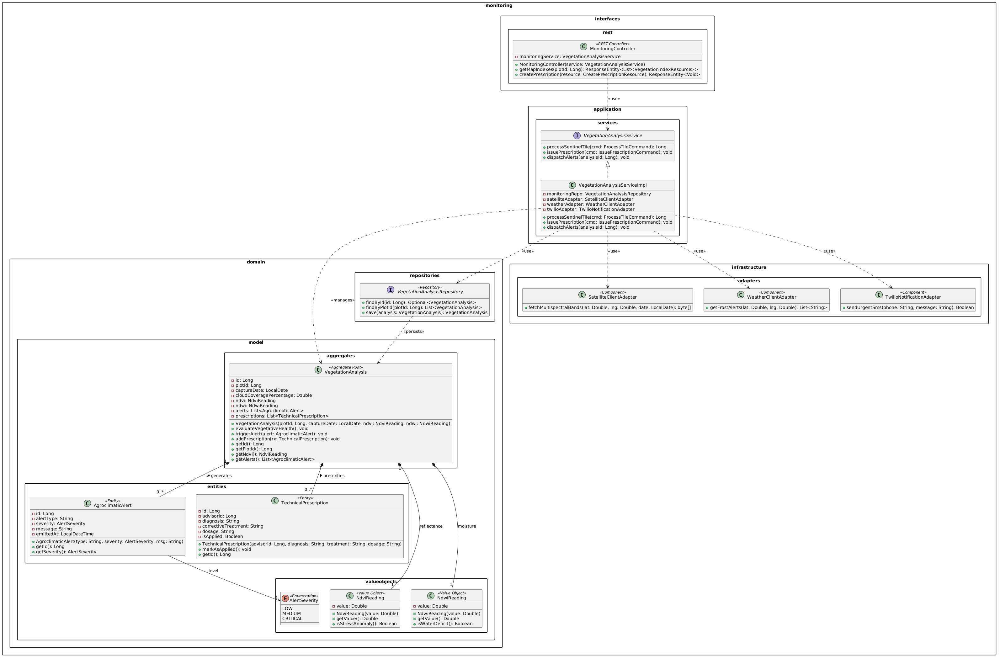

##### Desglose Estructural de Clases y Componentes:

* **`VegetationAnalysis` (Aggregate Root):**
  Consolida el estado biofísico de un predio en un punto específico en el tiempo.
    * **Atributos privados:**
        * `- id: Long`: Identificador del registro analítico.
        * `- plotId: Long`: Parcela evaluada.
        * `- captureDate: LocalDate`: Fecha de adquisición de la baldosa satelital.
        * `- cloudCoveragePercentage: Double`: Porcentaje de cobertura nubosa detectado.
        * `- ndvi: NdviReading`: Valor computado del índice de vegetación normalizado.
        * `- ndwi: NdwiReading`: Valor computado del índice diferencial de agua.
        * `- alerts: List<AgroclimaticAlert>`: Alertas preventivas emitidas.
        * `- prescriptions: List<TechnicalPrescription>`: Recetas técnicas registradas por agrónomos.
    * **Métodos públicos:**
        * `+ evaluateVegetativeHealth(): void`: Compara los índices contra umbrales basales para detectar estrés biótico o abiótico.
        * `+ triggerAlert(alert: AgroclimaticAlert): void`: Anexa una advertencia ante caídas bruscas de reflectancia.
        * `+ addPrescription(rx: TechnicalPrescription): void`: Incorpora la prescripción correctiva del asesor técnico.

* **`NdviReading` y `NdwiReading` (Value Objects):**
  Encapsulan los índices matemáticos mediante `- value: Double`, validando en sus constructores que el valor numérico se sitúe estrictamente en el intervalo $[-1.0, 1.0]$. `NdviReading` provee `+ isStressAnomaly(): Boolean` (activo si el valor cae por debajo de 0.40 en etapas clave), y `NdwiReading` expone `+ isWaterDeficit(): Boolean`.

* **`AgroclimaticAlert` y `TechnicalPrescription` (Entities):**
    * `AgroclimaticAlert`: Modela eventos de riesgo; posee `- alertType: String`, `- severity: AlertSeverity` (`LOW`, `MEDIUM`, `CRITICAL`), `- message: String` y `- emittedAt: LocalDateTime`.
    * `TechnicalPrescription`: Receta de campo; posee `- advisorId: Long`, `- diagnosis: String`, `- correctiveTreatment: String`, `- dosage: String` y `- isApplied: Boolean`, exponiendo `+ markAsApplied(): void`.

* **Componentes de Integración y Transformación (`SatelliteClientAssembler`, `WeatherClientAssembler`, `TwilioNotificationAssembler`):**
    * `SatelliteClientAssembler`: Descarga bandas ópticas multiespectrales B4, B8 y B8A desde Sentinel-2 y ejecuta `+ toVegetationAnalysis(tileData: byte[]): VegetationAnalysis`.
    * `WeatherClientAssembler`: Consume alertas meteorológicas y heladas de SENAMHI, traduciéndolas mediante `+ toAgroclimaticAlert(rawWeatherAlert: String): AgroclimaticAlert`.
    * `TwilioNotificationAssembler`: Serializa la alerta en una carga útil de texto con `+ toSmsPayload(alert: AgroclimaticAlert): String` y despacha el mensaje SMS/WhatsApp a los productores.

##### Relaciones y Cardinalidades del Contexto:
* **Composición (`VegetationAnalysis` "1" *-- "1" `NdviReading` y `NdwiReading`):** Los índices satelitales son inseparables del informe espectral.
* **Composición (`VegetationAnalysis` "1" *-- "0..*" `AgroclimaticAlert` y `TechnicalPrescription`):** El análisis de una fecha puede generar múltiples alertas y albergar varias prescripciones correctivas.
* **Dependencias:** `VegetationAnalysisServiceImpl` consume los ensambladores satelitales, meteorológicos y de mensajería para orquestar la ingesta y respuesta agronómica.

---

#### 4.7.1.5. Field Cost Accounting Context Class Diagram

Modela la contabilidad analítica de costos agrícolas, soportando la sincronización de bitácoras sin conexión (*offline-first*) y el cálculo computacional del punto de equilibrio financiero.

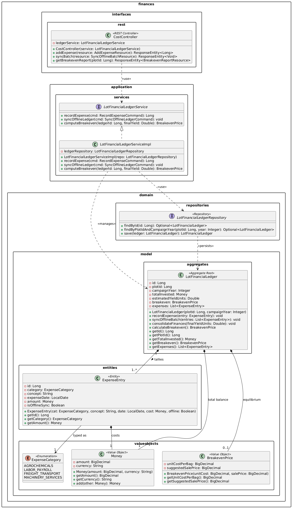

##### Desglose Estructural de Clases y Componentes:

* **`LotFinancialLedger` (Aggregate Root):**
  Libro mayor contable que centraliza las inversiones operativas de una campaña productiva.
    * **Atributos privados:**
        * `- id: Long`: Identificador del libro financiero.
        * `- plotId: Long`: Parcela vinculada a la campaña.
        * `- campaignYear: Integer`: Año o ciclo agrícola correspondiente.
        * `- totalInvested: Money`: Inversión acumulada consolidada.
        * `- estimatedYieldUnits: Double`: Rendimiento estimado o real expresado en sacos o toneladas.
        * `- breakeven: BreakevenPrice`: Objeto de valor con el umbral financiero mínimo.
        * `- expenses: List<ExpenseEntry>`: Asientos contables individuales.
    * **Métodos públicos:**
        * `+ recordExpense(entry: ExpenseEntry): void`: Registra un gasto individual actualizando la sumatoria acumulada.
        * `+ syncOfflineBatch(entries: List<ExpenseEntry>): void`: Procesa asientos diferidos provenientes del almacenamiento local del cliente.
        * `+ consolidateFinances(finalYieldUnits: Double): void`: Cierra el ciclo contable calculando los costos unitarios definitivos.
        * `+ calculateBreakeven(): BreakevenPrice`: Ejecuta la fórmula financiera dividiendo el total invertido entre el volumen cosechado.

* **`ExpenseEntry` (Entity) y `ExpenseCategory` (Enumeration):**
  Modela cada egreso operativo. Contiene `- id: Long`, `- category: ExpenseCategory`, `- concept: String`, `- expenseDate: LocalDate`, `- amount: Money` y `- isOfflineSync: Boolean`. `ExpenseCategory` clasifica el gasto en `AGROCHEMICALS` (fertilizantes y plaguicidas), `LABOR_PAYROLL` (jornales de campo), `FREIGHT_TRANSPORT` (flete rural) o `MACHINERY_SERVICES` (alquiler de maquinaria).

* **`BreakevenPrice` (Value Object):**
  Almacena de forma inmutable el resultado del costeo financiero mediante `- unitCostPerBag: BigDecimal` y `- suggestedSalePrice: BigDecimal` (precio con margen de utilidad proyectado).

* **`ExpenseResourceAssembler` (Assembler / Interface Layer):**
  Transformador de presentación desacoplado. Expone `+ toResourceFromEntity(entity: ExpenseEntry): ExpenseResource` y `+ toEntityFromResource(resource: AddExpenseResource): ExpenseEntry` para evitar que las entidades contables internas queden expuestas directamente sobre la red HTTP.

* **`LotFinancialLedgerRepository`, `LotFinancialLedgerService` y `CostController`:**
  El repositorio permite la consulta mediante `+ findByPlotIdAndCampaignYear(plotId: Long, year: Integer)`. El servicio orquesta `+ recordExpense()`, `+ syncOfflineLedger()` y `+ computeBreakeven()`. El controlador REST expone los endpoints en `/api/v1/finances` e inyecta `ExpenseResourceAssembler`.

##### Relaciones y Cardinalidades del Contexto:
* **Composición (`LotFinancialLedger` "1" *-- "1..*" `ExpenseEntry`):** Un libro contable se compone necesariamente de uno o más asientos de egreso.
* **Composición (`LotFinancialLedger` *-- "1" `Money` y `0..1` `BreakevenPrice`):** El balance acumulado y el punto de equilibrio son partes integrales del estado del libro contable.
* **Asociación dirigida (`ExpenseEntry` --> "1" `ExpenseCategory`):** Todo asiento está unívocamente tipificado por una categoría operativa.
* **Dependencias:** `CostController` utiliza `LotFinancialLedgerService` y `ExpenseResourceAssembler` para procesar y presentar los asientos contables.

---

#### 4.7.1.6. Harvest Quality & Certification Context Class Diagram

Este contexto delimita el pesaje formal de acopio, la graduación física de tubérculos de papa, la catación organoléptica de café bajo normas internacionales y la emisión del certificado inmutable avalado con código QR.

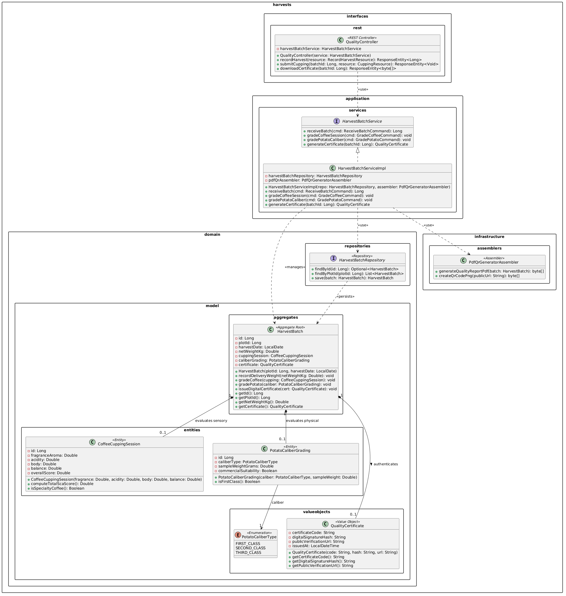

##### Desglose Estructural de Clases y Componentes:

* **`HarvestBatch` (Aggregate Root):**
  Representa el lote material acopiado y sometido a verificación técnica.
    * **Atributos privados:**
        * `- id: Long`: Identificador del lote de cosecha.
        * `- plotId: Long`: Referencia al predio de procedencia.
        * `- harvestDate: LocalDate`: Fecha formal de recolección.
        * `- netWeightKg: Double`: Masa neta recepcionada en balanza.
        * `- cuppingSession: CoffeeCuppingSession`: Evaluación sensorial de café (si aplica).
        * `- caliberGrading: PotatoCaliberGrading`: Graduación morfométrica de papa (si aplica).
        * `- certificate: QualityCertificate`: Acreditación digital emitida.
    * **Métodos públicos:**
        * `+ recordDeliveryWeight(netWeightKg: Double): void`: Registra el pesaje oficial de entrega.
        * `+ gradeCoffee(cupping: CoffeeCuppingSession): void`: Asocia los puntajes de cata sensorial.
        * `+ gradePotato(caliber: PotatoCaliberGrading): void`: Asocia los calibres físicos clasificados.
        * `+ issueDigitalCertificate(cert: QualityCertificate): void`: Emite el certificado inmutable con firma digital.

* **`CoffeeCuppingSession` (Entity):**
  Modela el protocolo de catación según el estándar SCA. Contiene `- fragranceAroma: Double`, `- acidity: Double`, `- body: Double`, `- balance: Double` y `- overallScore: Double`. Expone `+ computeTotalScaScore(): Double` y `+ isSpecialtyCoffee(): Boolean` (válido si el puntaje final supera los 80 puntos SCA).

* **`PotatoCaliberGrading` (Entity) y `PotatoCaliberType` (Enumeration):**
  Evalúa el tubérculo según la norma técnica peruana del MIDAGRI. Posee `- caliberType: PotatoCaliberType` (`FIRST_CLASS`, `SECOND_CLASS`, `THIRD_CLASS`), `- sampleWeightGrams: Double` y `- commercialSuitability: Boolean`.

* **`QualityCertificate` (Value Object):**
  Encapsula la acreditación inmutable mediante `- certificateCode: String`, `- digitalSignatureHash: String` (código hash SHA-256 generado sobre los atributos del lote), `- publicVerificationUrl: String` y `- issuedAt: LocalDateTime`.

* **`PdfQrGeneratorAssembler` (Infrastructure Layer):**
  Componente encargado del ensamblado técnico de comprobantes. Ejecuta `+ generateQualityReportPdf(batch: HarvestBatch): byte[]` para compilar el reporte formal en PDF y `+ createQrCodePng(publicUrl: String): byte[]` para renderizar la matriz visual del código QR auditable.

##### Relaciones y Cardinalidades del Contexto:
* **Composición (`HarvestBatch` "1" *-- "0..1" `CoffeeCuppingSession` / `PotatoCaliberGrading`):** La evaluación técnica depende del tipo botánico del cultivo cosechado en la parcela.
* **Composición (`HarvestBatch` "1" *-- "0..1" `QualityCertificate`):** El certificado digital se expide únicamente tras concluir el pesaje y la calificación técnica.
* **Dependencias:** `HarvestBatchServiceImpl` orquesta el agregado y delega en `PdfQrGeneratorAssembler` la construcción de los artefactos visuales de verificación.

---

#### 4.7.1.7. Commercial Settlement Context Class Diagram

Gobierna la publicación en catálogo de los lotes certificados, la recepción de ofertas comerciales emitidas por compradores mayoristas y la liquidación transaccional asegurando el margen neto sobre el costo de producción.

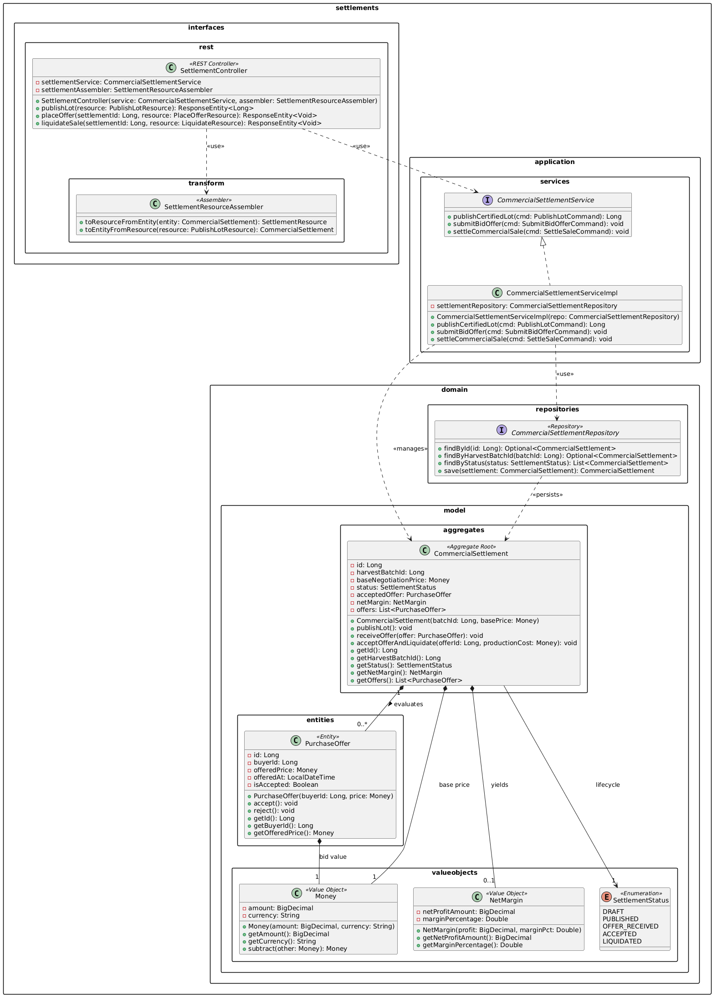

##### Desglose Estructural de Clases y Componentes:

* **`CommercialSettlement` (Aggregate Root):**
  Controla el acuerdo comercial y la liquidación financiera de la venta.
    * **Atributos privados:**
        * `- id: Long`: Identificador de la negociación.
        * `- harvestBatchId: Long`: Referencia al lote certificado disponible.
        * `- baseNegotiationPrice: Money`: Precio de apertura establecido para la venta.
        * `- status: SettlementStatus`: Fase actual del ciclo de vida comercial.
        * `- acceptedOffer: PurchaseOffer`: Oferta comercial formalmente aceptada por el productor o directivo.
        * `- netMargin: NetMargin`: Margen de ganancia neta consolidado.
        * `- offers: List<PurchaseOffer>`: Lista de propuestas de compra recibidas.
    * **Métodos públicos:**
        * `+ publishLot(): void`: Transiciona el estado a publicado en el catálogo mayorista tras verificar el punto de equilibrio.
        * `+ receiveOffer(offer: PurchaseOffer): void`: Añade una propuesta de compra a la negociación.
        * `+ acceptOfferAndLiquidate(offerId: Long, productionCost: Money): void`: Acepta la oferta seleccionada, calcula el margen neto resultante y cambia el estado a liquidado (`LIQUIDATED`).

* **`PurchaseOffer` (Entity):**
  Propuesta económica vinculada al lote. Contiene `- id: Long`, `- buyerId: Long`, `- offeredPrice: Money`, `- offeredAt: LocalDateTime` y `- isAccepted: Boolean`. Expone `+ accept(): void` y `+ reject(): void`.

* **`SettlementStatus` (Enumeration) y `NetMargin` (Value Object):**
    * `SettlementStatus`: Máquina de estados de la venta: `DRAFT`, `PUBLISHED`, `OFFER_RECEIVED`, `ACCEPTED` y `LIQUIDATED`.
    * `NetMargin`: Objeto inmutable que almacena `- netProfitAmount: BigDecimal` y `- marginPercentage: Double`, garantizando que la liquidación visualice la rentabilidad final obtenida.

* **`SettlementResourceAssembler` (Assembler / Interface Layer):**
  Traduce las peticiones comerciales entre la web y el dominio. Implementa `+ toResourceFromEntity(entity: CommercialSettlement): SettlementResource` y `+ toEntityFromResource(resource: PublishLotResource): CommercialSettlement`.

* **`CommercialSettlementRepository`, `CommercialSettlementService` y `SettlementController`:**
  El repositorio declara `+ findByHarvestBatchId(batchId: Long): Optional<CommercialSettlement>`. El servicio orquesta `+ publishCertifiedLot(cmd: PublishLotCommand): Long`, `+ submitBidOffer()` y `+ settleCommercialSale()`. El controlador REST expone los endpoints bajo `/api/v1/settlements` e inyecta `SettlementResourceAssembler`.

##### Relaciones y Cardinalidades del Contexto:
* **Composición (`CommercialSettlement` "1" *-- "0..*" `PurchaseOffer`):** Un acuerdo comercial puede recibir múltiples ofertas mayoristas en competencia (`0..*`).
* **Composición (`CommercialSettlement` *-- "1" `Money` y `0..1` `NetMargin`):** El precio base y el margen neto final son parte constituyente del agregado.
* **Asociación dirigida (`CommercialSettlement` --> "1" `SettlementStatus`):** El ciclo de vida de la comercialización está regido por la enumeración de estados.
* **Dependencias:** `SettlementController` utiliza `CommercialSettlementService` y `SettlementResourceAssembler`, el cual opera sobre el agregado `CommercialSettlement` y persiste su estado mediante `CommercialSettlementRepository`.

---

## 4.8. Database Design
### 4.8.1. Database Diagrams