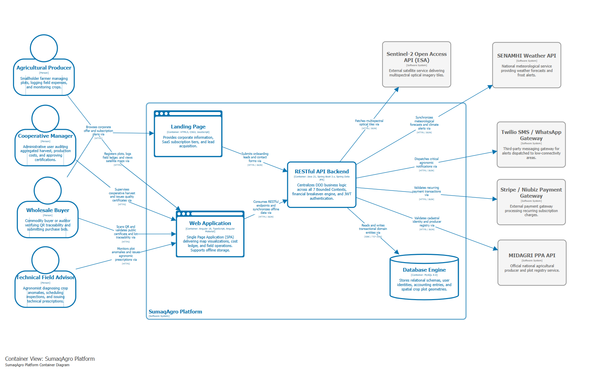
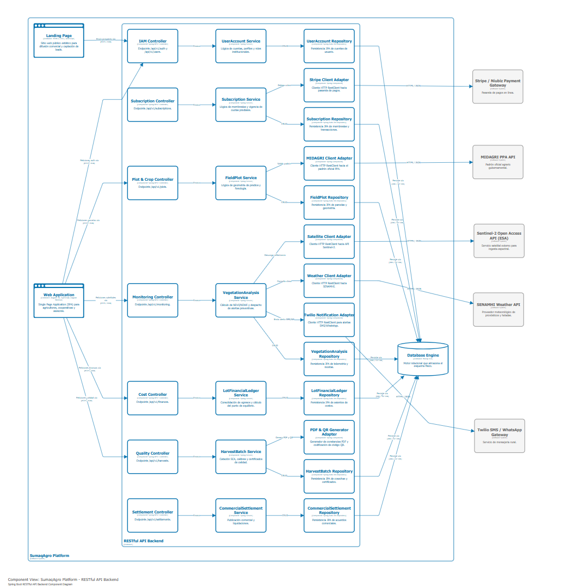

# Capítulo IV: Product Design

## 4.1. Style Guidelines
### 4.1.1. General Style Guidelines
### 4.1.2. Web Style Guidelines

## 4.2. Information Architecture
### 4.2.1. Organization Systems
### 4.2.2. Labeling Systems
### 4.2.3. SEO Tags and Meta Tags
### 4.2.4. Searching Systems
### 4.2.5. Navigation Systems

## 4.3. Landing Page UI Design
### 4.3.1. Landing Page Wireframe
### 4.3.2. Landing Page Mock-up

## 4.4. Web Applications UX/UI Design
### 4.4.1. Web Applications Wireframes
### 4.4.2. Web Applications Wireflow Diagrams
### 4.4.3. Web Applications Mock-ups
### 4.4.4. Web Applications User Flow Diagrams

## 4.5. Web Applications Prototyping

## 4.6. Domain-Driven Software Architecture
En esta sección se traslada la comprensión del negocio obtenida en el Big Picture Event Storming hacia el diseño de arquitectura de software guiado por el dominio (Domain-Driven Design - DDD) y el modelo de abstracción y comunicación visual C4 Model en sus niveles de Contexto, Contenedores y Componentes. A través de esta aproximación arquitectónica, se divide el espacio del problema en Bounded Contexts independientes y de bajo acoplamiento, estableciendo sus agregados transaccionales (Aggregates), comandos, eventos de dominio, modelos de consulta (Read Models) y políticas de automatización reactivas. Asimismo, se formaliza la topología técnica y modular de la solución distribuida, articulando la aplicación web de cara al usuario, el servicio de backend RESTful en Spring Boot, la base de datos relacional y las interfaces de integración con servicios externos.

---
### 4.6.1. Design-Level Event Storming
El equipo llevó a cabo una sesión sincrónica de trabajo colaborativo en Miro siguiendo las pautas metodológicas de la guía Design-Level EventStorming (<https://bit.ly/dles-guide>). La dinámica se enfocó en profundizar y refinar el modelo general del dominio de las cadenas de café de especialidad y papa andina, definiendo las reglas de invariante transaccional y la mecánica de ejecución del sistema.

#### Proceso y Actividades Realizadas en el Taller

Durante la dinámica colaborativa, el equipo ejecutó las siguientes actividades de modelado:

* **Presentación y encuadre del dominio objetivo:** Revisión de las fronteras preliminares identificadas en la fase Big Picture para acotar los flujos de alta criticidad del negocio y delimitar el Core Domain de la plataforma SaaS.
* **Refinamiento de eventos de dominio (Domain Events - Naranja):** Formalización de los hechos inmutables de negocio ocurridos en cada fase operativa, expresados estrictamente en tiempo pasado participio.
* **Incorporación de desencadenantes (Commands - Azul y Policies - Morado):** Asociación de las intenciones operativas formuladas en imperativo con sus respectivos ejecutores (actores o eventos previos). Se establecieron políticas reactivas bajo la convención *Whenever [Domain Event] Then [Command]* para orquestar la consistencia eventual entre distintos contextos.
* **Integración de proyecciones y actores (Read Models - Verde):** Identificación de las vistas de datos, reportes y tableros que los usuarios requieren para tomar decisiones antes de ejecutar un comando.
* **Mapeo de sistemas externos (External Systems - Rosa):** Identificación de pasarelas y servicios satelitales o gubernamentales ajenos a la solución que interactúan como emisores o receptores de datos.
* **Definición de reglas de negocio e invariantes (Aggregates - Amarillo):** Agrupación de datos y comportamientos transaccionales atómicos bajo raíces de agregación (Aggregate Roots) para garantizar la consistencia del estado del sistema en todo momento.

---
#### Evidencia del Modelado en Miro

A continuación se presenta la vista general del tablero desarrollado en Miro, evidenciando los 7 Bounded Contexts formalizados con sus respectivos agregados, comandos, eventos, modelos de lectura, integraciones externas y políticas de automatización:

* **Enlace interactivo al espacio de trabajo:** [Tablero de Event Storming en Miro](https://miro.com/welcomeonboard/WG5aQ1R0dmR5b0xQWTI5TEZvaXplRmpPTUxmT2pmR1NNVXBVakcxRFI5Yk16dVY3TXpRc0RwbHVKNWFndGJvZDZkZXJrbkN4VFZQdzhHTjV6MWdBNUJtQnhYMVFmcjNLbkxyOWQwZlVuWHVPRUdrWUJzeGVtb1g5cE9UeGFKdjJBd044SHFHaVlWYWk0d3NxeHNmeG9BPT0hdjE=?share_link_id=126689221129)

---
#### Alineación con Subdominios SaaS y Bounded Contexts

Considerando la estructura de subdominios recomendada para plataformas SaaS de servicios (gestión de identidades, suscripciones, recursos, ejecución de servicios y analítica) y adaptándola al *Ubiquitous Language* de la cadena de valor agroalimentaria, el dominio se estructuró en 7 Bounded Contexts:

**1. Identity & Access Management (IAM) Context (Generic Subdomain)**
* **Responsabilidad:** Administrar el ciclo de vida de identidades, perfiles, asignación de roles institucionales y provisión de credenciales seguras mediante tokens criptográficos JWT.
* **Agregado `UserAccount`:**
    * *Commands:* `CreateProducerAccount`, `RegisterCooperativeAccount`, `UpdateUserProfile`, `AssignCooperativeRole`, `InviteAgronomistToCooperative`.
    * *Events:* `ProducerAccountCreated`, `CooperativeAccountRegistered`, `UserProfileUpdated`, `CooperativeRoleAssigned`, `AgronomistInvitationSent`.
    * *Read Models:* `UserProfileDashboard`, `CooperativeMemberDirectory`.

**2. Subscriptions & Payments Context (Generic Subdomain)**
* **Responsabilidad:** Controlar la monetización SaaS, selección de planes comerciales (Semilla, Cooperativa Pro, Asesor Técnico), validación de transacciones y cuotas activas de parcelas.
* **Agregado `Subscription`:**
    * *Commands:* `SelectSubscriptionPlan`, `SubmitPaymentTransaction`, `ActivateSubscriptionPro`, `CancelSubscriptionPlan`.
    * *Events:* `SubscriptionPlanSelected`, `PaymentTransactionProcessed`, `SubscriptionProActivated`, `SubscriptionPlanCancelled`.
    * *Read Models:* `PricingCatalogView`, `BillingStatusLedger`.
    * *External System:* Stripe / Niubiz Payment Gateway.

**3. Plot & Crop Management Context (Supporting Subdomain)**
* **Responsabilidad:** Administrar la georreferenciación física de fundos y parcelas mediante coordenadas perimetrales continuas (polígonos GPS), caracterización de suelo e inicio fenológico.
* **Agregado `FieldPlot`:**
    * *Commands:* `RegisterFieldPlot`, `DelineatePerimeterCoordinates`, `RecordSoilBaseline`, `SelectCropType`, `SpecifySeedVariety`, `RecordSowingDate`.
    * *Events:* `FieldPlotRegistered`, `PerimeterCoordinatesDelineated`, `SoilBaselineRecorded`, `CropTypeSelected`, `SeedVarietySpecified`, `SowingDateRecorded`.
    * *Read Models:* `CadastralGISMap`, `CropPhenologyTimeline`.
    * *External System:* MIDAGRI Padrón de Productores (PPA) API.

**4. Satellite Analytics & Alerting Context (Core Subdomain)**
* **Responsabilidad:** Orquestar la observación terrestre multiespectral mediante Sentinel-2 para deducir vigor foliar (NDVI) y estrés hídrico (NDWI), despachar alertas preventivas y gestionar recetas técnicas de campo.
* **Agregado `VegetationAnalysis`:**
    * *Commands:* `FetchMultispectralTiles`, `ComputeVegetationIndexes`, `TriggerAgroclimaticAlert`, `UploadPestEvidencePhoto`, `ScheduleFieldInspection`, `RecordDamageAssessment`, `IssueTechnicalPrescription`, `ConfirmTreatmentApplication`.
    * *Events:* `MultispectralTilesIngested`, `NDVIIndexComputed`, `NDWIIndexComputed`, `VegetationAnomalyDetected`, `AgroclimaticAlertDispatched`, `PestEvidencePhotoUploaded`, `FieldInspectionScheduled`, `DamageAssessmentRecorded`, `TechnicalPrescriptionIssued`, `TreatmentApplicationConfirmed`.
    * *Read Models:* `SatelliteVegetationMap`, `MultispectralIndexDashboard`, `PhytosanitaryDiagnosisInbox`.
    * *External Systems:* Sentinel-2 Open Access API (ESA), SENAMHI Weather API, Twilio SMS / WhatsApp Gateway.

**5. Field Cost Accounting Context (Core Subdomain)**
* **Responsabilidad:** Proveer una bitácora contable rural para asentar compras de insumos, jornales diarios y fletes (con soporte de persistencia local desconectada), determinando el costo unitario por lote y el punto de equilibrio financiero.
* **Agregado `LotFinancialLedger`:**
    * *Commands:* `RecordAgrochemicalExpense`, `RecordDailyLaborExpense`, `RecordFieldFreightExpense`, `LogOfflineFieldExpense`, `SynchronizeFieldLedger`, `ConsolidateLotExpenses`, `CalculateBreakevenPrice`.
    * *Events:* `AgrochemicalExpenseRecorded`, `DailyLaborExpenseRecorded`, `FieldFreightExpenseRecorded`, `OfflineFieldExpenseLogged`, `FieldLedgerSynchronized`, `TotalLotInvestmentCalculated`, `BreakevenPriceCalculated`.
    * *Read Models:* `LotExpenseLogView`, `BreakevenAnalysisReport`.

**6. Harvest Quality & Certification Context (Core Subdomain)**
* **Responsabilidad:** Controlar la recolección, pesaje formal de acopio, calificación de calibres de tubérculo (MIDAGRI) y protocolos de catación sensorial SCA, emitiendo certificados digitales inmutables con código QR público.
* **Agregado `HarvestBatch`:**
    * *Commands:* `RegisterHarvestYield`, `WeighDeliveredLot`, `ExtractRepresentativeSample`, `GradePotatoCaliber`, `PerformCoffeeCuppingSCA`, `AssignQualityScore`, `GenerateDigitalQualityCertificate`, `VerifyLotTraceability`.
    * *Events:* `HarvestYieldRegistered`, `DeliveredLotWeighed`, `RepresentativeSampleExtracted`, `PotatoCaliberGraded`, `CoffeeCuppingCompleted`, `QualityScoreAssigned`, `DigitalQualityCertificateGenerated`, `TraceabilityQRCodeCreated`, `LotTraceabilityVerified`.
    * *Read Models:* `HarvestGradingSheet`, `PublicTraceabilityQRView`.
    * *External System:* Public QR Verification Gateway.

**7. Commercial Settlement Context (Core Subdomain)**
* **Responsabilidad:** Publicar lotes certificados en el catálogo comercial, gestionar las posturas de oferta de compradores mayoristas y liquidar la venta garantizando un margen por encima del costo de producción.
* **Agregado `CommercialSettlement`:**
    * *Commands:* `SetBaseSettlementPrice`, `PublishCertifiedLot`, `SubmitPurchaseOffer`, `AcceptLotSaleAndLiquidate`, `CalculateFinalNetMargin`.
    * *Events:* `BaseSettlementPriceSet`, `CertifiedLotPublished`, `PurchaseOfferReceived`, `LotSaleRegistered`, `NetIncomeCalculated`.
    * *Read Models:* `CertifiedLotCatalog`, `CommercialSettlementLedger`.

---
#### Políticas de Automatización Reactivas (Policies)
La orquestación entre los contextos delimitados se rige por políticas eventuales bajo el estándar *Whenever [Domain Event] Then [Command]*:
* **P1:** `Whenever ProducerAccountCreated Then SelectSubscriptionPlan`
* **P2:** `Whenever SubscriptionProActivated Then RegisterFieldPlot`
* **P3:** `Whenever SowingDateRecorded Then FetchMultispectralTiles`
* **P4:** `Whenever VegetationAnomalyDetected Then TriggerAgroclimaticAlert`
* **P5:** `Whenever TreatmentApplicationConfirmed Then RecordAgrochemicalExpense`
* **P6:** `Whenever DeliveredLotWeighed Then ConsolidateLotExpenses`
* **P7:** `Whenever DigitalQualityCertificateGenerated Then PublishCertifiedLot`
* **P8:** `Whenever BreakevenPriceCalculated Then SetBaseSettlementPrice`

### 4.6.2. Software Architecture Context Diagram

En este apartado se presenta el Diagrama de Contexto del Sistema (Nivel 1 del modelo C4), el cual delimita las fronteras operativas y de software de la plataforma **SumaqAgro**, ubicándola como la solución central del ecosistema. A través de esta vista de alto nivel, se establecen los canales de comunicación y flujos de información que mantiene el sistema tanto con los distintos perfiles de usuario identificados en la investigación como con los servicios externos de terceros necesarios para la operación agrícola. Siguiendo los lineamientos de arquitectura y el enfoque *Diagram-as-Code* exigido para el proyecto, el modelado se desarrolló mediante la herramienta **Structurizr** a través de su especificación formal en Structurizr DSL.

#### Explicación del Diagrama de Contexto

El diagrama sitúa en el centro a **SumaqAgro Platform**, plataforma web distribuida orientada a la agricultura de precisión, el cálculo de costos operativos de campo y la certificación de calidad para las cadenas de café de especialidad y papa andina. A su alrededor se articulan las siguientes interacciones:

##### 1. Actores y Usuarios del Dominio
* **Agricultural Producer (Productor Agrícola):** Agricultor que accede mediante navegadores web o dispositivos móviles para registrar la delimitación geográfica de sus parcelas, monitorear el vigor foliar satelital (NDVI/NDWI) y registrar sus compras de insumos, jornales y fletes en la bitácora de costos.
* **Cooperative Manager (Directivo de Cooperativa):** Usuario administrativo que utiliza la plataforma desde terminales de escritorio para auditar el volumen de acopio de los socios, monitorear los balances financieros por hectárea y aprobar formalmente la emisión de los certificados de calidad de cosecha.
* **Technical Field Advisor (Asesor Técnico de Campo):** Ingeniero agrónomo que hace seguimiento a las alertas satelitales tempranas de estrés hídrico o plagas para priorizar sus visitas presenciales en parcelas críticas, emitiendo recetas agronómicas y dosis correctivas desde la aplicación.
* **Wholesale Buyer (Comprador Mayorista / Exportador):** Usuario comercial que interactúa con la plataforma de forma abierta y sin necesidad de credenciales, escaneando el código QR público de los sacos o lotes para verificar en línea la procedencia geográfica, la variedad botánica y el perfil de calidad certificado.

##### 2. Sistemas Externos e Integraciones
* **Sentinel-2 Open Access API (ESA):** Proveedor satelital que suministra de manera periódica baldosas ópticas multiespectrales. El sistema consume este servicio vía peticiones HTTPS/JSON para computar los índices biofísicos de reflectancia vegetal sin depender de sensores IoT instalados en campo.
* **SENAMHI Weather API:** Servicio meteorológico nacional consultado por HTTPS/JSON para sincronizar pronósticos climáticos y emitir advertencias tempranas ante eventos de heladas meteorológicas o sequías estacionales en los valles productivos.
* **Twilio SMS / WhatsApp Gateway:** Pasarela de mensajería externa utilizada por SumaqAgro para remitir notificaciones prioritarias y alertas agroclimáticas urgentes a productores ubicados en zonas rurales con baja cobertura móvil de datos.
* **Stripe / Niubiz Payment Gateway:** Pasarela de procesamiento de pagos electrónicos integrada mediante API REST (HTTPS/JSON) para la gestión y cobro transaccional de los planes de suscripción de cooperativas agrarias y asesores técnicos.
* **MIDAGRI PPA API:** Servicio gubernamental del Padrón de Productores Agrarios consumido mediante HTTPS/JSON para validar la titularidad catastral de predios y la condición formal de los socios agrícolas.
* **Public QR Verification Gateway:** Punto de acceso web público y liviano que resuelve las peticiones de validación iniciadas por los compradores mayoristas al escanear los códigos QR, certificando la autenticidad e inmutabilidad del lote evaluado.

---
### 4.6.3. Software Architecture Container Diagrams
El Diagrama de Contenedores (Nivel 2 de C4 Model) detalla la topología técnica del sistema, evidenciando las cuatro unidades de ejecución y despliegue independientes que componen la solución, sus responsabilidades asignadas y los protocolos de red utilizados para su interoperabilidad.

**Asignación de Responsabilidades y Decisiones Tecnológicas:**
* **Landing Page Container:** Sitio web estático desarrollado con HTML5, CSS3 y JavaScript vanilla, desplegado sobre una plataforma de hosting estático en la nube. Diseñado con una estructura ligera para garantizar un rendimiento óptimo sobre conexiones móviles rurales (redes 3G/4G). Presenta la propuesta de valor institucional, los planes de suscripción comercial y canaliza los prospectos de venta hacia la API mediante llamadas asíncronas HTTPS/JSON.
* **Web Application Container (Single Page Application - SPA):** Desarrollada sobre Angular 18, TypeScript y la biblioteca Angular Material. Provee interfaces adaptativas para el monitoreo de mapas multiespectrales, configuración de parcelas y bitácora contable. Integra mecanismos de caché local mediante Service Workers e IndexedDB, permitiendo registrar compras, jornales y labores en modo desconectado (offline-first) mientras el usuario se encuentra dentro de parcelas sin cobertura, sincronizando los datos automáticamente al volver a la ciudad.
* **RESTful API Backend Container:** Servidor de aplicaciones distribuido implementado en Java 21 con Spring Boot 3.x (Spring MVC, Spring Security y Spring Data JPA). Concentra la lógica de negocio basada en DDD para los 7 Bounded Contexts identificados. Implementa filtros de autenticación y autorización mediante Tokens JWT, realiza los cálculos del punto de equilibrio financiero, consume las APIs externas satelitales mediante adaptadores HTTP desacoplados y expone endpoints REST documentados bajo la especificación OpenAPI 3.0 / Swagger UI.
* **Database Engine Container:** Motor de base de datos relacional MySQL 8.0 que almacena el modelo de datos físico normalizado de los Bounded Contexts. Soporta relaciones con integridad referencial, índices espaciales para el almacenamiento de geometrías de parcelas y transacciones ACID bajo comunicación JDBC por el puerto TCP 3306.

---

### 4.6.4. Software Architecture Components Diagrams
El Diagrama de Componentes (Nivel 3 de C4 Model) ilustra la estructura modular interna del contenedor de backend en Spring Boot, exponiendo cómo se organizan los componentes en capas desacopladas (Layered Architecture) correspondientes a cada uno de los Bounded Contexts y sus agregados.

**Detalle Estructural de Componentes por Capa:**

* **Capa de Controladores REST (Inbound Controllers):**
  Controladores anotados con `@RestController` que exponen la API pública sobre HTTPS/JSON, interceptan las peticiones desde el cliente Angular, validan los DTOs de entrada y delegan el flujo a los servicios de dominio:
    * `IamController`: Expone `/api/v1/auth` y `/api/v1/users` para registro, autenticación JWT y gestión de roles.
    * `SubscriptionController`: Expone `/api/v1/subscriptions` para selección de planes y confirmación de pago.
    * `PlotController`: Expone `/api/v1/plots` para catastro de polígonos GPS y especificaciones botánicas.
    * `MonitoringController`: Expone `/api/v1/monitoring` para mapas satelitales, series NDVI/NDWI y recetas técnicas.
    * `CostController`: Expone `/api/v1/finances` para la bitácora financiera, sincronización diferida y cálculo de punto de equilibrio.
    * `QualityController`: Expone `/api/v1/harvests` para catación SCA, graduación de calibres y certificados de cosecha.
    * `SettlementController`: Expone `/api/v1/settlements` para publicación comercial de lotes y liquidaciones.

* **Capa de Servicios de Aplicación (Domain Application Services):**
  Servicios de aplicación (`@Service`) que orquestan las transacciones atómicas, validan las reglas de invariante de cada Agregado y coordinan los adaptadores externos:
    * `UserAccountService`: Implementa las reglas del agregado `UserAccount`, hashing de claves y asignación de permisos.
    * `SubscriptionService`: Gobierna el agregado `Subscription`, validando vigencias y cuotas de predios asignados.
    * `FieldPlotService`: Administra el agregado `FieldPlot`, verificando que los polígonos perimetrales no se autointersequen.
    * `VegetationAnalysisService`: Gestiona el agregado `VegetationAnalysis`, calculando algoritmos de reflectancia espectral y evaluando caídas porcentuales de biomasa foliar para despachar alertas.
    * `LotFinancialLedgerService`: Orquesta el agregado `LotFinancialLedger`, calculando la sumatoria de egresos operativos para deducir el costo unitario de producción.
    * `HarvestBatchService`: Supervisa el agregado `HarvestBatch`, validando umbrales mínimos de calidad antes de ordenar la firma de acreditaciones.
    * `CommercialSettlementService`: Gobierna el agregado `CommercialSettlement`, protegiendo que el precio ofertado cubra la rentabilidad mínima del lote.

* **Capa de Adaptadores de Infraestructura (Outbound Adapters):**
  Componentes de integración desacoplados (`@Component`) que encapsulan la comunicación con servicios externos o generan archivos binarios:
    * `StripeClientAdapter`: Consume mediante cliente REST la API de Stripe/Niubiz para la tokenización de cobros.
    * `MidagriClientAdapter`: Consulta la base oficial de datos del Padrón de Productores Agrarios (PPA).
    * `SatelliteClientAdapter`: Descarga las baldosas espectrales desde la API abierta de Sentinel-2.
    * `WeatherClientAdapter`: Consume los pronósticos y alertas meteorológicas de SENAMHI.
    * `TwilioNotificationAdapter`: Invoca la API de Twilio para emitir notificaciones críticas vía SMS y WhatsApp.
    * `PdfQrGeneratorAdapter`: Compila dinámicamente los informes técnicos PDF y codifica el código QR de validación pública.

* **Capa de Persistencia (Spring Data JPA Repositories):**
  Interfaces que extienden de `JpaRepository` para mapear los agregados hacia las tablas de la base de datos MySQL 8.0: `UserAccountRepository`, `SubscriptionRepository`, `FieldPlotRepository`, `VegetationAnalysisRepository`, `CostLedgerRepository`, `HarvestBatchRepository` y `CommercialSettlementRepository`.

---

## 4.7. Software Object-Oriented Design
### 4.7.1. Class Diagrams

## 4.8. Database Design
### 4.8.1. Database Diagrams