# Capítulo V: Product Implementation, Validation & Deployment

## 5.1. Software Configuration Management

### 5.1.1. Software Development Environment Configuration

Para garantizar una colaboración fluida y estandarizada a lo largo del ciclo de vida del producto digital **SumaqAgro**, el equipo ha definido y configurado un entorno de desarrollo integrado. Este conjunto de herramientas abarca las seis categorías fundamentales exigidas por la metodología del proyecto: *Project Management*, *Requirements Management*, *Product UX/UI Design*, *Software Development*, *Software Deployment* y *Software Documentation*. A continuación, se detalla la caracterización técnica de cada herramienta utilizada, su propósito específico en el proyecto y las rutas oficiales de acceso o descarga.

---
#### 1. Project Management

##### **Jira Software**

* **Propósito en el proyecto:** Gestión centralizada del Product Backlog, planificación y seguimiento de los Sprints, asignación de tareas (*work-items*), control de velocidad del equipo y visualización del flujo de trabajo en tableros Kanban/Scrum.
* **Ruta de Referencia:** [https://www.atlassian.com/software/jira](https://www.atlassian.com/software/jira)

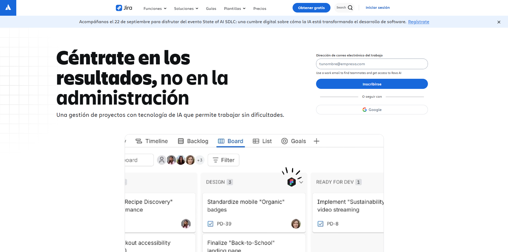

---

#### 2. Requirements Management

##### **UXPressia**

* **Propósito en el proyecto:** Modelado y documentación visual de los artefactos de investigación del usuario. Se utiliza para la elaboración de los *User Personas* (productores agrícolas, directivos de cooperativa y asesores agrónomos), *Empathy Maps*, *User Journey Maps* e *Impact Mapping*.
* **Ruta de Referencia:** [https://uxpressia.com](https://uxpressia.com)

##### **Miro**

* **Propósito en el proyecto:** Facilitar las sesiones de modelado colaborativo de dominio en tiempo real. Permite la construcción del *Big Picture Event Storming* y el *Design-Level Event Storming*, mapeando eventos de dominio, comandos, agregados y *Bounded Contexts*.
* **Ruta de Referencia:** [https://miro.com](https://miro.com)

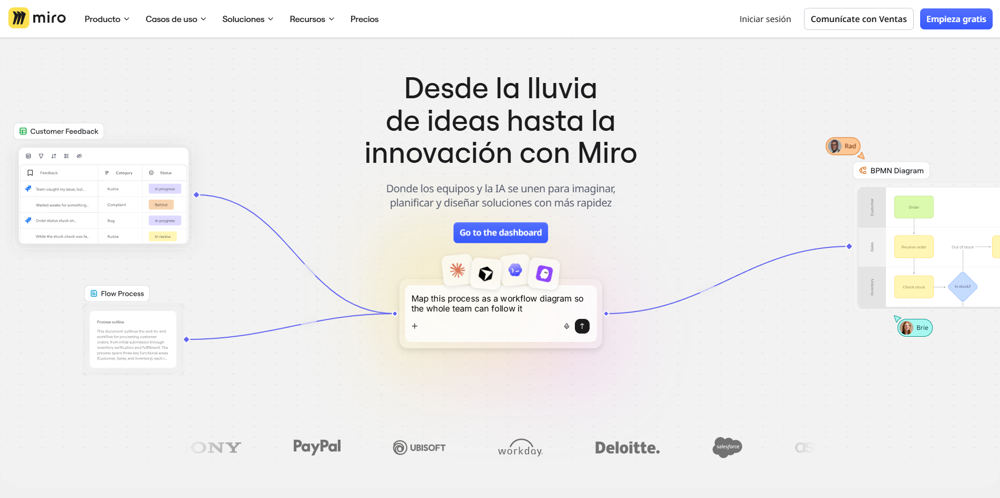

---

#### 3. Product UX/UI Design

##### **Figma**

* **Propósito en el proyecto:** Diseño de la arquitectura de información y experiencia de usuario. Permite la creación de la guía de estilos visuales (*Style Guide*), los *wireframes* de baja fidelidad, los *mockups* de alta fidelidad, los *wireflows* navegables y el prototipo interactivo de la Landing Page y la aplicación web.
* **Ruta de Referencia:** [https://www.figma.com](https://www.figma.com)

---

#### 4. Software Development

##### **GitHub**

* **Propósito en el proyecto:** Gestión de control de versiones distribuido (SCM), alojamiento del repositorio central del proyecto, revisión colaborativa de código mediante *Pull Requests*, integración del modelo de ramificación GitFlow y auditoría de *commits*.
* **Ruta de Referencia:** [https://github.com](https://github.com)

##### **IntelliJ IDEA**

* **Propósito en el proyecto:** Entorno de Desarrollo Integrado (IDE) principal para la programación del backend. Se utiliza para la construcción de los servicios Web RESTful utilizando Java 21, Spring Boot Framework, Spring Data JPA y Spring Security.
* **Ruta de Descarga:** [https://www.jetbrains.com/idea/download](https://www.jetbrains.com/idea/download)

##### **WebStorm**

* **Propósito en el proyecto:** IDE especializado para la implementación del frontend de la plataforma web. Proporciona soporte avanzado para TypeScript, Angular Framework, HTML5, CSS3/SASS y herramientas de depuración de código en el navegador.
* **Ruta de Descarga:** [https://www.jetbrains.com/webstorm](https://www.jetbrains.com/webstorm)

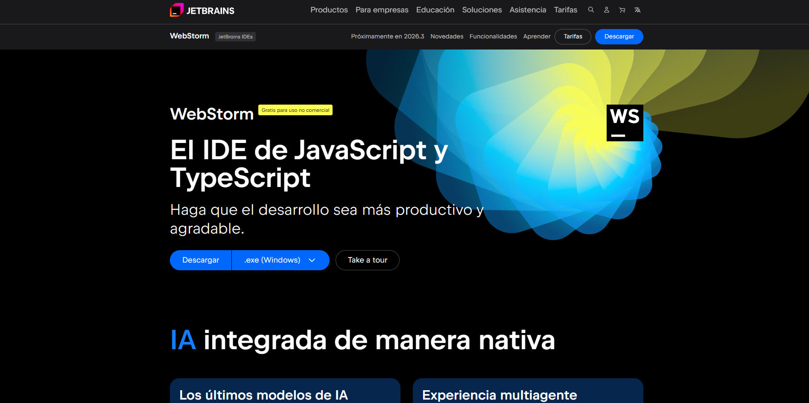

##### **DataGrip**

* **Propósito en el proyecto:** Entorno de desarrollo para bases de datos relacionales utilizado para la administración, modelado Entidad-Relación, gestión de esquemas y ejecución de consultas sobre el motor de base de datos MySQL.
* **Ruta de Descarga:** [https://www.jetbrains.com/datagrip](https://www.jetbrains.com/datagrip)

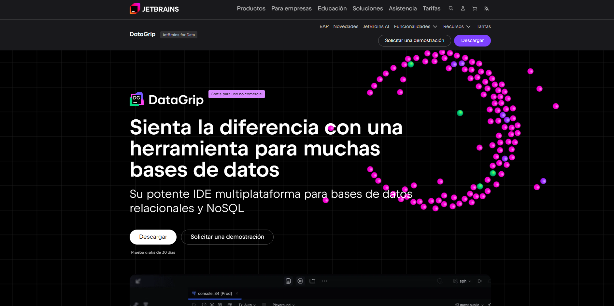

##### **Postman**

* **Propósito en el proyecto:** Cliente API HTTP para la prueba, validación y documentación de las peticiones (`GET`, `POST`, `PUT`, `DELETE`) hacia los endpoints RESTful del backend, permitiendo verificar los códigos de estado HTTP y los objetos JSON de respuesta.
* **Ruta de Descarga:** [https://www.postman.com/downloads](https://www.postman.com/downloads)

#### 5. Software Deployment

##### **Cloudflare Pages / GitHub Pages**
* **Propósito en el proyecto:** Plataformas de alojamiento en la nube para el despliegue continuo (*Continuous Deployment*) automatizado del frontend estático de la Landing Page, garantizando alta disponibilidad a través de la red Edge global de servidores, certificado SSL/TLS (HTTPS) de renovación automática y tiempos de respuesta optimizados.
* **Ruta de Referencia:** [https://pages.cloudflare.com](https://pages.cloudflare.com) / [https://pages.github.com](https://pages.github.com)

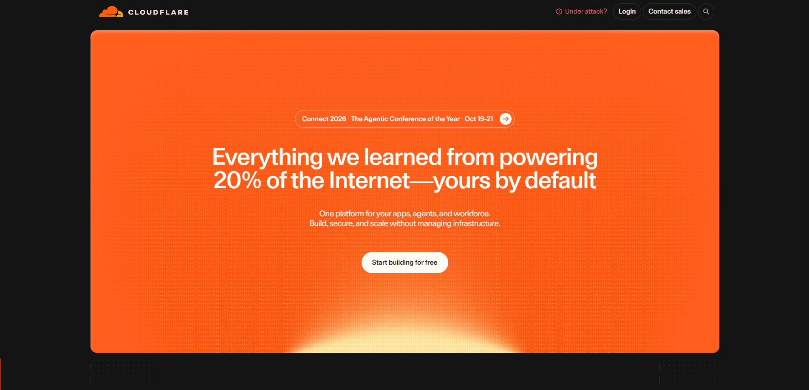

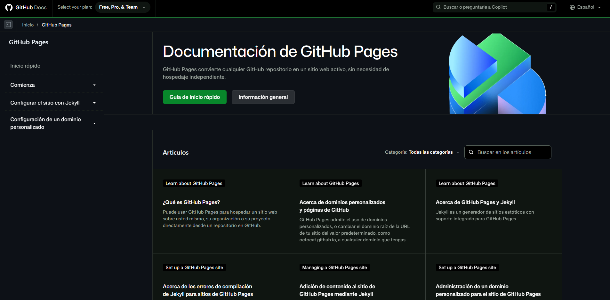

##### **Railway**

* **Propósito en el proyecto:** Infraestructura Cloud PaaS utilizada para el despliegue continuo y alojamiento del backend RESTful desarrollado en Spring Boot, así como el aprovisionamiento del servidor de base de datos relacional MySQL en entorno de producción.
* **Ruta de Referencia:** [https://railway.app](https://railway.app)

---

#### 6. Software Documentation

##### **Swagger UI**

* **Propósito en el proyecto:** Generación automática de la documentación interactiva de la API RESTful. Permite a los desarrolladores explorar los endpoints, probar llamadas HTTP directamente desde el navegador y consultar los esquemas de petición y respuesta JSON.
* **Ruta de Referencia:** [https://swagger.io/tools/swagger-ui](https://swagger.io/tools/swagger-ui)

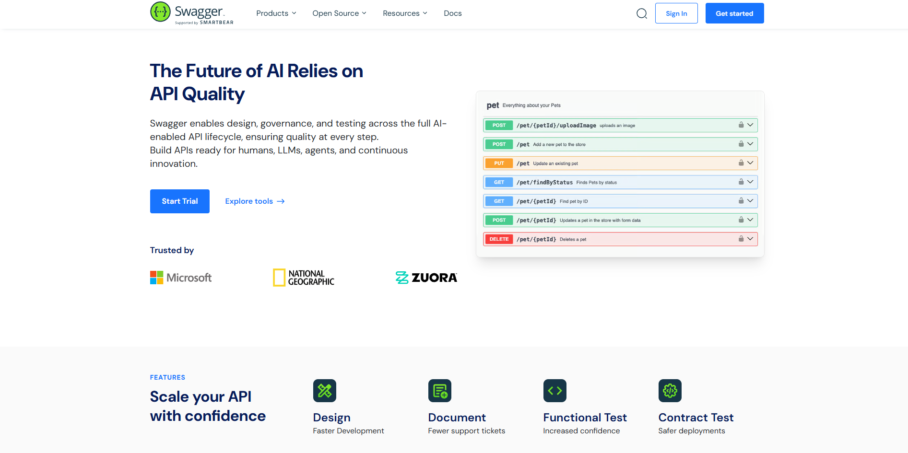

##### **Structurizr**

* **Propósito en el proyecto:** Herramienta para el diagramado y documentación de la arquitectura de software bajo el estándar **C4 Model** (Contexto, Contenedores y Componentes), utilizando Structurizr DSL para mantener la arquitectura como código (*Architecture as Code*).
* **Ruta de Referencia:** [https://structurizr.com](https://structurizr.com)

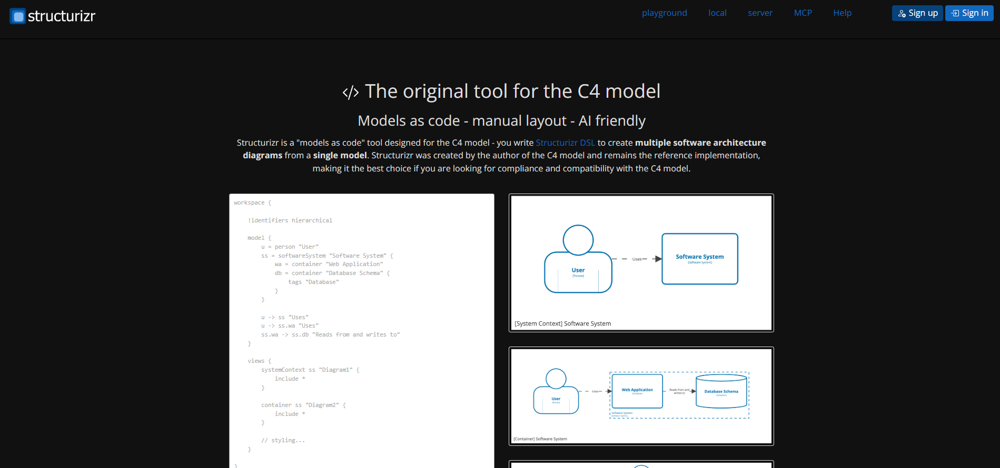

### 5.1.2. Source Code Management

Para garantizar la integridad del código fuente, el trabajo colaborativo eficiente y la trazabilidad inmutable del desarrollo de **SumaqAgro**, el equipo utiliza **Git** como sistema de control de versiones distribuido, alojado de forma centralizada en la plataforma **GitHub**.

A continuación, se especifican la estructura de la organización en GitHub, las URLs de los repositorios de cada producto digital, el flujo de trabajo con **GitFlow**, el esquema de versionado semántico (**Semantic Versioning**) y el estándar de mensajes mediante **Conventional Commits**.

---

#### 1. Organización y Repositorios en GitHub

Todos los componentes de software y la documentación del proyecto están agrupados bajo una organización pública en GitHub. Se ha asignado un repositorio independiente para cada producto digital de la solución, incluyendo las suites de pruebas unitarias e integración en el caso de los servicios web:

* **Organización Oficial en GitHub:** https://github.com/dymbia-opensource

* **Repositorio del Landing Page (Sitio Web Estático):** https://github.com/dymbia-opensource/sumaqAgro-landing-page

* **Repositorio de Web Services (RESTful API backend):**  *Próximamente*

* **Repositorio de Frontend Web Application:**  *Próximamente*

* **Repositorio del Informe del Proyecto (Project Report):**  https://github.com/dymbia-opensource/sumaqAgro-report

---

#### 2. Estrategia de Ramificación - GitFlow Workflow

El equipo ha adoptado **GitFlow** como modelo y flujo de trabajo estructurado para la gestión de ramas (*branches*). Este enfoque garantiza la separación entre el código estable listo para producción y el desarrollo activo de nuevas funcionalidades.

#### Ramas Principales (*Main Branches*)
1. `main` **(Producción):**  
   Contiene exclusivamente código de producción estable y libre de errores. Cada confirmación en esta rama representa un despliegue oficial (*release*) firmado con una etiqueta de versión semántica (*tag*).
2. `develop` **(Integración / Staging):**  
   Sirve como la rama principal de integración continua. Agrupa los avances terminados y revisados de las distintas funcionalidades antes de ser empaquetados para una nueva versión de producción.

#### Ramas de Soporte (*Supporting Branches*)
* **Ramas de Funcionalidad (`feature/*`):**  
  Se crean exclusivamente a partir de `develop` para construir un módulo, historia de usuario o componente específico. Una vez completada y revisada la funcionalidad, se integra de regreso a `develop` mediante un *Pull Request*.
* **Ramas de Preparación de Lanzamiento (`release/*`):**  
  Se derivan de `develop` cuando las historias de un Sprint están listas para producción. Permiten realizar ajustes menores de configuración, documentación y pruebas finales sin congelar el desarrollo activo en `develop`. Al finalizar, se fusiona hacia `main` y `develop`.
* **Ramas de Corrección Urgente (`hotfix/*`):**  
  Se crean directamente a partir de `main` para solucionar fallos críticos detectados en el entorno de producción en vivo. Una vez corregido el problema, la rama se integra tanto a `main` como a `develop` para mantener la sincronización.

---

#### 3. Convenciones para el Nombrado de Ramas

Para mantener una nomenclatura consistente y trazable entre los tableros de gestión y los repositorios de GitHub, se han definido las siguientes reglas estandarizadas:

* **Feature branches:** `feature/<numero-tarea>-<descripcion-corta>`  
  *Ejemplo:* `feature/10-satellite-ndvi-map`
* **Release branches:** `release/v<version-semantica>`  
  *Ejemplo:* `release/v1.0.0`
* **Hotfix branches:** `hotfix/<numero-incidencia>-<descripcion-corta>`  
  *Ejemplo:* `hotfix/401-jwt-expired-token`

---

#### 4. Versionado Semántico (Semantic Versioning 2.0.0)

Para el etiquetado (*tagging*) de lanzamientos oficiales en la rama `main`, el proyecto adopta la norma **Semantic Versioning 2.0.0**, utilizando el formato estructurado **`MAJOR.MINOR.PATCH`**:

* **MAJOR (Incremento de versión mayor):** Cambios incompatibles en la API RESTful o reestructuraciones arquitectónicas mayores. *(Ejemplo: `v1.0.0` → `v2.0.0`)*
* **MINOR (Incremento de versión menor):** Adición de nuevas historias de usuario o módulos funcionales compatibles con las versiones anteriores. *(Ejemplo: `v1.0.0` → `v1.1.0`)*
* **PATCH (Incremento de parche):** Correcciones de errores (*bug fixes*) o parches de seguridad menores retrocompatibles. *(Ejemplo: `v1.0.1` → `v1.0.2`)*

---

#### 5. Estándar de Mensajes de Commit - Conventional Commits

El equipo aplica estrictamente la especificación **Conventional Commits** para la redacción de mensajes de confirmación de cambios (*commits*). La sintaxis adoptada sigue la estructura:

`tipo(alcance): descripción corta en presente e imperativo`

#### Tipos de Commits Permitidos (`type`):
* `feat`: Nueva funcionalidad implementada para el usuario final.
* `fix`: Corrección de un fallo o error en el código.
* `docs`: Modificaciones exclusivas en documentación (archivos Markdown, comentarios, Swagger).
* `style`: Cambios de formato, identación o reglas de estilo CSS/HTML sin alterar la lógica.
* `refactor`: Reestructuración de código que no corrige errores ni añade características.
* `test`: Adición o corrección de pruebas unitarias o de integración.
* `chore`: Tareas de mantenimiento, actualización de dependencias o scripts de compilación.

### 5.1.3. Source Code Style Guide & Conventions

Para mantener un código fuente legible, mantenible, uniforme y alineado con los estándares internacionales de ingeniería de software, el equipo de desarrollo ha adoptado guías oficiales de estilo y convenciones de codificación para cada lenguaje y tecnología utilizada en la solución **SumaqAgro** (HTML5, CSS3, JavaScript, TypeScript, Angular, Java y Spring Boot), así como las especificaciones de comportamiento en Gherkin.

#### Regla General de Nomenclatura en Inglés
En cumplimiento estricto de las normas del proyecto y los estándares globales de software, **todas las identificaciones de elementos de código** (nombres de archivos, clases, interfaces, métodos, funciones, variables, constantes, parámetros, llaves de objetos JSON, rutas de endpoints REST y comentarios técnicos) **se redactan obligatoriamente en idioma inglés**. Los textos explicativos y la documentación del informe se mantienen en español.

A continuación, se detallan las guías de estilo adoptadas y sus reglas específicas:

---

#### 1. Guía de Estilo para HTML5, CSS3 / SASS y JavaScript (Landing Page & Web App)

#### Normas de Referencia
Se adoptan la **HTML Style Guide and Coding Conventions**, la **Google HTML/CSS Style Guide** y la **Google JavaScript Style Guide** (ES6+).

#### Convenciones HTML5
* **Etiquetas y Atributos:** Todas las etiquetas, elementos y atributos HTML deben escribirse estrictamente en minúsculas (`lowercase`).  
  *Ejemplo correcto:* `<input type="email" id="user-email" class="form-control" name="userEmail" />`
* **HTML5 Semántico:** Es obligatorio el uso de etiquetas semánticas (`<header>`, `<nav>`, `<main>`, `<section>`, `<article>`, `<aside>`, `<footer>`) en lugar de contenedores genéricos `
` para estructurar la maquetación, garantizando la accesibilidad y optimización SEO.
* **Comillas en Atributos:** Todos los valores de los atributos deben delimitarse mediante comillas dobles (`"`).
* **Accesibilidad (WCAG 2.1):** Todas las imágenes y elementos multimedia deben incluir obligatoriamente el atributo `alt` declarativo en inglés (ej. `alt="Satellite NDVI spectral map"`).
* **Indentación:** Se establece una indentación consistente de 2 espacios por cada nivel jerárquico de anidamiento HTML, evitando el uso de tabuladores.

#### Convenciones CSS3 / SASS
* **Nomenclatura BEM (Block Element Modifier):** Para la organización de clases CSS y evitar colisiones de estilos, se aplica la convención BEM con identificadores en inglés:
    * `Block`: Representa la entidad principal independiente (ej. `.card`, `.navbar`).
    * `Element`: Componente dependiente del bloque (ej. `.card__title`, `.navbar__item`).
    * `Modifier`: Variante de estado o apariencia (ej. `.card__button--accent`, `.navbar__link--active`).
* **Propiedades CSS Ordenadas:** Las declaraciones dentro de una regla CSS deben ordenarse siguiendo la estructura:
    1. Posicionamiento (`position`, `top`, `z-index`).
    2. Modelo de Caja (`display`, `flex`, `grid`, `width`, `padding`, `margin`).
    3. Tipografía (`font-family`, `font-size`, `color`, `text-align`).
    4. Visuales y Efectos (`background-color`, `border`, `box-shadow`, `opacity`).
* **Uso de Variables:** Se centralizan los colores corporativos, tipografías y espaciados mediante variables CSS/SASS (`:root` o `_variables.scss`), prohibiendo el uso de colores en formato hexadecimal directamente en las hojas de estilo de los componentes.

#### Convenciones JavaScript (Vanilla JS para scripts dinámicos en la Landing Page)
* **Variables y Funciones:** Se redactan en `camelCase` e idioma inglés. Se exige el uso de `const` para valores inmutables y `let` para variables mutables, quedando estrictamente prohibido el uso de `var`.
* **Manipulación de DOM:** Se promueve el uso de métodos modernos de la API DOM (`document.querySelector`, `addEventListener`) con nombres de handlers descriptivos en inglés (ej. `handleLanguageToggle`, `initHeroSlider`).

---

#### 2. Guía de Estilo para TypeScript y Angular Framework (Frontend Web Application)

#### Normas de Referencia
Se adopta la **Official Angular Coding Style Guide** en conjunto con la **Google TypeScript Style Guide**.

#### Convenciones para el Nombrado de Archivos
Todos los nombres de archivos en el proyecto Angular deben utilizar `kebab-case` en inglés y especificar el tipo de artefacto como sufijo antes de la extensión:
* **Componentes:** `name.component.ts` *(Ejemplo: `parcel-monitoring.component.ts`)*
* **Servicios:** `name.service.ts` *(Ejemplo: `satellite-data.service.ts`)*
* **Modelos / Interfaces:** `name.model.ts` *(Ejemplo: `crop-evaluation.model.ts`)*
* **Módulos / Rutas:** `name.routes.ts` *(Ejemplo: `app.routes.ts`)*

#### Convenciones de Nombres en Código
* **Clases, Interfaces y Decoradores:** Se redactan en `PascalCase` e inglés.  
  *Ejemplo:* `export class ParcelDetailComponent implements OnInit`
* **Variables, Métodos y Propiedades:** Se redactan en `camelCase` e inglés.  
  *Ejemplo:* `currentNdviScore: number = 0.78;`
* **Constantes Globales:** Se redactan en `UPPER_SNAKE_CASE` e inglés.  
  *Ejemplo:* `export const DEFAULT_LANGUAGE = 'en';`

#### Reglas de Calidad TypeScript
* **Tipado Estricto (Strict Mode):** Se habilita la propiedad `"strict": true` en el archivo `tsconfig.json`. Queda expresamente prohibido el uso del tipo implícito o explícito `any`; todo dato debe contar con un tipo explícito o una interfaz bien definida.
* **Inyección de Dependencias:** Se promueve el uso de la función `inject()` de Angular en lugar de la inyección por constructor para mantener la concisión.
* **Manejo de Reactividad (RxJS):** La desuscripción de `Observables` debe manejarse mediante la tubería `async` en las plantillas HTML o mediante el operador `takeUntilDestroyed()` para prevenir fugas de memoria (*memory leaks*).

---

#### 3. Guía de Estilo para Java 21 y Spring Boot (Backend RESTful API)

#### Normas de Referencia
Se adopta la **Google Java Style Guide** complementada con las convenciones oficiales del **Spring Boot Features / Standards**.

#### Estructura de Paquetes
La estructura del paquete base sigue la nomenclatura de dominio inverso en minúsculas y sin guiones, con identificadores en inglés:  
`com.dymbia.sumaqagro.<bounded-context>.<layer>`

*Ejemplo de capas:*
* `com.dymbia.sumaqagro.monitoring.domain.model`
* `com.dymbia.sumaqagro.monitoring.infrastructure.persistence`
* `com.dymbia.sumaqagro.monitoring.interfaces.rest`

#### Convenciones de Nombres
* **Clases e Interfaces:** Se redactan en `PascalCase` e inglés utilizando sustantivos claros y descriptivos.  
  *Ejemplos:* `CropParcel`, `ParcelRepository`, `CalculateBreakEvenUseCase`.
* **Métodos y Variables de Instancia:** Se redactan en `camelCase` e inglés utilizando verbos o frases verbales para los métodos.  
  *Ejemplos:* `calculateNdviAverage()`, `totalCostPerHectare`.
* **Constantes:** Se definen como `public static final` y se redactan en `UPPER_SNAKE_CASE` e inglés.  
  *Ejemplo:* `public static final int MAX_PARCEL_HECTARES = 500;`

#### Estándares de Ingeniería Backend y REST API
* **Formato de Código:** Indentación obligatoria de 4 espacios (configurada en IntelliJ IDEA). No se permiten comodines (`*`) en las sentencias `import` (ej. importar `java.util.List` explícitamente en lugar de `java.util.*`).
* **Uso de DTOs (Data Transfer Objects):** La capa REST no debe exponer directamente entidades `@Entity` de JPA. Se exige el uso de patrones DTO (`Record` en Java 21) para las peticiones (`RequestDTO`) y respuestas (`ResponseDTO`).
* **Anotaciones Lombok:** Se requiere el uso de `@Getter`, `@Setter`, `@Builder` y `@RequiredArgsConstructor` para reducir la verbosidad de métodos accesores y constructores.
* **Diseño de Endpoints RESTful:**
    * URIs en minúsculas, plurales, en idioma inglés y versionadas: `/api/v1/parcels`, `/api/v1/certificates`.
    * Verbos HTTP adecuados: `GET` (lectura), `POST` (creación), `PUT` (actualización completa), `DELETE` (eliminación).
* **Manejo Global de Excepciones:** Se implementa la anotación `@RestControllerAdvice` para capturar excepciones de negocio y retornar respuestas estructuradas bajo el estándar RFC 7807 (*Problem Details for HTTP APIs*) con el código de estado HTTP correspondiente.

---

#### 4. Convenciones Gherkin para Especificaciones Legibles (BDD Acceptance Criteria)

#### Norma de Referencia
Se adopta la convención **Gherkin Conventions for Readable Specifications** para la especificación de los Criterios de Aceptación de las Historias de Usuario bajo el enfoque BDD (*Behavior-Driven Development*).

#### Reglas de Redacción de Escenarios
* **Estructura Declarativa:** Los escenarios deben redactarse con una sintaxis orientada al comportamiento del usuario (*behavior-driven*) y no a los detalles técnicos de la interfaz gráfica (evitar expresiones como "hacer clic en el botón X").
* **Palabras Clave Estándar:** Cada escenario debe articularse estrictamente con los conectores BDD en español:
    * **`Dado que` (`Given`):** Establece las precondiciones y el contexto inicial del sistema.
    * **`Cuando` (`When`):** Describe la acción o evento desencadenante ejecutado por el actor.
    * **`Entonces` (`Then`):** Especifica el resultado esperado, la respuesta del sistema o el cambio de estado observable.
* **Atomicidad y Claridad:** Cada escenario debe probar una única regla de negocio o flujo alternativo (un escenario por cada caso de éxito o fallo principal).

---

### 5.1.4. Software Deployment Configuration

En esta sección se especifica la arquitectura y los procedimientos de despliegue continuo (*Continuous Deployment - CD*) e integración desde GitHub para los productos digitales que integran la solución **SumaqAgro**.

#### 5.1.4.1\. Landing Page — Cloudflare Pages

El Landing Page funciona como el portal público de presentación e ingreso a la solución. Su código fuente es un sitio web estático responsivo alojado en el repositorio público de GitHub y publicado en entorno de producción mediante la plataforma **Cloudflare Pages** (contando con **GitHub Pages** como entorno de respaldo y redundancia).

#### Guía Paso a Paso del Despliegue

##### Paso 1: Acceso al panel de administración de Workers &amp; Pages

Se ingresa a la consola de administración de Cloudflare en la sección *Workers &amp; Pages*, donde se visualiza el panel principal de control del proyecto, junto con las métricas de solicitudes y estado del servicio.

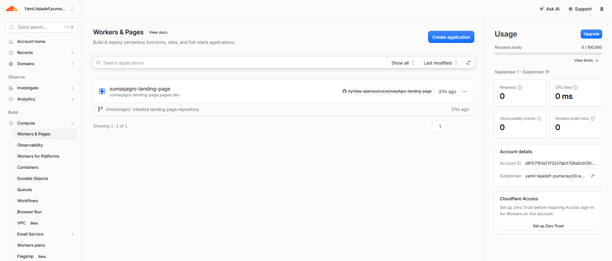

##### Paso 2: Inicio del asistente de creación de aplicación

En la cabecera superior del panel de *Workers &amp; Pages*, se selecciona el botón principal **"Create application"** para iniciar el flujo de aprovisionamiento de un nuevo sitio o servicio estático en la nube.

##### Paso 3: Selección del método de integración con repositorio (GitHub)

Dentro de la pantalla de opciones *Make something new*, se elige el método **"Continue with GitHub"**. Esto permite establecer una conexión directa mediante *webhooks* con el repositorio de control de versiones para habilitar la compilación e integración continua (CI/CD).

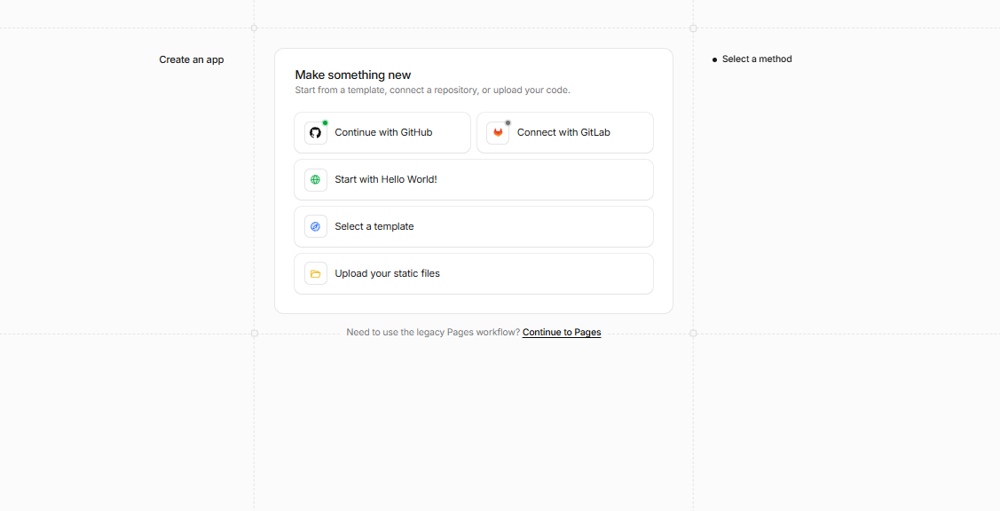

##### Paso 4: Autenticación y autorización de la organización en GitHub

Se autoriza a la plataforma Cloudflare Pages para acceder a la organización pública de GitHub, otorgando permisos de lectura sobre el código fuente para sincronizar las confirmaciones de cambios (*commits*).

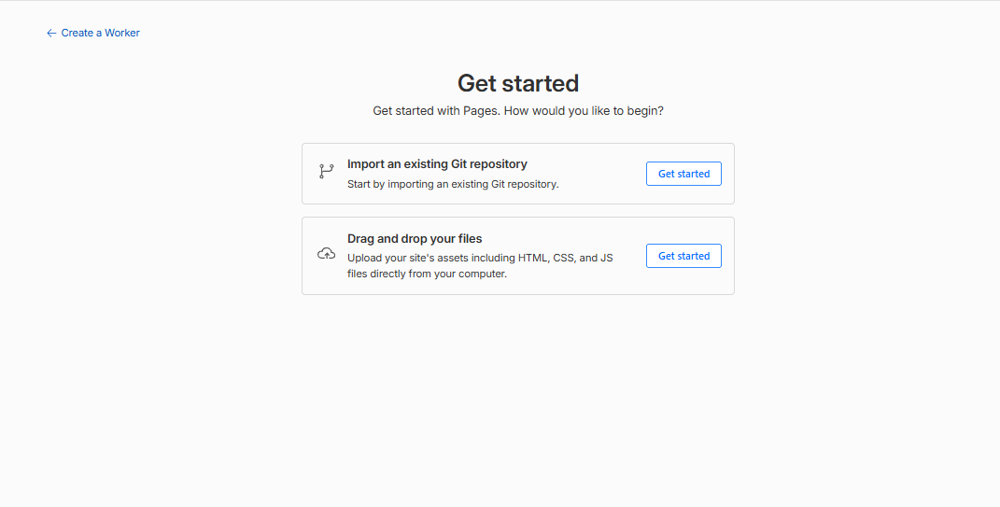

##### Paso 5: Selección del repositorio del Landing Page

En el listado de repositorios vinculados de la organización, se selecciona el proyecto correspondiente al sitio estático: `sumaqAgro-landing-page`. Se confirma la elección presionando el botón **"Begin setup"**.

##### Paso 6: Configuración de parámetros de build y rama de producción

Se configuran los ajustes fundamentales del despliegue:

* **Project name:** `sumaqagro-landing-page`
* **Production branch:** `main` *(rama protegida de producción bajo GitFlow)*
* **Framework preset:** `None` / `Static HTML`
* **Build command:** *(Vacío para sitio estático directo)*
* **Build output directory:** `/` *(directorio raíz)*

Se finaliza la configuración haciendo clic en **"Save and Deploy"**.

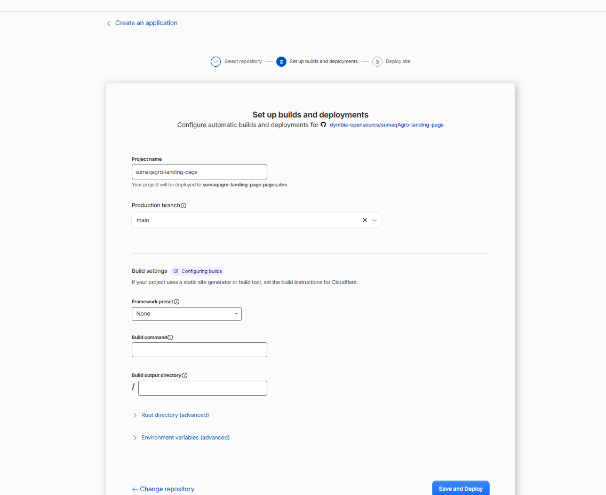

##### Paso 7: Ejecución del pipeline de compilación y distribución Edge

Cloudflare Pages inicia automáticamente el pipeline de entrega continua: clona el código fuente desde GitHub, valida la estructura de archivos estáticos (HTML/CSS/JS/Assets) y distribuye los artefactos en los más de 300 centros de datos de su red Edge global.

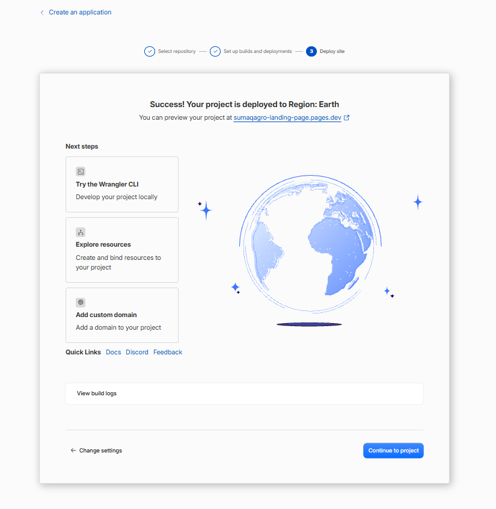 

##### Paso 8: Confirmación de despliegue exitoso y dominio público HTTPS

Finalmente, se completa el proceso de publicación en producción de forma satisfactoria. Cloudflare genera la URL pública de acceso (`sumaqagro-landing-page.pages.dev`) con certificado SSL/TLS de encriptación automático, forzando la navegación segura mediante `HTTPS://`.

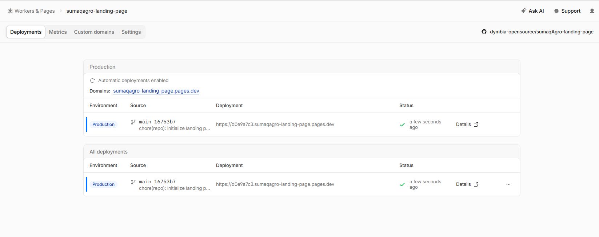

* **URL Oficial de Producción:** [https://sumaqagro-landing-page.pages.dev](https://sumaqagro-landing-page.pages.dev)

## 5.2. Landing Page, Services & Applications Implementation
### 5.2.1. Sprint 1
#### 5.2.1.1. Sprint Planning 1
#### 5.2.1.2. Aspect Leaders and Collaborators
#### 5.2.1.3. Sprint Backlog 1
#### 5.2.1.4. Development Evidence for Sprint Review
#### 5.2.1.5. Execution Evidence for Sprint Review
#### 5.2.1.6. Services Documentation Evidence for Sprint Review
#### 5.2.1.7. Software Deployment Evidence for Sprint Review
#### 5.2.1.8. Team Collaboration Insights during Sprint