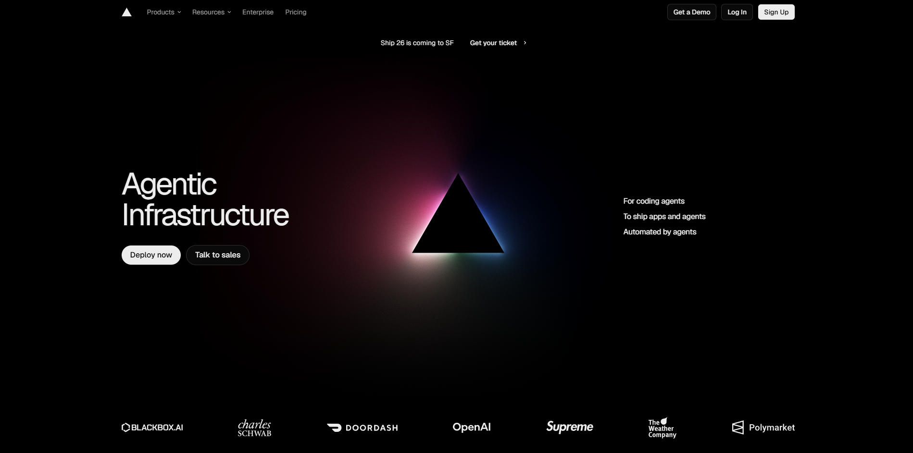

# Capítulo V: Product Implementation, Validation & Deployment

## 5.1. Software Configuration Management

### 5.1.1. Software Development Environment Configuration

Para garantizar una colaboración fluida y estandarizada a lo largo del ciclo de vida del producto digital **SumaqAgro**, el equipo ha definido y configurado un entorno de desarrollo integrado. Este conjunto de herramientas abarca las seis categorías fundamentales exigidas por la metodología del proyecto: *Project Management*, *Requirements Management*, *Product UX/UI Design*, *Software Development*, *Software Deployment* y *Software Documentation*. A continuación, se detalla la caracterización técnica de cada herramienta utilizada, su propósito específico en el proyecto y las rutas oficiales de acceso o descarga.

---
#### 1. Project Management

##### **Jira Software**

* **Propósito en el proyecto:** Gestión centralizada del Product Backlog, planificación y seguimiento de los Sprints, asignación de tareas (*work-items*), control de velocidad del equipo y visualización del flujo de trabajo en tableros Kanban/Scrum.
* **Ruta de Referencia:** [https://www.atlassian.com/software/jira](https://www.atlassian.com/software/jira)

---

#### 2. Requirements Management

##### **UXPressia**

* **Propósito en el proyecto:** Modelado y documentación visual de los artefactos de investigación del usuario. Se utiliza para la elaboración de los *User Personas* (productores agrícolas, directivos de cooperativa y asesores agrónomos), *Empathy Maps*, *User Journey Maps* e *Impact Mapping*.
* **Ruta de Referencia:** [https://uxpressia.com](https://uxpressia.com)

##### **Miro**

* **Propósito en el proyecto:** Facilitar las sesiones de modelado colaborativo de dominio en tiempo real. Permite la construcción del *Big Picture Event Storming* y el *Design-Level Event Storming*, mapeando eventos de dominio, comandos, agregados y *Bounded Contexts*.
* **Ruta de Referencia:** [https://miro.com](https://miro.com)

---

#### 3. Product UX/UI Design

##### **Figma**

* **Propósito en el proyecto:** Diseño de la arquitectura de información y experiencia de usuario. Permite la creación de la guía de estilos visuales (*Style Guide*), los *wireframes* de baja fidelidad, los *mockups* de alta fidelidad, los *wireflows* navegables y el prototipo interactivo de la Landing Page y la aplicación web.
* **Ruta de Referencia:** [https://www.figma.com](https://www.figma.com)

---

#### 4. Software Development

##### **GitHub**

* **Propósito en el proyecto:** Gestión de control de versiones distribuido (SCM), alojamiento del repositorio central del proyecto, revisión colaborativa de código mediante *Pull Requests*, integración del modelo de ramificación GitFlow y auditoría de *commits*.
* **Ruta de Referencia:** [https://github.com](https://github.com)

##### **IntelliJ IDEA**

* **Propósito en el proyecto:** Entorno de Desarrollo Integrado (IDE) principal para la programación del backend. Se utiliza para la construcción de los servicios Web RESTful utilizando Java 21, Spring Boot Framework, Spring Data JPA y Spring Security.
* **Ruta de Descarga:** [https://www.jetbrains.com/idea/download](https://www.jetbrains.com/idea/download)

##### **WebStorm**

* **Propósito en el proyecto:** IDE especializado para la implementación del frontend de la plataforma web. Proporciona soporte avanzado para TypeScript, Angular Framework, HTML5, CSS3/SASS y herramientas de depuración de código en el navegador.
* **Ruta de Descarga:** [https://www.jetbrains.com/webstorm](https://www.jetbrains.com/webstorm)

##### **DataGrip**

* **Propósito en el proyecto:** Entorno de desarrollo para bases de datos relacionales utilizado para la administración, modelado Entidad-Relación, gestión de esquemas y ejecución de consultas sobre el motor de base de datos MySQL.
* **Ruta de Descarga:** [https://www.jetbrains.com/datagrip](https://www.jetbrains.com/datagrip)

##### **Postman**

* **Propósito en el proyecto:** Cliente API HTTP para la prueba, validación y documentación de las peticiones (`GET`, `POST`, `PUT`, `DELETE`) hacia los endpoints RESTful del backend, permitiendo verificar los códigos de estado HTTP y los objetos JSON de respuesta.
* **Ruta de Descarga:** [https://www.postman.com/downloads](https://www.postman.com/downloads)

---

#### 5. Software Deployment

##### **Vercel / GitHub Pages**

* **Propósito en el proyecto:** Plataformas de alojamiento en la nube para el despliegue continuo (*Continuous Deployment*) automatizado del frontend estático de la Landing Page, garantizando alta disponibilidad, certificado SSL (HTTPS) y tiempos de respuesta optimizados.
* **Ruta de Referencia:** [https://vercel.com](https://vercel.com) / [https://pages.github.com](https://pages.github.com)

##### **Railway**

* **Propósito en el proyecto:** Infraestructura Cloud PaaS utilizada para el despliegue continuo y alojamiento del backend RESTful desarrollado en Spring Boot, así como el aprovisionamiento del servidor de base de datos relacional MySQL en entorno de producción.
* **Ruta de Referencia:** [https://railway.app](https://railway.app)

---

#### 6. Software Documentation

##### **Swagger UI**

* **Propósito en el proyecto:** Generación automática de la documentación interactiva de la API RESTful. Permite a los desarrolladores explorar los endpoints, probar llamadas HTTP directamente desde el navegador y consultar los esquemas de petición y respuesta JSON.
* **Ruta de Referencia:** [https://swagger.io/tools/swagger-ui](https://swagger.io/tools/swagger-ui)

##### **Structurizr**

* **Propósito en el proyecto:** Herramienta para el diagramado y documentación de la arquitectura de software bajo el estándar **C4 Model** (Contexto, Contenedores y Componentes), utilizando Structurizr DSL para mantener la arquitectura como código (*Architecture as Code*).
* **Ruta de Referencia:** [https://structurizr.com](https://structurizr.com)

### 5.1.2. Source Code Management
### 5.1.3. Source Code Style Guide & Conventions
### 5.1.4. Software Deployment Configuration

## 5.2. Landing Page, Services & Applications Implementation
### 5.2.1. Sprint 1
#### 5.2.1.1. Sprint Planning 1
#### 5.2.1.2. Aspect Leaders and Collaborators
#### 5.2.1.3. Sprint Backlog 1
#### 5.2.1.4. Development Evidence for Sprint Review
#### 5.2.1.5. Execution Evidence for Sprint Review
#### 5.2.1.6. Services Documentation Evidence for Sprint Review
#### 5.2.1.7. Software Deployment Evidence for Sprint Review
#### 5.2.1.8. Team Collaboration Insights during Sprint